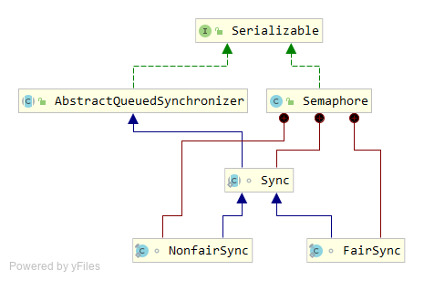

### 信号量Semaphore原理

Semaphore（信号量）是用来控制同时访问特定资源的线程数量，它通过协调各个线程，保证合理的使用公共资源。线程可以通过acquire()方法来获取信号量的许可，当信号量中没有可用的许可的时候，线程阻塞，直到有可用的许可为止。线程可以通过release()方法释放它持有的信号量的许可。

Semaphore对于信号量的控制是基于AQS（AbstractQueuedSynchronizer）来做的。Semaphore有一个内部类Sync继承了AQS。而且Semaphore中还有两个内部类FairSync和NonfairSync继承Sync，也就是说Semaphore有公平锁和非公平锁之分。



#### **Semaphore的方法列表** 

```java
// 创建具有给定的许可数和非公平的公平设置的 Semaphore。
Semaphore(int permits)
// 创建具有给定的许可数和给定的公平设置的 Semaphore。
Semaphore(int permits, boolean fair)

// 从此信号量获取一个许可，在提供一个许可前一直将线程阻塞，否则线程被中断。
void acquire()
// 从此信号量获取给定数目的许可，在提供这些许可前一直将线程阻塞，或者线程已被中断。
void acquire(int permits)
// 从此信号量中获取许可，在有可用的许可前将其阻塞。
void acquireUninterruptibly()
// 从此信号量获取给定数目的许可，在提供这些许可前一直将线程阻塞。
void acquireUninterruptibly(int permits)
// 返回此信号量中当前可用的许可数。
int availablePermits()
// 获取并返回立即可用的所有许可。
int drainPermits()
// 返回一个 collection，包含可能等待获取的线程。
protected Collection<Thread> getQueuedThreads()
// 返回正在等待获取的线程的估计数目。
int getQueueLength()
// 查询是否有线程正在等待获取。
boolean hasQueuedThreads()
// 如果此信号量的公平设置为 true，则返回 true。
boolean isFair()
// 根据指定的缩减量减小可用许可的数目。
protected void reducePermits(int reduction)
// 释放一个许可，将其返回给信号量。
void release()
// 释放给定数目的许可，将其返回到信号量。
void release(int permits)
// 返回标识此信号量的字符串，以及信号量的状态。
String toString()
// 仅在调用时此信号量存在一个可用许可，才从信号量获取许可。
boolean tryAcquire()
// 仅在调用时此信号量中有给定数目的许可时，才从此信号量中获取这些许可。
boolean tryAcquire(int permits)
// 如果在给定的等待时间内此信号量有可用的所有许可，并且当前线程未被中断，则从此信号量获取给定数目的许可。
boolean tryAcquire(int permits, long timeout, TimeUnit unit)
// 如果在给定的等待时间内，此信号量有可用的许可并且当前线程未被中断，则从此信号量获取一个许可。
boolean tryAcquire(long timeout, TimeUnit unit)
```

#### 源码分析

构造函数：

```java
// permits-信号数量，默认是非公平锁
public Semaphore(int permits) {
    sync = new NonfairSync(permits);
}
// 通过fair指定公平锁或非公平锁
public Semaphore(int permits, boolean fair) {
    sync = fair ? new FairSync(permits) : new NonfairSync(permits);
}

// 最后都是通过Sync调用的AQS的setState方法，permits被设置为AQS中的state
Sync(int permits) {
    setState(permits);
}
```

Sync类：

```java
abstract static class Sync extends AbstractQueuedSynchronizer {
    private static final long serialVersionUID = 1192457210091910933L;
	//构造函数，调用的AQS的setState方法，permits被设置为AQS中的state
    Sync(int permits) {
        setState(permits);
    }
	//获取AQS的state
    final int getPermits() {
        return getState();
    }

     //非公平方式尝试获取
    final int nonfairTryAcquireShared(int acquires) {
        for (;;) {
             // 获取可用许可证
            int available = getState();
            // 计算获取剩余许可证
            int remaining = available - acquires;
            // 1.如果remaining小于0则直接返回remaining
            // 2.如果remaining大于0则先更新同步状态再返回remaining
            if (remaining < 0 ||
                compareAndSetState(available, remaining))
                return remaining;
        }
    }

    // 尝试释放许可
    protected final boolean tryReleaseShared(int releases) {
        for (;;) {
            // 获取可用许可证
            int current = getState();
            // 计算释放后剩余许可证
            int next = current + releases;
            // 释放后还小于当前许可证数量，抛出异常
            if (next < current) // overflow
                throw new Error("Maximum permit count exceeded");
           // 通过CAS设置AQS的state
            if (compareAndSetState(current, next))
                return true;
        }
    }
	// 根据指定的缩减量减小可用许可的数目 
    final void reducePermits(int reductions) {
        for (;;) {
            int current = getState();
            int next = current - reductions;
            if (next > current) // underflow 许可数目溢出
                throw new Error("Permit count underflow");
            // CAS设置state
            if (compareAndSetState(current, next))
                return;
        }
    }

    // 获取并返回立即可用的所有许可
    final int drainPermits() {
        for (;;) {
            int current = getState();
            if (current == 0 || compareAndSetState(current, 0))
                return current;
        }
    }
}
```

NonfairSync类：

```java
// 非公平同步器
static final class NonfairSync extends Sync {
    private static final long serialVersionUID = -2694183684443567898L;

    NonfairSync(int permits) {
        super(permits);
    }
	// 尝试获取许可证
    protected int tryAcquireShared(int acquires) {
        // 直接调用父类Sync的方法--非公平方式尝试获取
        return nonfairTryAcquireShared(acquires);
    }
}
```

FairSync类：

```java
//公平同步器
static final class FairSync extends Sync {
    private static final long serialVersionUID = 2014338818796000944L;

    FairSync(int permits) {
        super(permits);
    }

    //尝试获取许可证
    protected int tryAcquireShared(int acquires) {
        for (;;) {
            //判断同步队列前面有没有人排队
            if (hasQueuedPredecessors()) {
                //如果有的话就直接返回-1，表示尝试获取失败
                return -1;
            }
            //获取可用许可证
            int available = getState();
            //获取剩余许可证
            int remaining = available - acquires;
            //1.如果remaining小于0则直接返回remaining
            //2.如果remaining大于0则先更新同步状态再返回remaining
            if (remaining < 0 || compareAndSetState(available, remaining)) {
                return remaining;
            }
        }
    }
}
```


获取许可证 ：

```java
//获取一个许可证(响应中断)
public void acquire() throws InterruptedException {
    sync.acquireSharedInterruptibly(1);
}

//获取一个许可证(不响应中断)
public void acquireUninterruptibly() {
    sync.acquireShared(1);
}

//尝试获取许可证(非公平获取)
public boolean tryAcquire() {
    return sync.nonfairTryAcquireShared(1) >= 0;
}

//尝试获取许可证(定时获取)
public boolean tryAcquire(long timeout, TimeUnit unit) throws InterruptedException {
    return sync.tryAcquireSharedNanos(1, unit.toNanos(timeout));
}
```

释放许可证 :

```java
//释放锁的操作(共享模式)
public final boolean releaseShared(int arg) {
    //1.尝试去释放锁
    if (tryReleaseShared(arg)) {
        //2.如果释放成功就唤醒其他线程
        doReleaseShared();
        return true;
    }
    return false;
}
```

