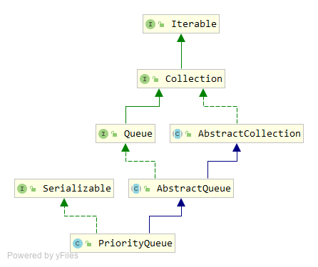
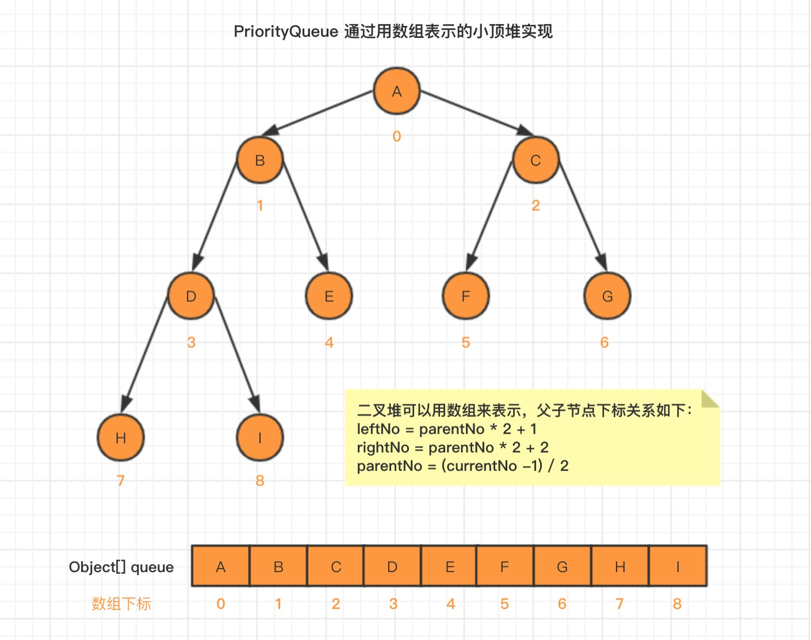

### PriorityQueue原理分析

#### 底层原理：

类关系图：



PriorityQueue是一个无界的优先级队列，底层通过数组，并采用完全二叉树的形式来描述元素的存储。

存储结构如下：



每个元素的下标 按照如下规则确定：

```java
/**
  * parentNo：表示父节点下标；
  * leftNo：表示子元素左节点下标；
  * rightNo：表示子元素右节点下标；
  * currentNo：表示当前元素节点下标；
 **/
leftNo = parentNo * 2 + 1
rightNo = parentNo * 2 + 2
parentNo = (currentNo -1) / 2
```

通过上述三个公式，可以轻易计算出某个节点的父节点以及子节点的下标。**这也就是为什么可以直接用数组来存储元素实现二叉树结构的原因。** 

#### 源码分析

主要属性：

```java
// 初始化容量
private static final int DEFAULT_INITIAL_CAPACITY = 11;
// 队列容量，通过数组存储
transient Object[] queue; // non-private to simplify nested class access
// 队列中的元素个数
private int size = 0;
// 比较器,为null使用自然排序
private final Comparator<? super E> comparator;
// 修改记录
transient int modCount = 0; // non-private to simplify nested class access
```

构造函数：

```java
// 使用默认值创建对象
public PriorityQueue() {
    this(DEFAULT_INITIAL_CAPACITY, null);
}
//指定容量
public PriorityQueue(int initialCapacity) {
    this(initialCapacity, null);
}
// 指定比较器
public PriorityQueue(Comparator<? super E> comparator) {
    this(DEFAULT_INITIAL_CAPACITY, comparator);
}
// 指定容量和比较器
public PriorityQueue(int initialCapacity, Comparator<? super E> comparator) {
    // Note: This restriction of at least one is not actually needed,
    // but continues for 1.5 compatibility
    if (initialCapacity < 1)
        throw new IllegalArgumentException();
    this.queue = new Object[initialCapacity];
    this.comparator = comparator;
}
//使用给定的集合创建
public PriorityQueue(Collection<? extends E> c) {
    if (c instanceof SortedSet<?>) { // 传入的是SortedSet
        SortedSet<? extends E> ss = (SortedSet<? extends E>) c;
        // 获取SortedSet中的比较器
        this.comparator = (Comparator<? super E>) ss.comparator();
        // 创建并复制元素
        initElementsFromCollection(ss);
    }
    else if (c instanceof PriorityQueue<?>) {  // 传入的是PriorityQueue
        PriorityQueue<? extends E> pq = (PriorityQueue<? extends E>) c;
        this.comparator = (Comparator<? super E>) pq.comparator();
        initFromPriorityQueue(pq);
    }
    else { // 普通集合
        // 使用自然比较器
        this.comparator = null;
        initFromCollection(c);
    }
}

// ##############补充方法#############
// 初始化时复制数组内容
private void initElementsFromCollection(Collection<? extends E> c) {
    Object[] a = c.toArray();
    // If c.toArray incorrectly doesn't return Object[], copy it.
    if (a.getClass() != Object[].class)
        a = Arrays.copyOf(a, a.length, Object[].class);
    int len = a.length;
    if (len == 1 || this.comparator != null)
        for (int i = 0; i < len; i++)
            if (a[i] == null) // priorityQueue不允许元素为null
                throw new NullPointerException();
    this.queue = a;
    this.size = a.length;
}

// 从PriorityQueue复制
private void initFromPriorityQueue(PriorityQueue<? extends E> c) {
    if (c.getClass() == PriorityQueue.class) {
        this.queue = c.toArray();
        this.size = c.size();
    } else { // 传入的参数不是一个PriorityQueue
        initFromCollection(c);
    }
}
// 普通集合复制
private void initFromCollection(Collection<? extends E> c) {
    initElementsFromCollection(c);
 	// 调整存储顺序
    heapify();
}
```

**说明：**

从下标0开始，并不是一直是从小到大的顺序，但是下标0一定是最小的，添加元素会不停的与父节点比较，小的话就会与父节点交换位置。删除元素时，会从顶部往底部移


太累了，暂时先不弄了，，，，，，，，，，，，，，，，，，，