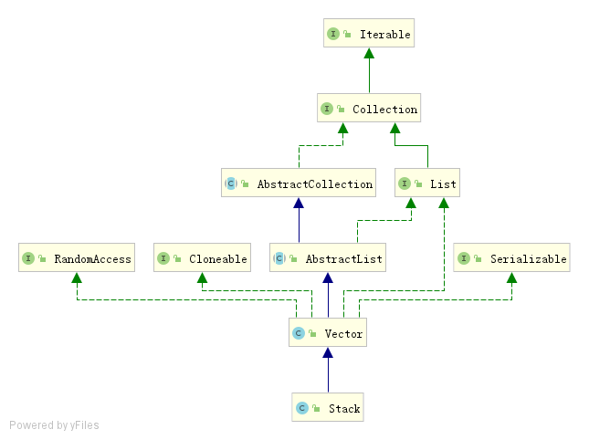

# Stack源码分析

Stack-栈，继承自Vector，通过数组实现的，具有**先进后出**的特性。Vector与ArrayList最大的不同在于Vector是线程安全的，不过在不考虑线程安全的情况下，官方对接使用ArrayList代替Vector。Vector在实际工作上用得并不多，因此不在对其源码进行分析。

Stack的继承结构如下：



只有一个父类Vector，也没有实现其他接口，源码也相对简单，如下：

```java
public class Stack<E> extends Vector<E> {
    /**
     * 创建一个空的栈
     */
    public Stack() {
    }

    // 将元素存入栈顶
    public E push(E item) {
        // addElement的实现在Vector中
        addElement(item);
        return item;
    }

    // 返回栈顶元素并从栈中删除该元素
    public synchronized E pop() {
        E       obj;
        int     len = size();
        obj = peek();
        removeElementAt(len - 1);
        return obj;
    }

	// 返回栈顶元素，不进行删除
    public synchronized E peek() {
        int     len = size();
        if (len == 0)
            throw new EmptyStackException();
        return elementAt(len - 1);
    }

    // 判断栈是否为空
    public boolean empty() {
        return size() == 0;
    }

    // 查找“元素o”在栈中的位置：由栈底向栈顶方向数
    public synchronized int search(Object o) {
        // 获取元素索引，具体实现在Vector中
        int i = lastIndexOf(o);
        if (i >= 0) {
            return size() - i;
        }
        return -1;
    }

    /** use serialVersionUID from JDK 1.0.2 for interoperability */
    private static final long serialVersionUID = 1224463164541339165L;
}
```