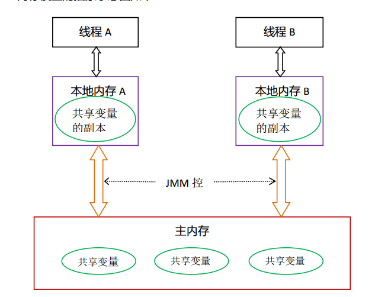

#### 线程间通信机制

**内存共享：** 线程之间通过读-写内存中的公共状态来隐式进行通信

**消息传递：** 线程之间没有公共状态，必须通过明确的发送消息来显示的进行通信

Java的并发采用的是内存共享模型，

#### JMM

Java内存模型的作用：规范内存数据和工作空间数据的交互。

线程之间的共享变量存储在主内存（main memory）中，每个线程都有一个私有的本地内存（local memory）（抽象概念），本地内存中存储了该线程以读-写共享变量的副本。

**说明：**

+ 主内存：共享的信息
+ 本地内存：又叫工作内存，私有信息、基本数据类型、引用对象的引用地址都在工作内存中分配空间存储，引用对象存放在堆中
+ 工作方式：
  + 线程修改私有数据，直接在本地内存（工作内存）中修改
  + 线程修改共享数据，把数据复制到工作内存中，在工作内存中修改，修改完成后刷新到主内存中

#### 存储器的层次结构

结构如下：

CPU缓存一致性问题：体现在并发处理的不同步

解决方案：

+ 总线加锁，降低CPU的吞吐量

  老版本CPU采取的方式

+ 缓存一致性协议

  市面上有很多种缓存一致性协议，Inter采用的是MESI Cache，MESI的具体实现是：CPU每个cache line用额外的两位来标记四种状态（Modified，Exclusive、Shared、Invalid），分别表示：

  + Modified ：当前CPU修改过
  + Exclusive：独享，只有自己使用，其他CPU连读都没有
  + Shared：其他CPU在同时读
  + Invalid：无效的

  当CPU在Cache中操作数据时，如果该数据是共享变量，数据在CACHE读到寄存器中，进行修改，并更新内存数据，Cache LINE置无效，其他的CPU就从内存中读数据，

+ 总结

  有些无法被缓存的数据或者跨越多个缓存行的数据依然必须使用总线锁

  现代CPU的数据一致性是通过缓存锁+总线锁来保证的

#### 缓存行

读取缓存一cache line为基本单位，目前多数为64bytes。

伪共享：位于同一缓存行的两个不同数据，被两个不同CPU锁定，产生相互影响的伪共享问题（解决方案，缓存行对齐优化：disruptor）

#### 重排序-乱序问题

CPU为了提高指令执行效率，会在一条指令执行过程中（比如去内存读取数据—慢100倍），去同时执行另一条指令，前提是，两条指令没有依赖关系。

WCBuffer：合并写

* 编译器优化的重排序

* 指令级并行的重排序   现代处理器使用了指令级并行技术来将多条指令重叠执行。如果不存在数据依赖性，处理器可以改变语句对应机器指令的执行顺序

* 内存系统的重排序  由于处理器使用缓存和读-写缓冲区，这使得加载和存储操作看上去可能是乱序执行的

  

  重排序可能会导致多线程程序出现内存可见性问题，JMM会通过内存屏障指令来禁止特定类型的处理器重排序，为程序员提供一致的内存可见性保证

#### 如何保障有序性

+ 硬件内存屏障 X86

  + sfence(save)

    在sfence指令前的写操作，必须在sfence指令后的写操作前完成

  + lfence(load)

    在lfence指令前的读操作，必须在Ifence指令后的读操作前完成

  + mfence(modify/mix)

    在mfence指令前的读写操作，必须在mfence指令后的读写操作前完成

  原子指令，如x86上的“lock....”指令是一个Full Barrier，执行时会锁住内存子系统来确保执行顺序，甚至跨多个CPU。Software Locks通常使用了内存屏障或者原子指令来实现变量可见性和保持程序顺序

+ JVM级别的内存屏障规范（JSR133）

  + LoadLoad屏障：Load1;LoadLoad;Load2

    在Load2以及后续读操作前，保证Load1要读取的数据被读取完

  + StoreStore屏障：Store1;StoreStore;Store1

    在Store2以及后续写操作执行前，保证Store1的写操作对其他处理器可见

  + LoadStore屏障：Load1;LoadStore;Store2

    在Store2及后续写入操作被刷出前，保证Load1要读取的数据被读取完毕。

  + StoreLoad屏障：Store1; StoreLoad; Load2

    在Load2及后续所有读取操作执行前，保证Store1的写入对所有处理器可见。

#### happens-before

​	JDK5使用JSR-133内存模型，JSR-133使用happens-before来阐述操作间的内存可见性。

在JMM中，如果一个操作执行的结果需要对另一个操作可见，那么这两个操作之间必须存在happens-before关系。

**happens-before规则**

* 程序顺序规则：一个线程中的每个操作，happens-before与该线程中的任意后续操作
* 监视器锁规则：对一个监视器的解锁，happens-before于随后对这个监视器的枷锁
* volatile变量规则：对一个volatile域的写，happens-before域任意后续对这个volatile域的读
* 传递性：如果A happens-before B ,B happens-before C，那么A happens-before C

#### as-if-serial语义

不管怎么重排序，(单线程)程序的执行结果不能被改变

#### 数据竞争

在一个线程中写一个变量，在另一个线程中读同一个变量，而且读和写没有通过同步来排序，就会发生数据竞争

#### 一个64位long/double型变量的写操作

对于32位操作系统来说，单次操作能处理的最大长度为32bit，对于64bit的long/double的操作都是分两次完成的，不是一个原子操作，可通过volatile关键字修饰，保证其原子性。

对于64位操作系统，单次能操作64bit，所以对于long和double的操作都是原子操作。

#### Volatile特性

可见性，对一个volatile变量的读，总是能看到（任意线程）对这个volatile变量最后的写入

原子性，对单个volatile变量的读写具有原子性，但类似volatile++这种复合操作不具备原子性

#### Volatile内存语义

volatile变量在写的时候会把本地内存中的值写入到主内存中（锁释放的内存语义与此相同）

volatile变量在读的时候会把本地内存中的值作废，直接从主内存中读取 （锁获取的内存语义与此相同）

#### volatile的实现细节

1. 字节码层面
   ACC_VOLATILE

2. JVM层面
   volatile内存区的读写 都加屏障

   > StoreStoreBarrier
   >
   > volatile 写操作
   >
   > StoreLoadBarrier

   > LoadLoadBarrier
   >
   > volatile 读操作
   >
   > LoadStoreBarrier

3. OS和硬件层面
   https://blog.csdn.net/qq_26222859/article/details/52235930
   hsdis - HotSpot Dis Assembler
   windows lock 指令实现 | MESI实现

#### synchronized实现细节

1. 字节码层面
   ACC_SYNCHRONIZED
   monitorenter monitorexit
2. JVM层面
   C C++ 调用了操作系统提供的同步机制
3. OS和硬件层面
   X86 : lock cmpxchg / xxx
   [https](https://blog.csdn.net/21aspnet/article/details/88571740)[://blog.csdn.net/21aspnet/article/details/](https://blog.csdn.net/21aspnet/article/details/88571740)[88571740](https://blog.csdn.net/21aspnet/article/details/88571740)

