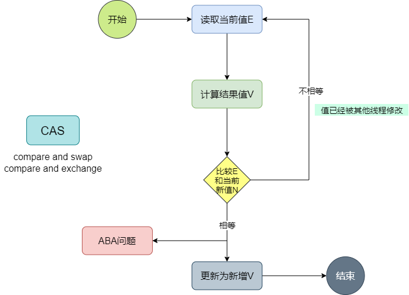

## CAS深入理解

### 简介

CAS，全称是compare and swap，核心思想是：设置或修改数据之前判断一下值是否被改变，没有被改变则设置为新值，如果被改变了就重新获取新值，重新计算，然后再比较设置。

流程如下：



### JVM底层实现原理

JDK中许多地方都使用了CAS，此处以Atomic原子类举例说明，Atomic是通过调用Unsafe类的相关方法来实现变量的原子操作，

**Unsafe代码：**

```java
// 通过比较设置值
public final native boolean compareAndSwapInt(Object var1, long var2, int var4, int var5);
```

compareAndSwapInt是一个naitive方法，一个本地方法，并不是由JDK实现的，而是C++按照JVM规范实现的，此处需要搞一份JVM的源代码（以hotspot为列）

**compareAndSwapInt实现代码：**

```C++
UNSAFE_ENTRY(jboolean, Unsafe_CompareAndSwapInt(JNIEnv *env, jobject unsafe, jobject obj, jlong offset, jint e, jint x))
  UnsafeWrapper("Unsafe_CompareAndSwapInt");
  oop p = JNIHandles::resolve(obj);
  jint* addr = (jint *) index_oop_from_field_offset_long(p, offset);
  return (jint)(Atomic::cmpxchg(x, addr, e)) == e;
UNSAFE_END
```

以上代码位于`hotspot\src\share\vm\prims\unsafe.cpp`，其中核心代码是:`Atomic::cmpxchg`

**Atomic::cmpxchg代码**

```hpp
inline jint Atomic::cmpxchg (jint exchange_value, volatile jint* dest, jint     compare_value) {
  int mp = os::is_MP();
  __asm__ volatile (LOCK_IF_MP(%4) "cmpxchgl %1,(%3)"
                    : "=a" (exchange_value)
                    : "r" (exchange_value), "a" (compare_value), "r" (dest), "r" (mp)
                    : "cc", "memory");
  return exchange_value;
}
```

以上代码位于：`\hotspot\src\os_cpu\linux_x86\vm\atomic_linux_x86.inline.hpp`,其代码说明如下：

+ **asm：**表示是汇编语句
+ **cmpxchgl：** 汇编指令，全称是compare and exchange，
+ **LOCK_IF_MP：** 如果是多个CPU 就在指令前加上lock指令，最终执行的指令是：lock cmpxchgl
+ **说明：**cmpxchgl 并不能保证原子性，是通过lock指令来保证的

**硬件支持：**

一个带有lock前缀的指令在执行时，会锁定一个北桥信号，不是采用锁总线的方式

### CAS导致的ABA问题

**什么是ABA问题**

所谓的ABA问题就是线程将一个变量的值从A修改为B，而另外一个线程则把变量的值从B修改为A，后面再来操作此变量的值得时候是感知不到变量被修改为B的操作的。

**如何解决ABA问题**

+ 通过AtomicStampedReference添加stamp进行区分
+ 数据库table等可以添加version字段，每次操作++

### 总结

汇编中有CAS对应的指令`cmpcchgl`，但是如果在多CPU系统上，该指令并不能保证原子性（在比较过后可能被其他线程改变成其他的值），具体的实现是在`cmpcchgl`指令前加Lock指令，通过锁定北桥信号来保证其原子性。