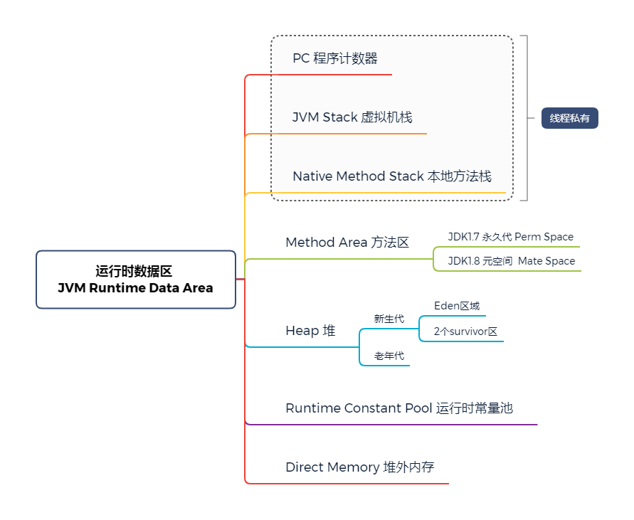

# JVM简介

jvm跨语言的平台，java跨平台的语言，jvm是一种规范，官方文档：

https://docs.oracle.com/javase/specs/index.html

java执行流程：


## JVM常见的实现

+ Hotspot

+ Jrockit(BEA)

+ J9(IBM)

+ Microsoft VM

+ TaobaoVM

  Hotspot深度定制版

+ LiquidVM

  直接针对硬件

+ azul zing

  最新垃圾回收，业界标杆

+ GraalVM
  oracle新开发的一款虚拟机，有可能会替代Hotspot，Spring最新版本有对这个进行支持

JDK内容：


## Class文件格式

二进制字节流

### 类加载器


为什么会有双亲委派机制？

主要为了安全，

如何打破双亲委派机制？

重写loadClass方法

### 加载过程

+ Loading

+ Linking

  + Verification-校验

    验证文件是否符合JVM规范

  + Preparation-准备，预备

    静态变量赋默认值

  + Resolution-解析

    将类、方法、属性等符号引用解析为直接引用，常量池中的各种符号引用解析为指针，偏移量等内存地址的直接引用

+ Initialzing-初始化

### 编译器

+ -Xmixed 混合模式（默认）
+ -Xint 使用解释模式，启动很快，执行稍慢
+ -Xcomp，使用纯编译模式，执行很快，启动很慢

### JVM Runtime Data  Area( 运行时数据区)




#### PC 程序计数器

存放指令的位置，<span style="color:red">线程私有</span>

#### JVM Stack 虚拟机栈

<span style="color:red">线程私有</span>

Frame - 每个方法对应一个栈帧

+ 局部变量表（Local Variable Table）

+ 操作数栈（Operand Stack）

  对于long的处理（store and load），多数虚拟机的实现都是原子的，没必要加volatile

+ 动态链接（Dynamic Linking）

  https://blog.csdn.net/qq_41813060/article/details/88379473 

  动态链接是一个将符号引用解析为直接引用的过程

+ return address

```java
public class Test01 {
    public static void main(String[] args) {
        int i = 8;
         i = i++;
        //i = ++i;
        System.out.println(i);
    }
}
// 对应字节码
 0 bipush 8
 2 istore_1
 3 iload_1
 4 iinc 1 by 1
 7 istore_1
 8 getstatic #2 <java/lang/System.out>
11 iload_1
12 invokevirtual #3 <java/io/PrintStream.println>
15 return
```

```java
public class Test01 {
    public static void main(String[] args) {
        int i = 8;
         //i = i++;
        i = ++i;
        System.out.println(i);
    }
}
// 对应字节码
 0 bipush 8
 2 istore_1
 3 iinc 1 by 1
 6 iload_1
 7 istore_1
 8 getstatic #2 <java/lang/System.out>
11 iload_1
12 invokevirtual #3 <java/io/PrintStream.println>
15 return
```

#### Native Method Stack

本地方法栈，<span style="color:red">线程私有</span>

#### Method Area

方法区，method area是jvm的规范，具体的虚拟机可以有不同的实现

+ Perm Space（<1.8）方法区，Hotspot-永久代
+ Meta Space(>=1.8) 元空间

两者的区别：

| 方法区     | 大小                         | 是否FGC       | 对字符串的处理               |
| ---------- | ---------------------------- | ------------- | ---------------------------- |
| Perm Space | 启动时指定，不能变           | FGC不会清理   | 字符串常量位于Perm Space     |
| Meta Space | 如果不设定，最大就是物理内存 | 会触发FGC清理 | 字符串常量位于堆空间（Heap） |

如何证明JDK1.7字符串常量位于Perm，而JDK1.8位于堆空间(Heap)？

提示：结合GC，一直创建字符串常量，观察堆和Meta Space的情况

#### Heap

堆空间

#### Runtime Constant Pool

运行时常量池

#### Direct Memory

直接内存(堆外内存)，JVM可以直接访问的内核空间的内存（OS管理的内存），JDK1.5之后可以通过未公开的unsafe和NIO包下的ByteBuffer操作堆外内存

NIO，提高效率，实现zero copy

### JVM Instructions (JVM指令集)

#### 分类

+ 基于寄存器的指令集

+ 基于栈的指令集

  Hotspot中的LocalVariable Table=JVM中的寄存器

#### 常用指令

+ store：将操作数栈最上面的值弹出，然后存储到（赋值）局部变量表中指定下标的局部变量上
+ load：从局部变量表中加载指定的内容，然后放入操作数栈中
+ pop：从操作数栈中弹出
+ mul：
+ sub：
+ invoke：执行方法
  + InvokeStatic：执行静态方法
  + InvokeVirtual：执行一般方法，支持多态
  + InvokeInterface：执行接口方法
  + InvokeSpecial：执行可以直接定位，不需要多态的方法，比如：private方法，构造方法等
  + InvokeDynamic：lambda表达式或者反射其他的动态语言Scala、kotlin或者CGLib ASM，动态产生的class，会用到该指令

### GC

熟悉GC常用算法，熟悉常见垃圾收集器，具有实际JVM调优实战经验

#### 如何定位垃圾

+ 引用计数法（Reference Count）

  存在循环引用的问题

+ 根可达算法（Root Searching）

  哪些对象是根？线程栈变量、静态变量、常量池、JNI指针

  深入理解Java虚拟机书中，

  > JVM  stack、native method stack、run-time constant pool，static reference，In method Area 、clazz

#### 常见的垃圾回收算法

+ 标记清除（mark sweep）

  位置不连续、产生碎片，效率偏低（两遍扫描，标记-清除两个阶段）；

  算法相对简单，存活对象比较多的情况下效率较高

+ 拷贝（复制）算法（coping）

  适用于存活对象较少的情况，只扫描一次，效率提高，没有碎片；

  浪费空间，移动复制对象，需要调整对象引用

+ 标记压缩算法（mark compact）

  没有碎片，方便对象分配

  扫描两次，需要移动对象，效率偏低

#### JVM内存分代模型

用于分代垃圾回收算法，堆内存逻辑分区如下：


+ 部分垃圾回收器使用的模型

  除Epsilon、ZGC、Shenandoah之外的GC都是使用逻辑分代模型

  G1是逻辑分代、物理不分代，除此之外的垃圾回收器不仅逻辑分代，同时也是物理分代

+ 新生代+老年代+永久代（1.7）Perm Generation/元空间(1.8)Meta space

  + 永久代/元空间  - Class
  + 永久代必须指定大小限制，元空间可以设置、也可以不设置（最大空间受限于物理内存大小）
  + 字符串常量 1.7永久代，1.8堆空间
  + MethodArea是JVM规范，一个逻辑概念，其具体实现是永久代、元空间

+ 新生代=Eden+2个survivor区

  + YGC回收之后，大多数对象会被回收，活着的进入s0
  + 再次YGC，活着的对象eden+s0 -> s1
  + 再次YGC，eden+s1 -> s0
  + 年龄足够 -> 老年代（15 CMS 6）
  + s区装不下 -> 老年代

+ 老年代

  + 顽固分子
  + 老年代满了-FGC（Full GC）

+ GC Tuning

  + 尽量减少FGC

  + MinorGC=YGC

    年轻代空间耗尽时触发

  + MajorGC=FGC  FullGC

    在老年代无法继续分配空间时触发，新生代老年代同时进行回收

#### 栈上分配

+ 线程私有小对象
+ 无逃逸
+ 支持标量替换

<span style="color:red">无需调整</span>

#### 线程本地分配

TLAB—Thread Local Allocation Buffer

+ 占用eden，默认1%
+ 多线程的时候不用竞争eden就可以申请空间，提高效率
+ 小对象

<span style="color:red">无需调整</span>

#### 对象何时进入老年代

+ 超过XX:MaxTenuringThreshold指定的次数（YGC）

  + Parallel Scavenge 15
  + CMS 6
  + G1 15

  为什么最大是15，因为对象头中的markword里面，年龄代占4个字符，

+ 动态年龄

  + s1->s2超过50%，把年龄最大的放入old区

#### 常见的垃圾回收器

JDK诞生时就有了Serial，为了提高效率诞生了Parallel Scavenge；jDK1.4版本后期引入了CMS，为了配合CMS，由诞生了ParNew，CMS是里程碑式的GC，它开启了并发回收的过程，但是CMS问题还是比较多，因此目前没有任何一个JDK版本默认的垃圾回收器都是CMS的。

为什么会有并发垃圾回收器，是因为<span style="color:red">STW</span>（stop the word）

+ Serial 年轻代 串行回收

+ Parallel Scavenge 年轻代 <span style="color:red">并行回收</span>

+ ParNew 年轻代  配合CMS的并行回收器

+ Serial Old 

+ ParallelOld

+ Concurrent MarkSweep 老年代 <span style="color:red">并发</span>的，垃圾回收和应用程序同时运行，降低STW的时间（200ms）

  要使用CMS只能手动指定，CMS既然是MarkSweep，就一定会有碎片化的问题，碎片达到一定程度，CMS的老年代分配不下对象时，使用SerialOld进行老年代回收

+ G1(10ms)

  算法：三色标记+SATB

+ ZGC(1ms) pk C++

  算法：ColoredPointers + LoadBarrier

+ Shenandoah

  算法：ColorPointers + WriteBarrier

+ Eplison 

+ PS 和 PN区别的延伸阅读：
  https://docs.oracle.com/en/java/javase/13/gctuning/ergonomics.html

<span style="color:red">JDK8默认使用的是parallel Scavenge+Serial Old</span>

<span style="color:red">JDK14默认使用的是G1</span>

#### 垃圾回收器跟内存大小的关系

+ Serial 几十兆
+ Parallel Scavenge 上百兆-几个G
+ CMS-20G
+ G1 上百G
+ ZGC 4T-16T（JDK13）

JDK1.8默认的垃圾回收器是Parallel Scavenge+ParallelOld

#### 常见垃圾回收器组合参数设定（JDK1.8）

+ -XX:+UseSerialGC 

  等同于Serial New+Serial Old；适用于小型程序，默认情况下不会是这种选项，HotSpot会根据计算机以及配置和JDK版本自动选择收集器

+ -XX:+UseParNewGC

  =ParNew+SerialOld；这个组合已经很少用了，在某些版本中已经废弃，JDK9废除了这个指令

+ -XX:+UseConcMarkSweepGC = ParNew + CMS + Serial Old
+ -XX:+UseParallelGC = Parallel Scavenge + Parallel Old（1.8默认）【PS+SerialOld】
+ -XX:+UseParallelOldGC =  Parallel Scavenge + Parallel Old
+ -XX:+UseG1GC = G1

* Linux中没找到默认GC的查看方法，而windows中会打印UseParallelGC 
  * java +XX:+PrintCommandLineFlags -version
  * 通过GC的日志来分辨

* Linux下1.8版本默认的垃圾回收器到底是什么？

  * 1.8.0_181 默认（看不出来）Copy MarkCompact
  * 1.8.0_222 默认 PS + PO

### JVM调优

#### JVM常用命令行参数

命令行参数参考：https://docs.oracle.com/javase/8/docs/technotes/tools/unix/java.html

HotSpot参数分类：

+ 标准：-开头，所有的HotSpot都支持
+ 非标准：-X开头，特定版本HotSpot支持的特定命令
+ 不稳定：-XX开头，下个版本可能取消

memory leak：内存泄漏

out of memory：内存溢出

#### 示例演示

```java
import java.util.List;
import java.util.LinkedList;

public class HelloGC {
    public static void main(String[] args) {
        System.out.println("HelloGC!");
        List list = new LinkedList();
        for(;;) {
            byte[] b = new byte[1024*1024];
            list.add(b);
        }
    }
}
```

+ 打印jvm默认配置信息

  参数：-XX:+PrintCommandLineFlags 

  JDK1.8-jvm参数：

  > -XX:InitialHeapSize=67100544 
  >
  > -XX:MaxHeapSize=1073608704 
  >
  > -XX:+PrintCommandLineFlags 
  >
  > -XX:+UseCompressedClassPointers 
  >
  > -XX:+UseCompressedOops 
  >
  > -XX:-UseLargePagesIndividualAllocation 
  >
  > -XX:+UseParallelGC 

  JDK14-jvm参数：

  > // 并发优化线程(Remenbered Set)数量
  >
  > -XX:G1ConcRefinementThreads=4 
  >
  > -XX:GCDrainStackTargetSize=64 
  >
  > -XX:InitialHeapSize=67100544 
  >
  > -XX:MaxHeapSize=1073608704 
  >
  > -XX:MinHeapSize=6815736 
  >
  > -XX:+PrintCommandLineFlags 
  >
  > -XX:ReservedCodeCacheSize=251658240 
  >
  > -XX:+SegmentedCodeCache 
  >
  > -XX:+UseCompressedClassPointers 
  >
  > -XX:+UseCompressedOops 
  >
  > -XX:+UseG1GC 
  >
  > -XX:-UseLargePagesIndividualAllocation

+ 设置堆大小

  参数：-Xmn10M -Xms40M -Xmx60M -XX:+PrintCommandLineFlags -XX:+PrintGC

  JDK1.8-jvm参数：

  > -XX:InitialHeapSize=41943040 
  >
  > -XX:MaxHeapSize=62914560 
  >
  > -XX:MaxNewSize=10485760 
  >
  > -XX:NewSize=10485760 
  >
  > -XX:+PrintCommandLineFlags 
  >
  > -XX:+PrintGC 
  >
  > -XX:+UseCompressedClassPointers 
  >
  > -XX:+UseCompressedOops 
  >
  > -XX:-UseLargePagesIndividualAllocation 
  >
  > -XX:+UseParallelGC

  Parallel Scavenge+Serial Old的GC日志：

  > [GC (Allocation Failure)  7840K->5397K(39936K), 0.0071157 secs]
  > [GC (Allocation Failure)  12722K->12598K(39936K), 0.0107224 secs]
  > [GC (Allocation Failure)  19917K->19766K(39936K), 0.0197214 secs]
  > [GC (Allocation Failure)  27172K->26933K(39936K), 0.0096329 secs]
  > [Full GC (Ergonomics)  26933K->26575K(53248K), 0.0179287 secs]
  > [GC (Allocation Failure)  33954K->33839K(52736K), 0.0098533 secs]
  > [GC (Allocation Failure)  41356K->41040K(49664K), 0.0090939 secs]
  > [Full GC (Ergonomics)  41040K->40886K(56832K), 0.0241719 secs]
  > [GC (Allocation Failure)  44116K->44054K(58368K), 0.0041669 secs]
  > [Full GC (Ergonomics)  44054K->43959K(58368K), 0.0161410 secs]
  > [GC (Allocation Failure)  47155K->47095K(58368K), 0.0065456 secs]
  > [Full GC (Ergonomics)  47095K->47036K(58368K), 0.0134711 secs]
  > [GC (Allocation Failure)  50204K->50204K(58368K), 0.0028560 secs]
  > [Full GC (Ergonomics)  50204K->50110K(58368K), 0.0162234 secs]
  > [Full GC (Ergonomics)  53263K->53182K(58368K), 0.0147719 secs]
  > [Full GC (Ergonomics)  54254K->54231K(58368K), 0.0145046 secs]
  > [Full GC (Allocation Failure)  54231K->54212K(58368K), 0.0339220 secs]

  日志说明：

  

  

  对空间dump信息：

  > Heap
  >  PSYoungGen      total 7168K, used 3255K [0x00000000ff600000, 0x0000000100000000, 0x0000000100000000)
  >   eden space 4096K, 79% used [0x00000000ff600000,0x00000000ff92de08,0x00000000ffa00000)
  >   from space 3072K, 0% used [0x00000000ffa00000,0x00000000ffa00000,0x00000000ffd00000)
  >   to   space 3072K, 0% used [0x00000000ffd00000,0x00000000ffd00000,0x0000000100000000)
  >  ParOldGen       total 51200K, used 51165K [0x00000000fc400000, 0x00000000ff600000, 0x00000000ff600000)
  >   object space 51200K, 99% used [0x00000000fc400000,0x00000000ff5f77d8,0x00000000ff600000)
  >  Metaspace       used 3668K, capacity 4536K, committed 4864K, reserved 1056768K
  >   class space    used 397K, capacity 428K, committed 512K, reserved 1048576K

  

  JDK14-jvm参数：

  > -XX:G1ConcRefinementThreads=4 
  >
  > -XX:GCDrainStackTargetSize=64 
  >
  > -XX:InitialHeapSize=41943040 
  >
  > -XX:MaxHeapSize=62914560 
  >
  > -XX:MaxNewSize=10485760 
  >
  > -XX:MinHeapSize=41943040 
  >
  > -XX:NewSize=10485760 
  >
  > -XX:+PrintCommandLineFlags 
  >
  > -XX:+PrintGC 
  >
  > -XX:ReservedCodeCacheSize=251658240 
  >
  > -XX:+SegmentedCodeCache 
  >
  > -XX:+UseCompressedClassPointers 
  >
  > -XX:+UseCompressedOops 
  >
  > -XX:+UseG1GC 
  >
  > -XX:-UseLargePagesIndividualAllocation

G1GC日志信息：

> [0.025s][info ][gc] Using G1
> [0.077s][info ][gc] Periodic GC disabled
> HelloGC!
> [0.363s][info ][gc] GC(0) Pause Young (Concurrent Start) (G1 Humongous Allocation) 24M->22M(40M) 9.236ms
> [0.363s][info ][gc] GC(1) Concurrent Cycle
> [0.370s][info ][gc] GC(1) Pause Remark 30M->30M(54M) 0.879ms
> [0.399s][info ][gc] GC(1) Pause Cleanup 40M->40M(54M) 0.066ms
> [0.402s][info ][gc] GC(1) Concurrent Cycle 39.154ms
> [0.407s][info ][gc] GC(2) Pause Young (Concurrent Start) (G1 Humongous Allocation) 44M->44M(54M) 3.643ms
> [0.407s][info ][gc] GC(3) Concurrent Cycle
> [0.412s][info ][gc] GC(3) Pause Remark 56M->56M(60M) 0.905ms
> [0.417s][info ][gc] GC(4) Pause Young (Normal) (G1 Humongous Allocation) 56M->56M(60M) 1.744ms
> [0.419s][info ][gc] GC(5) Pause Young (Normal) (G1 Evacuation Pause) 58M->58M(60M) 1.280ms
> [0.422s][info ][gc] GC(3) Pause Cleanup 58M->58M(60M) 0.063ms
> [0.424s][info ][gc] GC(6) Pause Young (Normal) (G1 Humongous Allocation) 58M->58M(60M) 1.200ms
> [0.430s][info ][gc] GC(7) Pause Full (G1 Humongous Allocation) 58M->57M(60M) 5.517ms
> [0.430s][info ][gc] GC(3) Concurrent Cycle 22.943ms
> [0.431s][info ][gc] GC(8) Pause Young (Normal) (G1 Evacuation Pause) 59M->59M(60M) 0.596ms
> [0.436s][info ][gc] GC(9) Pause Full (G1 Evacuation Pause) 59M->59M(60M) 5.520ms
> [0.441s][info ][gc] GC(10) Pause Full (G1 Evacuation Pause) 59M->59M(60M) 4.591ms
> [0.442s][info ][gc] GC(11) Pause Young (Concurrent Start) (G1 Evacuation Pause) 59M->59M(60M) 0.619ms
> [0.442s][info ][gc] GC(13) Concurrent Cycle
> [0.448s][info ][gc] GC(12) Pause Full (G1 Evacuation Pause) 59M->59M(60M) 5.730ms
> [0.452s][info ][gc] GC(14) Pause Full (G1 Evacuation Pause) 59M->59M(60M) 4.380ms
> [0.453s][info ][gc] GC(15) Pause Young (Normal) (G1 Evacuation Pause) 59M->59M(60M) 0.444ms
> [0.458s][info ][gc] GC(16) Pause Full (G1 Evacuation Pause) 59M->59M(60M) 4.568ms
> [0.463s][info ][gc] GC(17) Pause Full (G1 Evacuation Pause) 59M->59M(60M) 5.288ms
> [0.467s][info ][gc] GC(18) Pause Young (Normal) (G1 Evacuation Pause) 59M->59M(60M) 3.423ms
> [0.475s][info ][gc] GC(19) Pause Full (G1 Evacuation Pause) 59M->5M(40M) 8.073ms
> [0.475s][info ][gc] GC(13) Concurrent Cycle 33.329ms

#### 调优前的基础概念

+ 吞吐量

  用户代码执行时间/(用户代码执行时间+垃圾回收时间)

+ 响应时间

  STW越短，响应时间越好

所谓调优，首先确定，追求啥，吞吐量优先，还会响应时间优先，还是在满足一定的响应时间的情况下，要求达到多大的吞吐量：

+ 吞吐量优先

  科学计算、数据挖掘、thrput等，一般采用PS+PO

+ 响应时间

  网站、GUI、API等，JDK1.8 推荐G1

#### 什么是调优

+ 根据需求进行JVM规划和预调优
+ 优化运行JVM环境（慢、卡顿）
+ 解决JVM运行过程中出现的各种问题(OOM)

#### 从规划开始

+ 从业务场景出发，要落实到具体的业务

+ 无监控，不调优（GC日志，压力测试等，调优前要能发现问题，调优后能看到效果）

+ 调优步骤：

  + 熟悉业务步骤（没有最好的垃圾收集器，只有最合适的）

    要求响应时间、停顿时间【CMS G1 ZGC】（需要给用户作响应）

    要求吞吐量【PS】

  + 选择垃圾回收器组合

  + 计算内存需求（结合业务、经验值去估算，最后进行压测）

  + 选定CPU（越高越好）

  + 设定年代大小，升级年龄

  + 设置日志参数

    > -Xlogg /opt/xxx/logs/xxx-xxx-gc-%t.log -XX:+UseGCLogFileRotation -XX:NumberOfGCLogFiles=5 -XX:GCLogFileSize=20M -XX:+PrintGCDetails -XX:+PrintGCDateStamps -XX:+PrintGCCause

    日志文件不能搞成一个，可以按照日期规定文件大小，或者每天生产一个文件

  + 观察日志情况

#### 案例

+ 垂直电商，最高每日百万订单，处理订单系统需要什么样的服务器配置？

  这个问题比较业余，因为很多不同的服务器配置都能支撑(1.5G 16G)，具体的思路是：判断每日高峰阶段，比如晚上8-10点间产生绝大部分订单，那么一个小时对应多少，从而计算出每秒的订单量；另外找高峰阶段的峰值，假如是1000订单/秒，因此需要考虑到这个峰值去设计，其实也是一个经验值。

  如果非要计算：一个订单产生多少内存？512K*1000 = 500M 内存

  专业一点的问法是：要求响应时间100ms

  那么就需要根据设计好后，进行压测！

  CPU的算率和实际内存大小有很大的关系

+ 12306大规模抢票应该如何支撑

  12306应该是中国并发量最大的秒杀网站，号称并发量100W，今天双11，淘宝好像是45W

  CDN-LVS-NGINX-业务系统-每台机器1w并发（单机10k问题），100台机器


