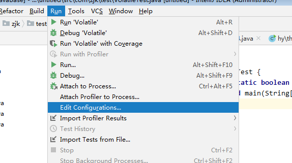
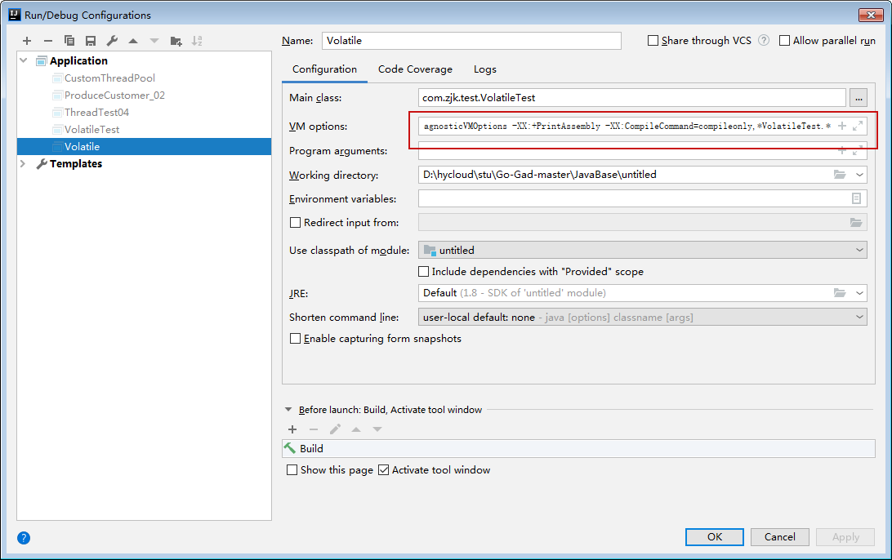
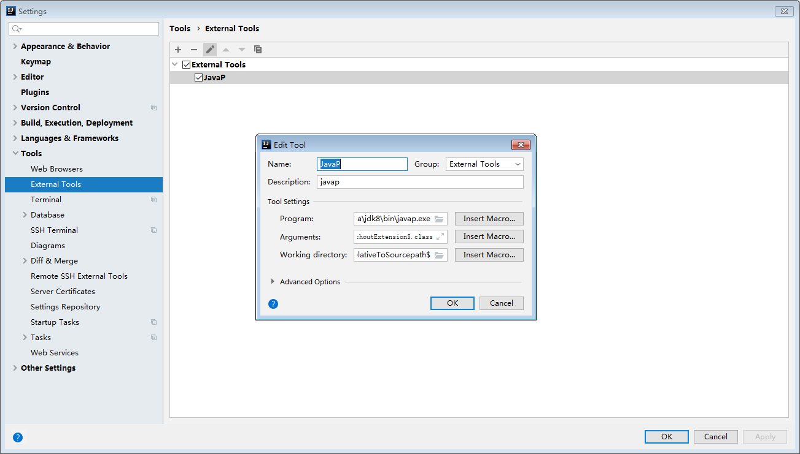
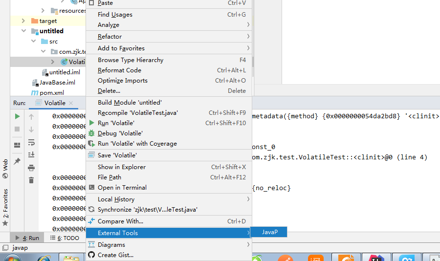

### Idea使用javap和hsdis

#### 使用hsdis

1、hsdis可从github上下载，

2、拷贝hsdis文件到jdk目录

​	将hsdis-amd64.dll、hsdis-i386.dll拷贝到jre/bin/server

​	将hsdis-amd64.dll、hsdis-i386.dll拷贝到jdk/jre/bin/server

3、在Idea中打开  run > Edit Configurations



4、配置VM参数



-server -Xcomp -XX:+UnlockDiagnosticVMOptions -XX:+PrintAssembly -XX:CompileCommand=compileonly,* VolatileTest.*

加上具体的类名* VolatileTest.* ，能够排除很多其他的汇编指令

5、具体结果（部分）如下：

```sh
CompilerOracle: compileonly *VolatileTest.*
Loaded disassembler from D:\Program Files\Java\jdk8\jre\bin\server\hsdis-amd64.dll
Decoding compiled method 0x0000000002a04950:
Code:
[Disassembling for mach='i386:x86-64']
[Entry Point]
[Verified Entry Point]
[Constants]
  # {method} {0x0000000054bd2ad8} '<clinit>' '()V' in 'com/zjk/test/VolatileTest'
  #           [sp+0x40]  (sp of caller)
  0x0000000002a04aa0: mov    %eax,-0x6000(%rsp)
  0x0000000002a04aa7: push   %rbp
  0x0000000002a04aa8: sub    $0x30,%rsp
  0x0000000002a04aac: movabs $0x54bd2b98,%rsi   ;   {metadata(method data for {method} {0x0000000054bd2ad8} '<clinit>' '()V' in 'com/zjk/test/VolatileTest')}
  0x0000000002a04ab6: mov    0xdc(%rsi),%edi
  0x0000000002a04abc: add    $0x8,%edi
  0x0000000002a04abf: mov    %edi,0xdc(%rsi)
  0x0000000002a04ac5: movabs $0x54bd2ad0,%rsi   ;   {metadata({method} {0x0000000054bd2ad8} '<clinit>' '()V' in 'com/zjk/test/VolatileTest')}
  0x0000000002a04acf: and    $0x0,%edi
  0x0000000002a04ad2: cmp    $0x0,%edi
  0x0000000002a04ad5: je     0x0000000002a04b04  ;*iconst_0
                                                ; - com.zjk.test.VolatileTest::<clinit>@0 (line 4)

  0x0000000002a04adb: nopl   0x0(%rax,%rax,1)
  0x0000000002a04ae0: jmpq   0x0000000002a04b6a  ;   {no_reloc}
  0x0000000002a04ae5: add    %al,(%rax)
  0x0000000002a04ae7: add    %al,(%rax)
  0x0000000002a04ae9: add    %bh,0x0(%rdi)
  0x0000000002a04aef: mov    %dil,0x68(%rsi)
  0x0000000002a04af3: lock addl $0x0,(%rsp)     ;*putstatic flag
                                                ; - com.zjk.test.VolatileTest::<clinit>@1 (line 4)
```

#### 使用javap



Arguments: 

```java
-c $FileNameWithoutExtension$.class
```

Working directary:

```java
$OutputPath$/$FileDirRelativeToSourcepath$
```

具体的java文件上右键：



得到java字节码，结果如下：

```java
"D:\Program Files\Java\jdk8\bin\javap.exe" -c VolatileTest.class
Compiled from "VolatileTest.java"
public class com.zjk.test.VolatileTest {
  public static volatile boolean flag;

  public com.zjk.test.VolatileTest();
    Code:
       0: aload_0
       1: invokespecial #1                  // Method java/lang/Object."<init>":()V
       4: return

  public static void main(java.lang.String[]);
    Code:
       0: iconst_0
       1: istore_1
       2: iload_1
       3: iconst_5
       4: if_icmpge     20
       7: getstatic     #2                  // Field java/lang/System.out:Ljava/io/PrintStream;
      10: iload_1
      11: invokevirtual #3                  // Method java/io/PrintStream.println:(I)V
      14: iinc          1, 1
      17: goto          2
      20: iconst_1
      21: putstatic     #4                  // Field flag:Z
      24: getstatic     #2                  // Field java/lang/System.out:Ljava/io/PrintStream;
      27: ldc           #5                  // String 执行完毕
      29: invokevirtual #6                  // Method java/io/PrintStream.println:(Ljava/lang/String;)V
      32: return

  static {};
    Code:
       0: iconst_0
       1: putstatic     #4                  // Field flag:Z
       4: return
}

```

