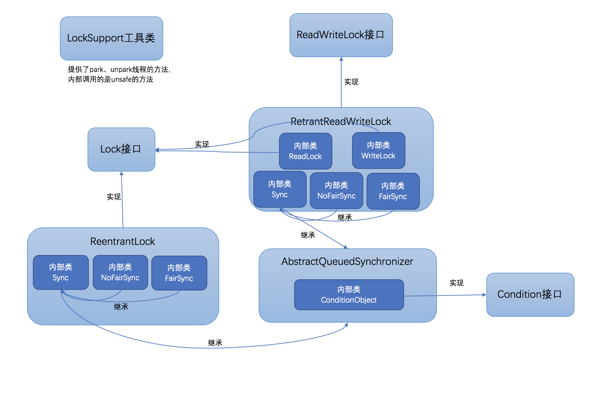
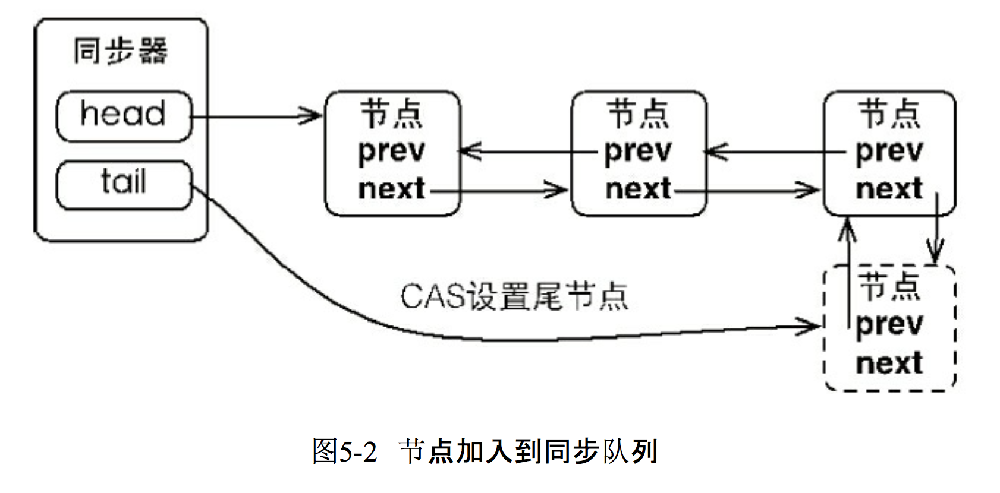
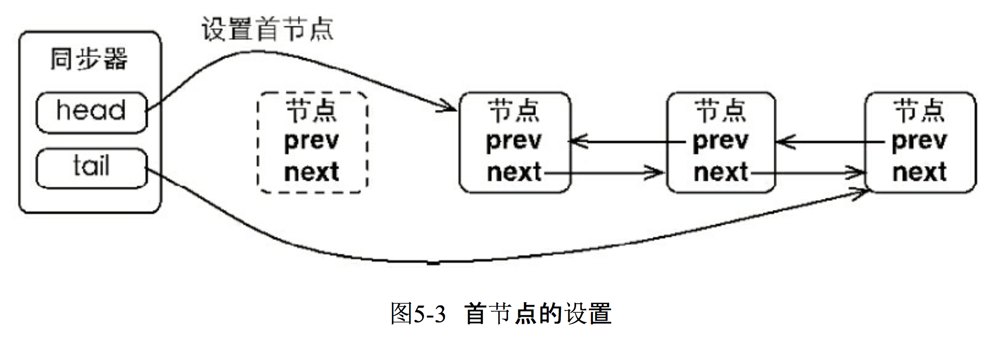
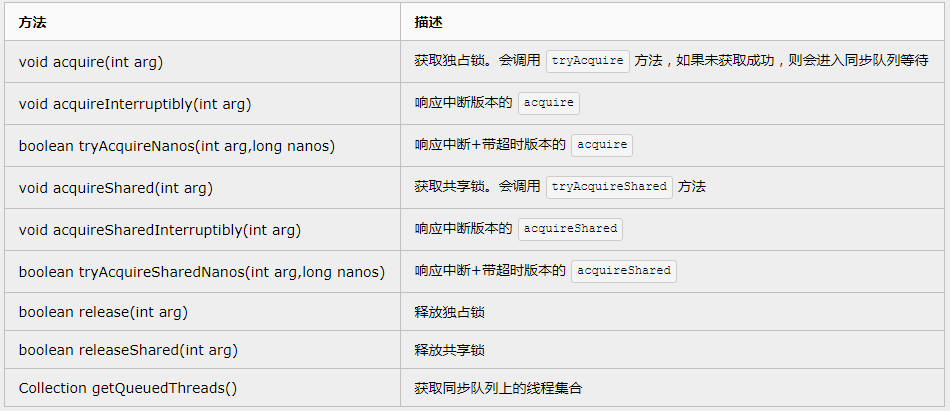

### AQS简介

​	AbstractQueuedSynchronizer(AQS)是JDK中实现并发编程的核心，用于构建锁或者其他相关同步装置的基础框架，JUC中的ReentrantLock、CountDownLatch等都是基于它来实现的。

​	synchronized：是jvm层面上的锁，是jvm内部实现的（C++实现），锁操作是在宿主机上完成。

​	Lock（基于AQS实现）：是Java语言层面上的锁，在Java语言层面上就能完成锁操作，Java中实现Lock接口实现的锁，都是基于AQS的，是Java层面的锁。

​	公平锁：先进来的线程先执行，当一个线程抢到锁时，会检查同步队列中是否有比当前线程先进入的线程，如果有就将锁让给最先进来的线程执行。

​	非公平锁：抢到锁的线程先执行

LockSupport、Lock、Condition、AQS、ReentrantLock等的关系



### AQS具体实现

​	AQS中通过一个双向的FIFO同步队列来维护获取对象锁的线程，当获取锁失败的时候，会用当前线程构建一个Node节点，加入到同步队列中。

​	AQS中维护了同步队列的head和tail节点以及同步状态

​	Node节点中维护了当前线程的status和前驱节点、后续节点、下一个等待节点（条件等待的时候用）

####  waitStatus包含如下状态：

​	 **CANCELLED(1):** 一个节点由于超时或者中断需要在CLH队列中取消等待状态,被取消的节点不会再次等待（即当前线程正在执行（要么永远不执行--取消执行），不在同步队列里）

​	**默认值(0):** 当前线程在同步队列中，而且是头节点 --- 即将要获取到锁（得到执行线程的机会）

​	**SIGNAL(-1):** 当前节点的后继节点处于等待状态时,如果当前节点的同步状态被释放或者取消, 必须唤起它的后继节点（当前线程已经执行完毕，锁释放的状态，同时要通知后续线程进入等待状态 --- 即使next节点 状态更改为 0）

​	**CONDITION(-2): **当前节点在等待队列中,只有当节点的状态设为0的时候该节点才会被转移到同步队列(当前线程在等待集合里（ wait set），不在同步队列里)

​	**PROPAGATE(-3):** 下一次的共享模式同步状态的获取将会无条件的传播

#### AQS同步器结构：

基础结构


当有节点加入到同步队列的时候，只需要对tail节点重新指向就可以了 



同步队列是一个FIFO的队列，在获取锁的时候总是首节点是获取同步状态的节点，首节点的线程在释放同步状态时，将会唤醒后继节点，而后继节点在获取同步状态成功时，会将自己设置为首节点。 

**首节点设置不需要CAS操作，因为在并发环境中只有一个线程都获取到锁，只有获取到锁的线程才能设置首节点。** 



### AQS-API

AQS主要做了三件事

 + 同步状态管理
 + 线程的阻塞和唤醒
 + 同步队列的维护

AQS同步状态的访问/修改

+ int getState(): 获取同步状态 
+ void setState(): 设置同步状态 
+ boolean compareAndSetState(int expect, int update)：基于CAS，原子设置当前状态 

要自定义基于AQS的同步工具时，可以选择覆盖以下几个方法来实现同步状态的管理：

+ tryAcquire ：排它的获取这个状态。这个方法的实现需要查询当前状态是否允许获取，然后再进行获取（使用compareAndSetState来做）状态。 
+ tryRelease：释放状态 
+ tryAcquireShared：共享的模式下获取状态
+ tryReleaseShared：共享的模式下释放状态 
+ isHeldExclusively：在排它模式下，状态是否被占用 

以上几个方法具体实现时都应该是非阻塞的

AQS本身将同步状态的管理用模板方法模式都封装好了，以下列举了AQS中的一些模板方法： 



以上方法，从语义上来区分就是获取和释放，从模式上区分就是独占式和共享式，从中断相应上来看就是支持和不支持 

### 详细解读

#### 队列节点Node类源码

```java
static final class Node {
     // 共享模式下等待的标记
    static final Node SHARED = new Node();
    
    // 独占模式下等待的标记
    static final Node EXCLUSIVE = null;

    // 等待状态：取消
    static final int CANCELLED =  1;
    
    // 等待状态：通知 表示后继线程需要被唤醒
    static final int SIGNAL    = -1;
    
    // 等待状态：条件等待 表示线程在Condtion上
    static final int CONDITION = -2;
    
    // 表示下一个acquireShared需要无条件的传播
    static final int PROPAGATE = -3;

    /**
     * 等待状态
     */
    volatile int waitStatus;

   /**
    * 当前节点的前驱节点,当前线程依赖它来检查waitStatus,在入队的时候才被分配，
    * 并且只在出队的时候才被取消(为了GC),头节点永远不会被取消，
    * 一个节点成为头节点仅仅是成功获取到锁的结果,
    * 一个被取消的线程永远也不会获取到锁,线程只取消自身,而不涉及其他节点 
    */
    volatile Node prev;

    /**
     * 当前节点的后继节点,当前线程释放的才被唤起,在入队时分配,
     * 在绕过被取消的前驱节点时调整,在出队列的时候取消(为了GC)
     * 如果一个节点的next为空,我们可以从尾部扫描它的prev,双重检查
     * 被取消节点的next设置为指向节点本身而不是null,为了isOnSyncQueue更容易操作
     */
    volatile Node next;

    //使该节点排队的线程。 在构造时初始化，使用后为空。
    volatile Thread thread;
   
    /**
     * 链接到下一个节点的等待条件,或特殊的值SHARED,因为条件队列只有在独占模式时才能被访问,
     * 所以我们只需要一个简单的连接队列在等待的时候保存节点,然后把它们转移到队列中重新获取
     * 因为条件只能是独占性的,我们通过使用特殊的值来表示共享模式
     */
    Node nextWaiter;

    //如果节点处于共享模式下等待直接返回true
    final boolean isShared() {
        return nextWaiter == SHARED;
    }

    //此节点的前一个节点
    final Node predecessor() throws NullPointerException {
        Node p = prev;
        if (p == null)
            throw new NullPointerException();
        else
            return p;
    }

    Node() {    // Used to establish initial head or SHARED marker
    }
    
    // 指定线程和模式的构造方法
    Node(Thread thread, Node mode) {     // Used by addWaiter
        this.nextWaiter = mode;
        this.thread = thread;
    }
    // 指定线程和节点状态的构造方
    Node(Thread thread, int waitStatus) { // Used by Condition
        this.waitStatus = waitStatus;
        this.thread = thread;
    }
}
```

#### AQS的成员变量

```java
//head:等待队列头部，延迟初始化，直到调用enq()方法才真正初始化；
private transient volatile Node head;
//tail:等待队列尾部，延迟初始化，直到调用enq（）方法才真正初始化；
private transient volatile Node tail;
// state:AQS状态位，通过try*方法维护；
// state（AQS状态）的操作 ： getState() ，setState()  ，compareAndSetState()
private volatile int state;
```

####  获取独占锁的实现

AQS独占锁的获取的流程示意如下： 


acquire(int arg)具体实现：

```java
/**
 * 获取独占锁，对中断不敏感。
 * 首先尝试获取一次锁，如果成功，则返回；
 * 否则会把当前线程包装成Node插入到队列中，在队列中会检测是否为head的直接后继，并尝试获取锁,
 * 如果获取失败，则会通过LockSupport阻塞当前线程，直至被释放锁的线程唤醒或者被中断，随后再次尝试获取锁，如此反复。
 */
public final void acquire(int arg) {
    if (!tryAcquire(arg) &&
        acquireQueued(addWaiter(Node.EXCLUSIVE), arg))
        selfInterrupt();
}

/**
 * 在队列中新增一个节点。
 */
private Node addWaiter(Node mode) {
    Node node = new Node(Thread.currentThread(), mode);
    Node pred = tail;
    // 快速尝试
    if (pred != null) {
        node.prev = pred;
        // 通过CAS在队尾插入当前节点
        if (compareAndSetTail(pred, node)) {
            pred.next = node;
            return node;
        }
    }
    // 初始情况或者在快速尝试失败后插入节点
    enq(node);
    return node;
}

/**
 * 通过循环+CAS在队列中成功插入一个节点后返回。
 */
private Node enq(final Node node) {
    for (;;) {
        Node t = tail;
        // 初始化head和tail
        if (t == null) {
            if (compareAndSetHead(new Node()))
                tail = head;
        } else {
            /*
             * AQS的精妙就是体现在很多细节的代码，比如需要用CAS往队尾里增加一个元素
             * 此处的else分支是先在CAS的if前设置node.prev = t，而不是在CAS成功之后再设置。
             * 一方面是基于CAS的双向链表插入目前没有完美的解决方案，另一方面这样子做的好处是：
             * 保证每时每刻tail.prev都不会是一个null值，否则如果node.prev = t
             * 放在下面if的里面，会导致一个瞬间tail.prev = null，这样会使得队列不完整。
             */
            node.prev = t;
            // CAS设置tail为node，成功后把老的tail也就是t连接到node。
            if (compareAndSetTail(t, node)) {
                t.next = node;
                return t;
            }
        }
    }
}

/**
 * 在队列中的节点通过此方法获取锁，对中断不敏感。
 */
final boolean acquireQueued(final Node node, int arg) {
    boolean failed = true;
    try {
        boolean interrupted = false;
        for (;;) {
            final Node p = node.predecessor();
            /*
             * 检测当前节点前驱是否head，这是试获取锁的资格。
             * 如果是的话，则调用tryAcquire尝试获取锁,
             * 成功，则将head置为当前节点。
             */
            if (p == head && tryAcquire(arg)) {
                setHead(node);
                p.next = null; // help GC
                failed = false;
                return interrupted;
            }
            /*
             * 如果未成功获取锁则根据前驱节点判断是否要阻塞。
             * 如果阻塞过程中被中断，则置interrupted标志位为true。
             * shouldParkAfterFailedAcquire方法在前驱状态不为SIGNAL的情况下都会循环重试获取锁。
             */
            if (shouldParkAfterFailedAcquire(p, node) &&
                parkAndCheckInterrupt())
                interrupted = true;
        }
    } finally {
        if (failed)
            cancelAcquire(node);
    }
}

/**
 * 根据前驱节点中的waitStatus来判断是否需要阻塞当前线程。
 */
private static boolean shouldParkAfterFailedAcquire(Node pred, Node node) {
    int ws = pred.waitStatus;
    if (ws == Node.SIGNAL)
        /*
         * 前驱节点设置为SIGNAL状态，在释放锁的时候会唤醒后继节点，
         * 所以后继节点（也就是当前节点）现在可以阻塞自己。
         */
        return true;
    if (ws > 0) {
        /*
         * 前驱节点状态为取消,向前遍历，更新当前节点的前驱为往前第一个非取消节点。
         * 当前线程会之后会再次回到循环并尝试获取锁。
         */
        do {
            node.prev = pred = pred.prev;
        } while (pred.waitStatus > 0);
        pred.next = node;
    } else {
         /**
          * 等待状态为0或者PROPAGATE(-3)，设置前驱的等待状态为SIGNAL,
          * 并且之后会回到循环再次重试获取锁。
          */
        compareAndSetWaitStatus(pred, ws, Node.SIGNAL);
    }
    return false;
}


/**
 * 该方法实现某个node取消获取锁。
 */
private void cancelAcquire(Node node) {

   if (node == null)
       return;

   node.thread = null;

   // 遍历并更新节点前驱，把node的prev指向前部第一个非取消节点。
   Node pred = node.prev;
   while (pred.waitStatus > 0)
       node.prev = pred = pred.prev;

   // 记录pred节点的后继为predNext，后续CAS会用到。
   Node predNext = pred.next;

   // 直接把当前节点的等待状态置为取消,后继节点即便也在cancel可以跨越node节点。
   node.waitStatus = Node.CANCELLED;

   /*
    * 如果CAS将tail从node置为pred节点了
    * 则剩下要做的事情就是尝试用CAS将pred节点的next更新为null以彻底切断pred和node的联系。
    * 这样一来就断开了pred与pred的所有后继节点，这些节点由于变得不可达，最终会被回收掉。
    * 由于node没有后继节点，所以这种情况到这里整个cancel就算是处理完毕了。
    *
    * 这里的CAS更新pred的next即使失败了也没关系，说明有其它新入队线程或者其它取消线程更新掉了。
    */
   if (node == tail && compareAndSetTail(node, pred)) {
       compareAndSetNext(pred, predNext, null);
   } else {
       // 如果node还有后继节点，这种情况要做的事情是把pred和后继非取消节点拼起来。
       int ws;
       if (pred != head &&
           ((ws = pred.waitStatus) == Node.SIGNAL ||
            (ws <= 0 && compareAndSetWaitStatus(pred, ws, Node.SIGNAL))) &&
           pred.thread != null) {
           Node next = node.next;
           /* 
            * 如果node的后继节点next非取消状态的话，则用CAS尝试把pred的后继置为node的后继节点
            * 这里if条件为false或者CAS失败都没关系，这说明可能有多个线程在取消，总归会有一个能成功的。
            */
           if (next != null && next.waitStatus <= 0)
               compareAndSetNext(pred, predNext, next);
       } else {
           /*
            * 这时说明pred == head或者pred状态取消或者pred.thread == null
            * 在这些情况下为了保证队列的活跃性，需要去唤醒一次后继线程。
            * 举例来说pred == head完全有可能实际上目前已经没有线程持有锁了，
            * 自然就不会有释放锁唤醒后继的动作。如果不唤醒后继，队列就挂掉了。
            * 
            * 这种情况下看似由于没有更新pred的next的操作，队列中可能会留有一大把的取消节点。
            * 实际上不要紧，因为后继线程唤醒之后会走一次试获取锁的过程，
            * 失败的话会走到shouldParkAfterFailedAcquire的逻辑。
            * 那里面的if中有处理前驱节点如果为取消则维护pred/next,踢掉这些取消节点的逻辑。
            */
           unparkSuccessor(node);
       }
       
       /*
        * 取消节点的next之所以设置为自己本身而不是null,
        * 是为了方便AQS中Condition部分的isOnSyncQueue方法,
        * 判断一个原先属于条件队列的节点是否转移到了同步队列。
        *
        * 因为同步队列中会用到节点的next域，取消节点的next也有值的话，
        * 可以断言next域有值的节点一定在同步队列上。
        *
        * 在GC层面，和设置为null具有相同的效果。
        */
       node.next = node; 
   }
}

/**
 * 唤醒后继线程。
 */
private void unparkSuccessor(Node node) {
    int ws = node.waitStatus;
    // 尝试将node的等待状态置为0,这样的话,后继争用线程可以有机会再尝试获取一次锁。
    if (ws < 0)
        compareAndSetWaitStatus(node, ws, 0);

    Node s = node.next;
    /*
     * 这里的逻辑就是如果node.next存在并且状态不为取消，则直接唤醒s即可
     * 否则需要从tail开始向前找到node之后最近的非取消节点。
     *
     * 这里为什么要从tail开始向前查找也是值得琢磨的:
     * 如果读到s == null，不代表node就为tail，参考addWaiter以及enq函数中的我的注释。
     * 不妨考虑到如下场景：
     * 1. node某时刻为tail
     * 2. 有新线程通过addWaiter中的if分支或者enq方法添加自己
     * 3. compareAndSetTail成功
     * 4. 此时这里的Node s = node.next读出来s == null，但事实上node已经不是tail，它有后继了!
     */
    if (s == null || s.waitStatus > 0) {
        s = null;
        for (Node t = tail; t != null && t != node; t = t.prev)
            if (t.waitStatus <= 0)
                s = t;
    }
    if (s != null)
        LockSupport.unpark(s.thread);
}
```

 #### 释放独占锁的实现

release的具体代码实现： 

```java
public final boolean release(int arg) {
    if (tryRelease(arg)) {
        /*
         * 此时的head节点可能有3种情况:
         * 1. null (AQS的head延迟初始化+无竞争的情况)
         * 2. 当前线程在获取锁时new出来的节点通过setHead设置的
         * 3. 由于通过tryRelease已经完全释放掉了独占锁，有新的节点在acquireQueued中获取到了独占锁，并设置了head

         * 第三种情况可以再分为两种情况：
         * （一）时刻1:线程A通过acquireQueued，持锁成功，set了head
         *          时刻2:线程B通过tryAcquire试图获取独占锁失败失败，进入acquiredQueued
         *          时刻3:线程A通过tryRelease释放了独占锁
         *          时刻4:线程B通过acquireQueued中的tryAcquire获取到了独占锁并调用setHead
         *          时刻5:线程A读到了此时的head实际上是线程B对应的node
         * （二）时刻1:线程A通过tryAcquire直接持锁成功，head为null
         *          时刻2:线程B通过tryAcquire试图获取独占锁失败失败，入队过程中初始化了head，进入acquiredQueued
         *          时刻3:线程A通过tryRelease释放了独占锁，此时线程B还未开始tryAcquire
         *          时刻4:线程A读到了此时的head实际上是线程B初始化出来的傀儡head
         */
        Node h = head;
        // head节点状态不会是CANCELLED，所以这里h.waitStatus != 0相当于h.waitStatus < 0
        if (h != null && h.waitStatus != 0)
            // 唤醒后继线程，此函数在acquire中已经分析过，不再列举说明
            unparkSuccessor(h);
        return true;
    }
    return false;
}
```

 整个release做的事情就是

1. 调用tryRelease
2. 如果tryRelease返回true也就是独占锁被完全释放，唤醒后继线程。

这里的唤醒是根据head几点来判断的，上面代码的注释中也分析了head节点的情况，只有在head存在并且等待状态小于零的情况下唤醒。

​	完全释放掉锁的含义，简单来说就是当前锁处于无主状态，等待线程有可能可以获取。 eg：对于可重入锁ReentrantLock, 每次tryAcquire后，state会+1，每次tryRelease后，state会-1，如果state变为0了，则此时称独占锁被完全释放了。

#### 获取共享锁的实现

​	与获取独占锁的实现不同的关键在于，共享锁允许多个线程持有。 如果需要使用AQS中共享锁，在实现tryAcquireShared方法时需要注意，返回负数表示获取失败;返回0表示成功，但是后继争用线程不会成功;返回正数表示 获取成功，并且后继争用线程也可能成功。 

```java
public final void acquireShared(int arg) {
    if (tryAcquireShared(arg) < 0)
        doAcquireShared(arg);
}

private void doAcquireShared(int arg) {
    final Node node = addWaiter(Node.SHARED);
    boolean failed = true;
    try {
        boolean interrupted = false;
        for (;;) {
            final Node p = node.predecessor();
            if (p == head) {
                int r = tryAcquireShared(arg);
                // 一旦共享获取成功，设置新的头结点，并且唤醒后继线程
                if (r >= 0) {
                    setHeadAndPropagate(node, r);
                    p.next = null; // help GC
                    if (interrupted)
                        selfInterrupt();
                    failed = false;
                    return;
                }
            }
            if (shouldParkAfterFailedAcquire(p, node) &&
                parkAndCheckInterrupt())
                interrupted = true;
        }
    } finally {
        if (failed)
            cancelAcquire(node);
    }
}

/**
 * 这个函数做的事情有两件:
 * 1. 在获取共享锁成功后，设置head节点
 * 2. 根据调用tryAcquireShared返回的状态以及节点本身的等待状态来判断是否要需要唤醒后继线程。
 */
private void setHeadAndPropagate(Node node, int propagate) {
    // 把当前的head封闭在方法栈上，用以下面的条件检查。
    Node h = head;
    setHead(node);
    /*
     * propagate是tryAcquireShared的返回值，这是决定是否传播唤醒的依据之一。
     * h.waitStatus为SIGNAL或者PROPAGATE时也根据node的下一个节点共享来决定是否传播唤醒，
     * 这里为什么不能只用propagate > 0来决定是否可以传播在本文下面的思考问题中有相关讲述。
     */
    if (propagate > 0 || h == null || h.waitStatus < 0 ||
        (h = head) == null || h.waitStatus < 0) {
        Node s = node.next;
        if (s == null || s.isShared())
            doReleaseShared();
    }
}

/**
 * 这是共享锁中的核心唤醒函数，主要做的事情就是唤醒下一个线程或者设置传播状态。
 * 后继线程被唤醒后，会尝试获取共享锁，如果成功之后，则又会调用setHeadAndPropagate,将唤醒传播下去。
 * 这个函数的作用是保障在acquire和release存在竞争的情况下，保证队列中处于等待状态的节点能够有办法被唤醒。
 */
private void doReleaseShared() {
    /*
     * 以下的循环做的事情就是，在队列存在后继线程的情况下，唤醒后继线程；
     * 或者由于多线程同时释放共享锁由于处在中间过程，读到head节点等待状态为0的情况下，
     * 虽然不能unparkSuccessor，但为了保证唤醒能够正确稳固传递下去，设置节点状态为PROPAGATE。
     * 这样的话获取锁的线程在执行setHeadAndPropagate时可以读到PROPAGATE，从而由获取锁的线程去释放后继等待线程。
     */
    for (;;) {
        Node h = head;
        // 如果队列中存在后继线程。
        if (h != null && h != tail) {
            int ws = h.waitStatus;
            if (ws == Node.SIGNAL) {
                if (!compareAndSetWaitStatus(h, Node.SIGNAL, 0))
                    continue;
                unparkSuccessor(h);
            }
            // 如果h节点的状态为0，需要设置为PROPAGATE用以保证唤醒的传播。
            else if (ws == 0 &&
                     !compareAndSetWaitStatus(h, 0, Node.PROPAGATE))
                continue;
        }
        // 检查h是否仍然是head，如果不是的话需要再进行循环。
        if (h == head)
            break;
    }
}
```

#### 释放共享锁的实现

释放共享锁与获取共享锁的代码共享了doReleaseShared，用于实现唤醒的传播。 

```java
public final boolean releaseShared(int arg) {
    if (tryReleaseShared(arg)) {
        // doReleaseShared的实现上面获取共享锁已经介绍
        doReleaseShared();
        return true;
    }
    return false;
}
```

