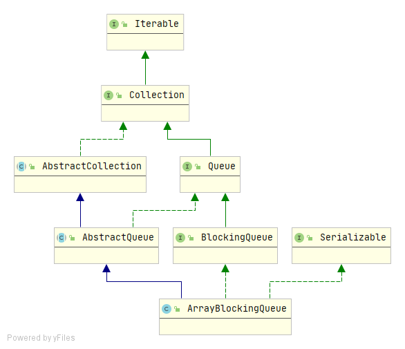

## ArrayBlockingQueue深入理解

### 简介

ArrayBlockingQueue是一种底层基于**数组**实现，实现了**BlockingQueue**接口的**有界阻塞队列**，需要在构造时指定队列的容量，是JDK1.5时随着JUC包引入的。

**继承结构：**



**ArrayBlockingQueue具有如下特点：**

+ 队列的容量在构造时指定，后续不能改变
+ 插入元素时在队尾插入，删除元素时在队首进行
+ 队列满时，调用特定的方法（put）插入元素会阻塞，队列空时，删除元素也会阻塞线程
+ 支持公平/非公平策略，默认为非公平策略，通过`ReentrantLock`实现的

> 这里的公平策略指的是当线程从阻塞到唤醒后，以最初请求的顺序(FIFO)来添加或者删除元素；非公平策略指的是线程被唤醒后，谁先抢占到锁，谁就能往队列中添加/删除元素，顺序是随机的。

### 实现原理

**核心参数：**

```java
public class ArrayBlockingQueue<E> extends AbstractQueue<E>
        implements BlockingQueue<E>, java.io.Serializable {
	// 内部数组，用于存储整个队列的元素
    final Object[] items;
    // 下一个待删除元素的索引，take、poll、peek、remove方法使用
    int takeIndex;
	// 下一个待插入元素位置的索引：put、offer、add
    int putIndex;
	// 队列中的元素个数
    int count;
	// 全局锁
    final ReentrantLock lock;
	// 非空条件队列，当队列空时，线程在该队列等待获取
    private final Condition notEmpty;
	// 非满条件队列，当队列满时线程在该队列等待插入
    private final Condition notFull;
}
```

**构造方法：**

```java
// 指定队列容量，默认采用非公平策略
public ArrayBlockingQueue(int capacity) {
    this(capacity, false);
}
// 指定队列初始容量和公平/非公平策略
public ArrayBlockingQueue(int capacity, boolean fair) {
    if (capacity <= 0)
        throw new IllegalArgumentException();
    this.items = new Object[capacity];
    lock = new ReentrantLock(fair);
    notEmpty = lock.newCondition();
    notFull =  lock.newCondition();
}
// 根据已有集合构造队列
// 
public ArrayBlockingQueue(int capacity, boolean fair,
                              Collection<? extends E> c) {
    this(capacity, fair);

    final ReentrantLock lock = this.lock;
    lock.lock(); // 加锁，用于保证items数组的可见性
    try {
        int i = 0;
        try {
            for (E e : c) {
                checkNotNull(e);// 元素不能为null
                items[i++] = e;
            }
        } catch (ArrayIndexOutOfBoundsException ex) {
            throw new IllegalArgumentException();
        }
        count = i;
        putIndex = (i == capacity) ? 0 : i; // 如果队列已满则重置putIndex索引为0
    } finally {
        lock.unlock(); // 解锁
    }
}
```

核心就是第二种构造方法，从构造方法可以看出，ArrayBlockingQueue在构造时就指定了内部数组的大小，并且通过ReentrantLock来保证并发环境下的线程安全。

ArrayBlockingQueue的公平/非公平策略其实就是内部ReentrantLock对象的策略，另外构造时还创建了两个Condition对象，在队列满时，插入线程需要在notFull上等待，当队列空时，删除线程会在notEmpty上等待。

对于`takeIndex`和`putIndex`的理解，结合数组items，形成类似于环形数组的结构，当`takeIndex`和`putIndex`达到最大值后又会从0开始。

### 方法摘要

**插入元素：**

```java
// 在队尾插入元素，插入成功返回true，如果队列已经满了，抛出IllegalStateException异常
public boolean add(E e);
// 在队尾插入元素，插入成功返回true，如果队列满了插入失败，返回false
public boolean offer(E e);
// 在队尾插入元素，如果队列满了等待指定的时间，插入成功返回true，插入失败返回false
public boolean offer(E e, long timeout, TimeUnit unit) throws InterruptedException
// 在队尾插入元素，插入成功返回true，如果队列满了，线程阻塞直到队列空闲 
public void put(E e) throws InterruptedException    
```

**获取元素：**

```java
// 检索，但并不删除队列的头元素，如果队列为空，则返回null
public E peek();
// 检索并删除队列的头元素，如果队列为空，则返回null
public E poll();
// 检索并删除此队列的头，如果队列为空，等待指定的等待时间
public E poll(long timeout, TimeUnit unit) throws InterruptedException;
// 从队列中删除指定的元素
public boolean remove(Object o);
// 检索并删除此队列的头，如果队列为空,线程阻塞直到有可用的元素
public E take() throws InterruptedException;
```

**其他方法：**

```java
// 原子的清除队列中的所有元素
public void clear();
// 判断队列中是否包含指定的元素
public boolean contains(Object o);
// 从该队列中删除所有可用的元素，并将它们添加到给定的集合中
public int drainTo(Collection<? super E> c);
// 最多从队列中删除指定数量的元素，并将它们返回到给定的集合中
public int drainTo(Collection<? super E> c, int maxElements);
// 返回该队列的迭代器
public Iterator<E> iterator();
// 获取队列空闲空间
public int remainingCapacity();
// 返回队列中元素个数
public int size();
// 返回此队列中的元素Spliterator
public Spliterator<E> spliterator();
```

### 源码分析

#### 插入元素源码分析

**add方法:**

```java
public boolean add(E e) {
    // 调用父类的方法
    return super.add(e);
}
// AbstractQueue#add
public boolean add(E e) {
    if (offer(e))
        return true;
    else // 添加失败抛出异常
        throw new IllegalStateException("Queue full");
}
```

**offer方法：**

```java
public boolean offer(E e) {
    // 判断元素e是否为null
    checkNotNull(e);
    // 获取锁
    final ReentrantLock lock = this.lock;
    lock.lock();
    try {
        // 判断队列是否已经满了
        if (count == items.length)
            return false;
        else {
            enqueue(e);
            return true;
        }
    } finally {// 释放锁
        lock.unlock();
    }
}
private void enqueue(E x) {
    final Object[] items = this.items;
    // 将元素添加到putIndex的位置
    items[putIndex] = x;
    // putIndex后移一位
    if (++putIndex == items.length)
        // 如果等于队列最大容量则putIndex设置为0，相当于从头开始
        putIndex = 0;
    // 队列中的元素个数+1
    count++;
    // 通知一个正在等待获取元素的线程
    notEmpty.signal();
}

public boolean offer(E e, long timeout, TimeUnit unit)
        throws InterruptedException {

    checkNotNull(e);
    long nanos = unit.toNanos(timeout);
    final ReentrantLock lock = this.lock;
    lock.lockInterruptibly();
    try {
        while (count == items.length) { //如果队列满了
            if (nanos <= 0) // 等待超时
                return false;
            nanos = notFull.awaitNanos(nanos);
        }
        enqueue(e);
        return true;
    } finally {
        lock.unlock();
    }
}
```

**put方法：**

```java
public void put(E e) throws InterruptedException {
    checkNotNull(e);
    final ReentrantLock lock = this.lock;
    lock.lockInterruptibly();
    try {
        while (count == items.length) //如果队列满了
            notFull.await(); // 线程阻塞
        enqueue(e);
    } finally {
        lock.unlock();
    }
}
```

#### 获取元素源码分析

**peek方法:**

```java
public E peek() {
    final ReentrantLock lock = this.lock;
    lock.lock();
    try {
        return itemAt(takeIndex); // 如果队列为空，返回null
    } finally {
        lock.unlock();
    }
}
final E itemAt(int i) {
    return (E) items[i];
}
```

**poll方法：**

```java
public E poll() {
    final ReentrantLock lock = this.lock;
    lock.lock();
    try {
        return (count == 0) ? null : dequeue();
    } finally {
        lock.unlock();
    }
}
private E dequeue() {
    final Object[] items = this.items;
    @SuppressWarnings("unchecked")
    // 取出元素
    E x = (E) items[takeIndex];
    // 设置为null，相当于删除
    items[takeIndex] = null;
    // 下次删除的元素下标等于队列的最大容量？
    if (++takeIndex == items.length)
        // 下次删除的下标位置设置为0
        takeIndex = 0;
    // 队列中的数量减一
    count--;
    if (itrs != null)
        itrs.elementDequeued();
    // 通知等待插入的线程
    notFull.signal();
    return x;
}

public E poll(long timeout, TimeUnit unit) throws InterruptedException {
    long nanos = unit.toNanos(timeout);
    final ReentrantLock lock = this.lock;
    lock.lockInterruptibly();
    try {
        while (count == 0) { // 队列为空
            if (nanos <= 0)
                return null;// 等待超时
            nanos = notEmpty.awaitNanos(nanos);
        }
        // 删除头结点
        return dequeue();
    } finally {
        lock.unlock();
    }
}
```

**remove方法：**

```java
// 删除指定的元素
public boolean remove(Object o) {
    if (o == null) return false;
    final Object[] items = this.items;
    final ReentrantLock lock = this.lock;
    lock.lock();
    try {
        if (count > 0) {// 队列不为空
            final int putIndex = this.putIndex;
            int i = takeIndex;
            do {
                if (o.equals(items[i])) { // 逐个判断，找到就删除
                    removeAt(i);
                    return true;
                }
                if (++i == items.length)// 如果下标i达到了队列的最大容量，从头部继续遍历
                    i = 0;
            } while (i != putIndex); // i==putindex,表示队列遍历完了
        }
        return false;
    } finally {
        lock.unlock();
    }
}
void removeAt(final int removeIndex) {
    final Object[] items = this.items;
    if (removeIndex == takeIndex) { // 删除的元素就是下次删除会删除的元素，
        // removing front item; just advance
        // 直接删除，队列元素不需要移动
        items[takeIndex] = null;
        if (++takeIndex == items.length)
            takeIndex = 0;
        count--;
        if (itrs != null)
            itrs.elementDequeued();
    } else { // 删除中间元素，数组需要移动
        final int putIndex = this.putIndex;
        for (int i = removeIndex;;) {
            int next = i + 1;
            if (next == items.length)
                next = 0;
            if (next != putIndex) {
                items[i] = items[next];
                i = next;
            } else {
                items[i] = null;
                this.putIndex = i;
                break;
            }
        }
        count--;
        if (itrs != null)
            itrs.removedAt(removeIndex);
    }
    // 通知等待插入的线程
    notFull.signal();
}

public E take() throws InterruptedException {
    final ReentrantLock lock = this.lock;
    lock.lockInterruptibly();
    try {
        while (count == 0) //队列为空，线程阻塞
            notEmpty.await();
        // 删除元素，并返回
        return dequeue();
    } finally {
        lock.unlock();
    }
}
```

主要方法就以上这些其他的方法这儿就不做分析了

### 总结

ArrayBlockingQueue利用ReentrantLock来保证线程的安全性，针对队列的修改都加了全局锁。对于超高并发的环境，由于生产者和消费者共用一把锁，可能出现性能瓶颈。

另外，由于ArrayBlockingQueue是有界的，适合于初始时就知道或者需要限制消息队列大小的情况。而LinkedBlockingQueue是基于链表实现的阻塞队列，该队列最大的特点是使用了"两把锁"，提升了吞吐量。