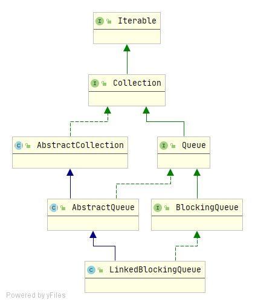
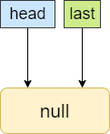
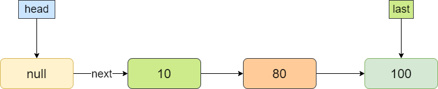

## LinkedBlockingQueue深入理解

### 简介

LinkedBlocingQueue是一种基于**单链表**实现的阻塞队列，通过构造方法指定了队列的容量则是**有界队列**，如果不指定容量，系统默认最大容量为`Integer.MAX_VALUE`,则为**无界队列**，是JDK1.5随JUC包引入的。

**继承结构如下：**



由上图可以看出，LinkedBlockingQueue的继承关系和ArrayBlockingQueue的完全一样，但是两者的实现还是不一样的，LinkedBlockingQueue是通过链表实现，ArrayBlockingQueue底层是通过数组实现的，两者的线程安全都是通过ReentrantLock来保证的，LinkedBlockingQueue的不同在于：**维护了两把锁——takeLock和putLock，takeLock用于控制出队的线程安全，putLock用于控制入队的线程安全**。

### 实现原理

**核心参数：**

```java
// 队列容量，如果不指定则为Integer.MAX_VALUE
private final int capacity;

// 队列中的元素个数
private final AtomicInteger count = new AtomicInteger();

/**
  * 队首指针
  * Invariant: head.item == null
  */
transient Node<E> head;

/**
  * 队尾指针
  * Invariant: last.next == null
  */
private transient Node<E> last;

/** 出队锁 */
private final ReentrantLock takeLock = new ReentrantLock();

/** 队列空时，出队线程在该队列上等待 */
private final Condition notEmpty = takeLock.newCondition();

/** 入队锁 */
private final ReentrantLock putLock = new ReentrantLock();

/** 线程满时，入队线程在该队列上等待 */
private final Condition notFull = putLock.newCondition();
```

**Node结点对象：**

```java
static class Node<E> {
    // 具体元素
    E item;
    // 下一个结点
    Node<E> next;
    Node(E x) { item = x; }
}
```

**构造方法：**

```java
// 默认构造方法，会创建一个无界队列
public LinkedBlockingQueue() {
    this(Integer.MAX_VALUE);
}
```

```java
// 构建一个指定容量的队列
public LinkedBlockingQueue(int capacity) {
    if (capacity <= 0) throw new IllegalArgumentException();
    this.capacity = capacity;
    // 创建头结点
    last = head = new Node<E>(null);
}
```

```java
// 通过给定的集合创建一个无界队列
public LinkedBlockingQueue(Collection<? extends E> c) {
    this(Integer.MAX_VALUE);
    final ReentrantLock putLock = this.putLock;
    putLock.lock(); // Never contended, but necessary for visibility
    try {
        int n = 0;
        for (E e : c) {
            if (e == null) // 队列中的元素不能为null
                throw new NullPointerException();
            if (n == capacity) // 队列已满
                throw new IllegalStateException("Queue full");
            // 在队尾插入元素
            enqueue(new Node<E>(e));
            ++n;
        }
        // 设置队列中的元素个数
        count.set(n);
    } finally {
        putLock.unlock();
    }
}
```

由上面三个构造方法可以看出，如果不指定容量，就会创建一个容量为Integer.MAX_VALUE的队列，从参数中可以看到，使用了一个原子变量AtomicInteger来记录队列中元素的个数，是因为入队/出队使用的不同的锁，使用原子变量能够保证数据的一致性。

构造完成后，LinkedBlockingQueue的结构如下：



插入数据后结构如下：



### 核心方法源码分析

**入队-put：**

```java
// 在队尾插入元素，如果队列满了则阻塞
public void put(E e) throws InterruptedException {
    if (e == null) throw new NullPointerException();
    // 用来标识是否插入成功
    int c = -1;
    // 新建一个node
    Node<E> node = new Node<E>(e);
    final ReentrantLock putLock = this.putLock;
    final AtomicInteger count = this.count;
    putLock.lockInterruptibly();
    try {        
        // 如果队列满了则等待
        while (count.get() == capacity) {
            notFull.await();
        }
        // 在队尾插入节点
        enqueue(node);
        c = count.getAndIncrement();
        if (c + 1 < capacity) // 入队成功后队列未满
            // 唤醒一个等待插入的线程
            notFull.signal();
    } finally {
        putLock.unlock();
    }
    if (c == 0) // 入队成功
        // 唤醒一个正在等待出队的线程
        signalNotEmpty();
}

// 在尾部插入
private void enqueue(Node<E> node) {
    // assert putLock.isHeldByCurrentThread();
    // assert last.next == null;
    last = last.next = node;
}
// 唤醒一个等待出队的线程
private void signalNotEmpty() {
    final ReentrantLock takeLock = this.takeLock;
    takeLock.lock();
    try {
        notEmpty.signal();
    } finally {
        takeLock.unlock();
    }
}
```

**出队-take：**

```java
// 从队首取出一个元素
public E take() throws InterruptedException {
    E x;
    int c = -1;
    final AtomicInteger count = this.count;
    final ReentrantLock takeLock = this.takeLock;
    takeLock.lockInterruptibly();
    try {
        // 如果队列为空，则等待
        while (count.get() == 0) {
            notEmpty.await();
        }
        x = dequeue();
        c = count.getAndDecrement();// c表示出队前队列中元素个数
        if (c > 1) // 出队成功过后，队列中还有元素，则通知一个正在等待出队线程
            notEmpty.signal();
    } finally {
        takeLock.unlock();
    }
    if (c == capacity) // 出队前队列满的，出队后队列有了空间，就通知一个正在等待入队的线程
        signalNotFull();
    return x;
}

/**
 * 队首出队一个元素.
 */
private E dequeue() {
    Node<E> h = head;
    Node<E> first = h.next;
    h.next = h;         // help GC
    head = first;
    E x = first.item;
    first.item = null;
    return x;
}
```