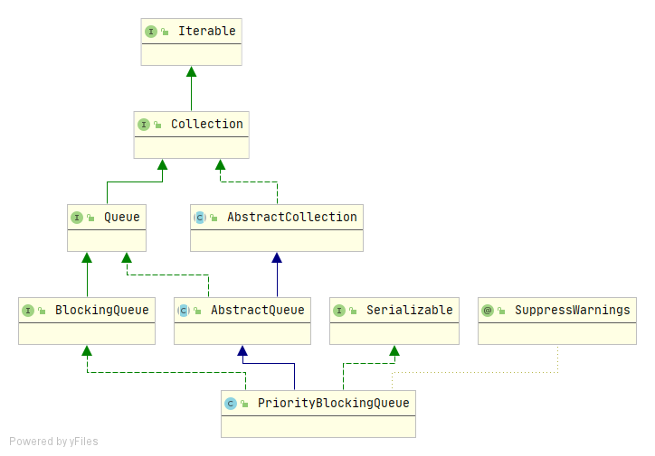
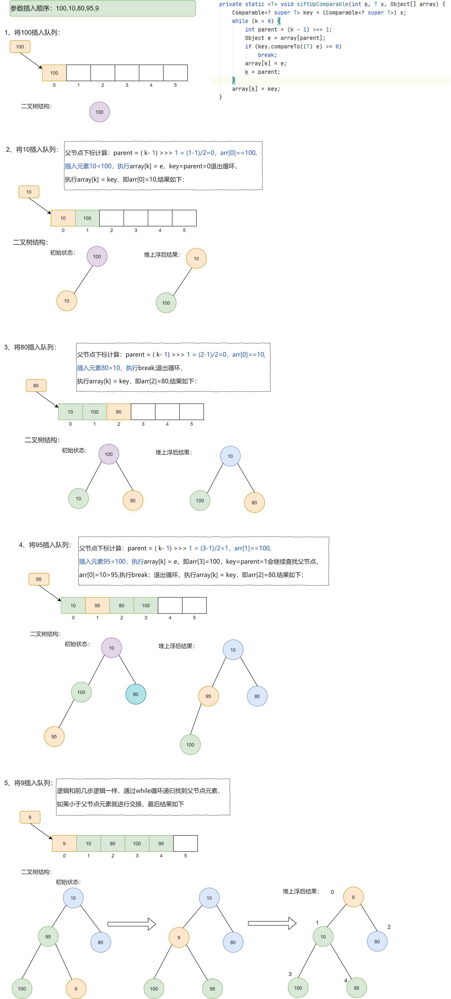
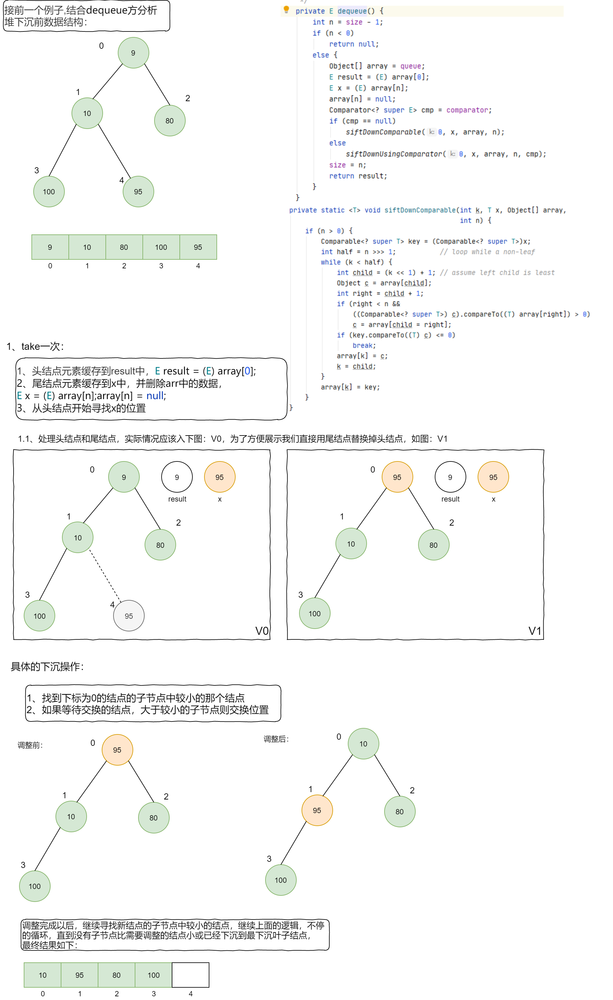

## PriorityBlockingQueue深入理解

### 简介

PriorityBlockingQueue是一种底层**基于数组实现的堆结构(在操作上类似于完全二叉树)**，实现了BlockingQueue接口的**有序无界阻塞队列**，需要在构造时指定队列的容量，是JDK1.5时随着JUC包引入的。

**继承结构：**



**PriorityBlockingQueue特点：**

+ 是一种优先级队列，是有序的
+ 是无界队列(仅受内存大小限制)
+ 因为是有序的，所以元素间必须进行比较，也就是元素必须实现Comparable接口
+ 由于PriorityBlockingQueue是无界队列，所以插入元素永远不会阻塞线程
+ PriorityBlockingQueue底层是一种基于数组实现的堆结构

### 实现原理

**核心参数：**

```java
/**
 * 默认初始化容量
 */
private static final int DEFAULT_INITIAL_CAPACITY = 11;
/**
 * 队列最大容量，因为数组中会存储一部分头信息，所以-8
 */
private static final int MAX_ARRAY_SIZE = Integer.MAX_VALUE - 8;
/**
 * 内部堆数组，保存实际数据，可以看成一颗二叉树：
 * 对于顶点queue[n]，左子节点：queue[2*n+1],右子节点：queue[2*(n+1)]
 */
private transient Object[] queue;
/**
  * 队列中的元素个数
  */
private transient int size;
/**
  * 比较器
  * 如果为null，以元素自身的自然顺序进行比较(元素必须实现Comparable)
  */
private transient Comparator<? super E> comparator;
/**
  * 全局锁
  */
private final ReentrantLock lock;
/**
  * 当队列为空时，获取元素的线程在该条件队列上等待
  */
private final Condition notEmpty;
/**
  * 用于分配的自旋锁，通过CAS获得。
  */
private transient volatile int allocationSpinLock;
/**
  * 一个仅在序列化期间使用的有序队列，为了兼容以前的版本
  */
private PriorityQueue<E> q;
```

**构造方法：**

PriorityBlockingQueue提供了四种构造器：

```java
// 默认构造器
public PriorityBlockingQueue() {
    this(DEFAULT_INITIAL_CAPACITY, null);
}
```

```java
// 指定初始容量
public PriorityBlockingQueue(int initialCapacity) {
    this(initialCapacity, null);
}
```

```java
// 指定初始容量和比较器
public PriorityBlockingQueue(int initialCapacity, Comparator<? super E> comparator) {
    if (initialCapacity < 1)
        throw new IllegalArgumentException();
    // 初始化全局锁
    this.lock = new ReentrantLock();
    // 初始化条件队列
    this.notEmpty = lock.newCondition();
    this.comparator = comparator;
    // 初始化数组队列
    this.queue = new Object[initialCapacity];
}
```

```java
/**
  * 通过已有集合构造队列
  * 如果已有集合是SortedSet或者PriorityBlockingQueue则保持原有元素顺序
  */
public PriorityBlockingQueue(Collection<? extends E> c) {
    this.lock = new ReentrantLock();
    this.notEmpty = lock.newCondition();
    // 是否需要排序的标识
    boolean heapify = true;
    // 是否需要null校验的标识，因为SortedSet允许null，而PriorityBlockingQueue不允许null
    boolean screen = true;  
    if (c instanceof SortedSet<?>) { // 如果是SortedSet
        SortedSet<? extends E> ss = (SortedSet<? extends E>) c;
        this.comparator = (Comparator<? super E>) ss.comparator();
        heapify = false;
    }
    // 如果是PriorityBlockingQueue
    else if (c instanceof PriorityBlockingQueue<?>) {
        PriorityBlockingQueue<? extends E> pq =
            (PriorityBlockingQueue<? extends E>) c;
        this.comparator = (Comparator<? super E>) pq.comparator();
        screen = false;
        if (pq.getClass() == PriorityBlockingQueue.class) // 精准匹配
            heapify = false;
    }
    Object[] a = c.toArray();
    int n = a.length;
    // If c.toArray incorrectly doesn't return Object[], copy it.
    if (a.getClass() != Object[].class)
        a = Arrays.copyOf(a, n, Object[].class);
    if (screen && (n == 1 || this.comparator != null)) { // null校验
        for (int i = 0; i < n; ++i)
            if (a[i] == null)
                throw new NullPointerException();
    }
    this.queue = a;
    this.size = n;
    if (heapify)
        // 重排序
        heapify();
}
```

以上四种构造器，最主要的是`public PriorityBlockingQueue(int initialCapacity, Comparator<? super E> comparator)`,对核心参数以及构造器源码的阅读后可以发现：

+ 如果不指定容量，默认初始化容量为11，内部数组queue其实是一棵完全二叉树

+ PriorityBlockingQueue内部也是通过`ReentrantLock`来保证并发访问的线程安全的
+ PriorityBlockingQueue只有一个等待队列——notEmpty，因为底层数组会自动扩容，插入元素时不会阻塞，只有当队列为空时，获取元素的线程才会阻塞

### 核心方法源码分析

**插入元素：**

```java
// add、put都是调用的offer方法
public boolean offer(E e) {
    if (e == null) // 判断元素是否为空
        throw new NullPointerException();
    final ReentrantLock lock = this.lock;
    lock.lock();// 加锁
    int n, cap;
    Object[] array;
    // n队列中元素个数
    // cap 队列容量
    while ((n = size) >= (cap = (array = queue).length))
        // 队列已满，进行扩容，此处使用while循环是保证在执行插入的时候有足够的空间
        tryGrow(array, cap);
    try {
        Comparator<? super E> cmp = comparator;
        if (cmp == null) // 比较器为null，按照元素自身自然顺序排序
            siftUpComparable(n, e, array);
        else // 按照比较器进行排序
            siftUpUsingComparator(n, e, array, cmp);
        // 队列中元素个数+1
        size = n + 1;
        // 唤醒一个正在等待获取元素的线程
        notEmpty.signal();
    } finally {
        lock.unlock();
    }
    return true;
}
```

在`offer`方法中比较重要的方法有：扩容(tryGrow)、顺序维护(siftUpComparable、siftUpUsingComparator)，其中顺序维护的两个方法基本一致，差别在于siftUpComparable采用的是自然顺序排序，siftUpUsingComparator使用的是比较器，下面就只针对siftUpComparable方法进行分析。

**扩容-tryGrow：**

```java
private void tryGrow(Object[] array, int oldCap) {
    lock.unlock(); //先解锁，因为扩容和入队/出队是可以并发出现的
    Object[] newArray = null;
    // allocationSpinLock=0表示没有线程在进行扩容操作
    // 通过cas设置allocationSpinLock=1，表示有线程正在扩容
    if (allocationSpinLock == 0 &&
        UNSAFE.compareAndSwapInt(this, allocationSpinLockOffset,0, 1)) {
        try {
            // 计算新的容量
            int newCap = oldCap + ((oldCap < 64)?(oldCap + 2):(oldCap >> 1));
            if (newCap - MAX_ARRAY_SIZE > 0) {    // 判断是否越界
                int minCap = oldCap + 1;// 最小需要容量，
                // 已经超过最大容量，存不下了
                if (minCap < 0 || minCap > MAX_ARRAY_SIZE) 
                    throw new OutOfMemoryError();
                // 在越界的情况下，将最大容量设置为新容量
                newCap = MAX_ARRAY_SIZE;
            }
            // 新容量必须大于oldCap,并且没有被其他线程扩容
            // 如果queue != array,说明其他线程扩容了，queue指向了新的数组，此处就不用扩容
            if (newCap > oldCap && queue == array)
                newArray = new Object[newCap];
        } finally {
            // 重新将是否在扩容的标识设置为0
            allocationSpinLock = 0;
        }
    }
    /**
      * 已经有其他线程在进行扩容,出现这种情况可能是以下原因：
      * 1、compareAndSwapInt(this, allocationSpinLockOffset,0, 1)的时候设置失败
      * 2、queue != array,说明其他线程扩容了
      */
    if (newArray == null) // back off if another thread is allocating
        Thread.yield(); // 等待其他线程完成
    lock.lock(); // 重新加锁，复制数组中的数据到新数组中
    if (newArray != null && queue == array) {
        queue = newArray;
        System.arraycopy(array, 0, newArray, 0, oldCap);
    }
}
```

整个扩容的方法主要在于需要考虑**并发扩容情况**以及**是否溢出**的问题。

**堆上浮-siftUpComparable：**

```java
// 将元素x插入到array[k]的位置，然后按照元素的资源顺序进行堆调整，
// 最终形成一个"小顶堆"
private static <T> void siftUpComparable(int k, T x, Object[] array) {
    Comparable<? super T> key = (Comparable<? super T>) x;
    while (k > 0) {
        int parent = (k - 1) >>> 1; // 相当于(k-1)除2, 就是求k结点的父结点索引parent
        Object e = array[parent];
        if (key.compareTo((T) e) >= 0)// 如果插入的值大于父节点的值，则退出
            break;
        // 交换当前结点和父节点的值
        array[k] = e;
        // 当前结点指向父节点
        k = parent;
    }
    // 设置当前结点的值
    array[k] = key;
}
```

siftUpComparable方法的作用其实就是"堆"的上浮调整，可以把堆的结构想象成一棵完成二叉树，每次插入元素的时候与其父节点比较，如果父节点大则交换元素，直到没有父节点比插入的结点大为止。这样也保证了“堆”顶（二叉树根节点）一定是最小元素。

举例说明整个插入流程，下图中二叉树只是为了便于理解，对于新添加的元素时通过一个临时变量x记录的，与其他结点比较、交换，并没有添加到树的叶子结点上的操作，具体流程如下：




**检索并删除元素-dequeue：**

```java
private E dequeue() {
    // 删除后队列中剩余元素
    int n = size - 1;
    if (n < 0)
        return null;
    else {
        Object[] array = queue;
        // 头结点元素
        E result = (E) array[0];
        // 尾结点元素
        E x = (E) array[n];
        // 尾结点设置为null
        array[n] = null;
        Comparator<? super E> cmp = comparator;
        if (cmp == null)
            // 堆下浮
            siftDownComparable(0, x, array, n);
        else
            siftDownUsingComparator(0, x, array, n, cmp);
        // 设置队列中元素个数
        size = n;
        // 返回结果
        return result;
    }
}
```

从**dequeue**方法可以看出，每次出队的元素都是“堆顶结点”，对于“小顶堆”就是队列中的最小值，对于“大顶堆”就是队列中的最大值。

**堆下浮-siftDownComparable：**

```java
/**
  * 堆的下沉，ke的位置空出来了，元素x从k索引位置开始向下寻找合适的位置，遇到比x小的结点则上移
  * k 待删除的位置
  * x 待比较的结点元素
  * array 数组
  * 堆大小
  */
private static <T> void siftDownComparable(int k, T x, Object[] array, int n) {
    // 如果n=0就不需要调整顺序了
    if (n > 0) {
        Comparable<? super T> key = (Comparable<? super T>)x;
        int half = n >>> 1;           // 相当于n/2,找到索引n对应的父节点
        while (k < half) { // 删除的结点不是n对应结点的父节点
           /**
             * 下述代码中:
             * c保存k的左右子结点中的较小结点值 
             * child保存较小结点对应的索引
             */
            int child = (k << 1) + 1; // k的左子结点
            Object c = array[child];
            int right = child + 1; // k的右子结点
            if (right < n &&
                ((Comparable<? super T>) c).compareTo((T) array[right]) > 0)
                c = array[child = right];
            if (key.compareTo((T) c) <= 0)
                break;
            array[k] = c;
            k = child;
        }
        array[k] = key;
    }
}
```



### 总结

**PriorityBlockingQueue**属于比较特殊的阻塞队列，适用于有元素优先级要求的场景。它的内部和ArrayBlockingQueue一样，使用一个了全局独占锁来控制同时只有一个线程可以进行入队和出队，另外由于该队列是无界队列，所以入队线程并不会阻塞。

PriorityBlockingQueue始终保证出队的元素是优先级最高的元素，并且可以定制优先级的规则，内部通过使用**堆（数组形式）**来维护元素顺序，它的内部数组是可扩容的，扩容和出/入队可以并发进行。