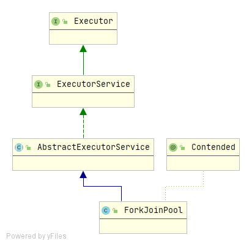
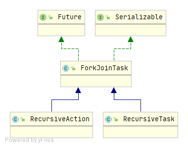

## ForkJoin简介

### 基本概念

基于“分治”的思想，J.U.C在JDK1.7时引入了一套**Fork/Join**框架。Fork/Join框架的基本思想就是将一个大任务分解（**Fork**）成一系列子任务，子任务可以继续往下分解，当多个不同的子任务都执行完成后，可以将它们各自的结果合并（**Join**）成一个大结果。

对于子任务的执行，为了提高效率，避免频繁创建线程，Fork/Join框架利用了线程池(ForkJoinPool)来调度任务。子任务会被放到不同的任务队列中，由于线程处理不同任务的速度不同，这样就可能存在某个线程先执行完了自己队列中的任务的情况，这时为了提升效率，我们可以让该线程去“窃取”其它任务队列中的任务，这就是所谓的**工作窃取算法 **。

### 如何使用**Fork/Join**框架

#### 涉及组件

##### ForkJoinPool

ForkJoinPool是ExecutorService的实现类，负责工作线程的管理、任务队列的维护，以及控制整个任务调度流程；



##### ForkJoinTask

Future接口的实现类，fork是其核心方法，用于分解任务并异步执行；而join方法在任务结果计算完毕之后才会运行，用来合并或返回计算结果；



ForkJoinTask有两个重要的实现类：RecursiveAction和RecursiveTask，两个都是抽象类，需要使用者自己去实现`compute`方法。RecursiveAction是没有返回值的，RecursiveTask是有返回值的。

#### 有返回值的示例

```java
import java.util.ArrayList;
import java.util.List;
import java.util.concurrent.ExecutionException;
import java.util.concurrent.ForkJoinPool;
import java.util.concurrent.ForkJoinTask;
import java.util.concurrent.RecursiveTask;

public class RecursiveTaskDemo extends RecursiveTask<Long> {
    private static final int THRESHOLD = 10000;
    private long start;
    private long end;

    public RecursiveTaskDemo(long start, long end) {
        this.start = start;
        this.end = end;
    }

    @Override
    protected Long compute() {
        long sum = 0;
        boolean canCompute = (end - start) < THRESHOLD;
        if(canCompute) {
            for (long i = start; i <= end; i++) {
                sum += i;
            }
        } else { //分成100个小任务
            long step = (end + start) / 100;
            List<RecursiveTaskDemo> subTasks = new ArrayList<>();
            long pos = start;
            for (int i = 0; i < 100; i++) {
                long lastOne = pos + step;
                if(lastOne>end){
                    lastOne = end;
                }
                RecursiveTaskDemo demo = new RecursiveTaskDemo(pos, lastOne);
                pos+=step+1;
                subTasks.add(demo);
                demo.fork();
            }
            for (RecursiveTaskDemo demo:subTasks) {
                sum+=demo.join();
            }
        }
        return sum;
    }

    public static void main(String[] args) {
        ForkJoinPool forkJoinPool = new ForkJoinPool();
        RecursiveTaskDemo taskDemo = new RecursiveTaskDemo(0, 200000L);
        ForkJoinTask<Long> result = forkJoinPool.submit(taskDemo);
        try {
            System.out.println(result.get());
        } catch (InterruptedException e) {
            e.printStackTrace();
        } catch (ExecutionException e) {
            e.printStackTrace();
        }
        long sum = 0;
        for (long i = 1; i <= 200000L; i++) {
            sum += i;
        }
        System.out.println(sum);
    }
}
```

#### 没有返回值的示例

```java
import java.util.concurrent.RecursiveAction;

public class RecursiveActionDemo extends RecursiveAction {
    @Override
    protected void compute() {
        
    }
}
```

实现方式与写法与上面的RecursiveTaskDemo相似，区别在与RecursiveAction没有返回值。

#### 异常情况

如果子任务过多，可能会导致栈溢出，如下

```java
"D:\Program Files (x86)\JDK8\bin\java.exe" -
java.util.concurrent.ExecutionException: java.lang.StackOverflowError
	at java.util.concurrent.ForkJoinTask.get(ForkJoinTask.java:1006)
	at com.zjk.hy.se.thread.executor.RecursiveTaskDemo.main(RecursiveTaskDemo.java:54)
```

