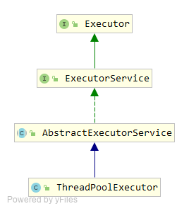

### ThreadPoolExecutor源码分析

线程池简介见：[线程池简介](线程池简介.md)

ThreadPoolExecutor类结构：



#### Executor

Doug lea写的一个专门提交任务的接口 

```java
public interface Executor {
	// 提交任务
    void execute(Runnable command);
}
```

#### ExecutorService

ExecutorService接口，继承自Executor，提供了更对的方法，

```java
public interface ExecutorService extends Executor {
	// 关闭线程池，不再接受任务，已接受的任务继续执行
    void shutdown();
	// 关闭线程池，不再接受新的任务，正在执行的任务尝试终止
    List<Runnable> shutdownNow();
	// 确认线程池是否关闭
    boolean isShutdown();
	// 确认执行shutdown或者shutdownNow后，线程池是否关闭
    boolean isTerminated();
	// 等待一段时间，如果到超时时间了，
    // 还没有terminated则返回false，反之则线程池已经terminated，返回true
    boolean awaitTermination(long timeout, TimeUnit unit)
        throws InterruptedException;

    // 提交任务
    <T> Future<T> submit(Callable<T> task);
	// 提交任务
    <T> Future<T> submit(Runnable task, T result);
	// 提交任务
    Future<?> submit(Runnable task);
	// 执行所有任务
    <T> List<Future<T>> invokeAll(Collection<? extends Callable<T>> tasks)
        throws InterruptedException;
	// 执行所有任务
    <T> List<Future<T>> invokeAll(Collection<? extends Callable<T>> tasks,
                                  long timeout, TimeUnit unit)
        throws InterruptedException;
	// 执行N个任务，有一个执行完成就返回，返回值为 T（具体结果）
    <T> T invokeAny(Collection<? extends Callable<T>> tasks)
        throws InterruptedException, ExecutionException;
	// 执行N个任务，有一个执行完成就返回，返回值为 T（具体结果）
    <T> T invokeAny(Collection<? extends Callable<T>> tasks,
                    long timeout, TimeUnit unit)
        throws InterruptedException, ExecutionException, TimeoutException;
}
```

#### AbstractExecutorService

AbstractExecutorService实现了ExecutorService接口，提供了一些线程池通用方法的实现。

**submit方法:**

```java
public Future<?> submit(Runnable task) {
    if (task == null) throw new NullPointerException();
    // 创建一个ftask,实际上是构造一个FutureTask
    RunnableFuture<Void> ftask = newTaskFor(task, null);
    //执行任务，该方法在具体的子类中实现
    execute(ftask);
    return ftask;
}

protected <T> RunnableFuture<T> newTaskFor(Runnable runnable, T value) {
    return new FutureTask<T>(runnable, value);
}
```

**invokeAll、invokeAny方法**

两个方法使用的比较少，源码比较简单，主要是执行队列中的任务并返回结果

