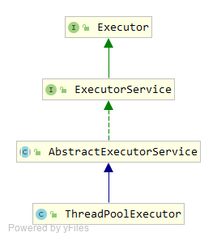
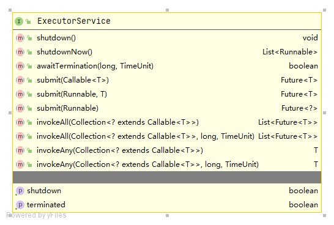
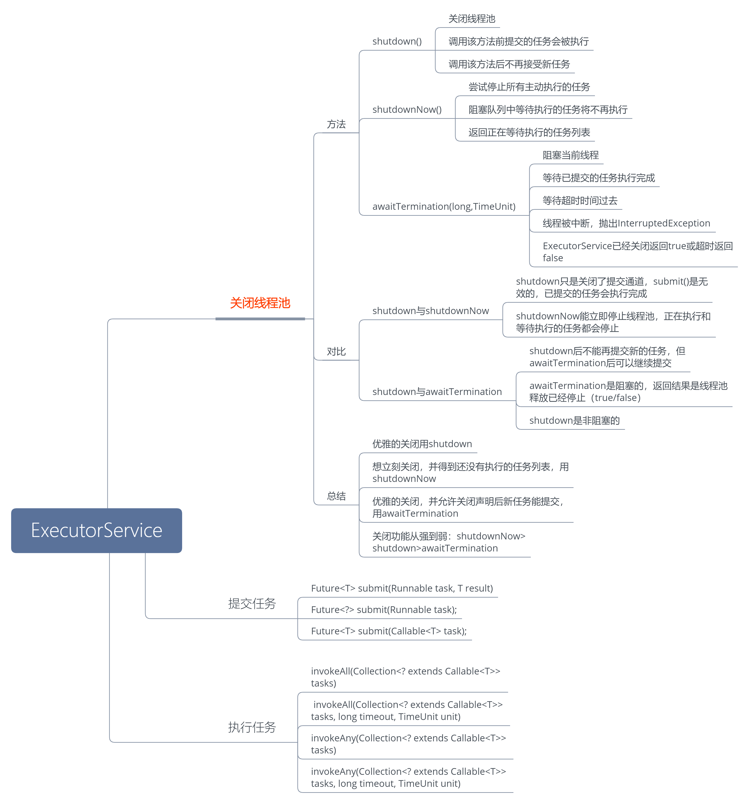
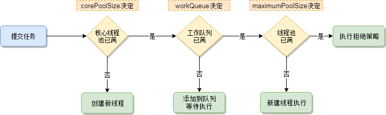
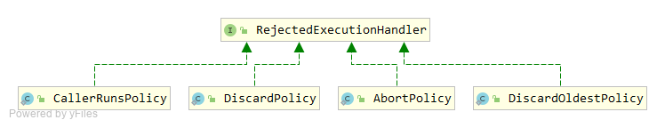
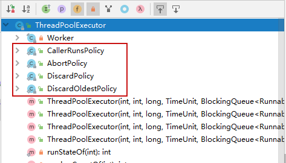
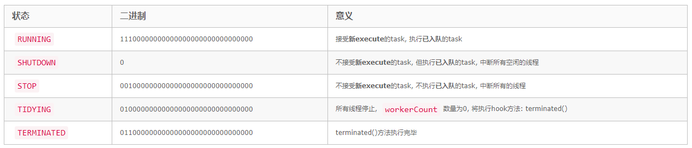

### 线程池简介

#### 优点：

+ **降低资源消耗**  通过重复利用已创建的线程降低线程创建、销毁所造成的消耗
+ **提高响应速度**  当任务到达时，任务可以不需要等待线程创建就能立即执行
+ **提高线程的可管理性**  使用线程池可以进行统一分配、调优、控制，（需要做到合理利用）

#### 线程池适用场合

+ 单个任务处理的时间比较短
+ 需要处理的任务数量大

#### 类结构



**Executor:**

```java
public interface Executor {
    void execute(Runnable command);
}
```

顶层接口，声明了一个方法`execute(Runnable command) `，该方法接受一个Runnable命令，在将来某个时间会执行该命令

**ExecutorService：**



ExecutorService接口继承自Executor，在Executor的基础上提供了一些方法用于线程池管理等，

如下：



**AbstractExecutorService:** 是一个抽象类，在ExecutorService的基础上对submit和invoke等方法有简单的实现

**ThreadPoolExecutor:** 线程池具体的实现

#### 创建线程池核心方法：

```java
public ThreadPoolExecutor(int corePoolSize,
                          int maximumPoolSize,
                          long keepAliveTime,
                          TimeUnit unit,
                          BlockingQueue<Runnable> workQueue,
                          ThreadFactory threadFactory,
                          RejectedExecutionHandler handler) 
```

+ corePoolSize：核心线程数，线程池维护线程的最少数量 ；当有任务来之后，就会创建一个线程去执行任务，当线程池中的线程数目达到corePoolSize后，就会把到达的任务放到缓存队列当中 
+ maximumPoolSize：线程池最大线程数，它表示在线程池中最多能创建多少个线程
+ keepAliveTime： 表示线程没有任务执行时最多保持多久时间会终止 
+ unit：参数keepAliveTime的时间单位 
+ workQueue：线程池所使用的缓冲队列  
+ threadFactory：创建线程的工厂对象
+ handler：线程池对拒绝任务的处理策略 

#### 通过Executors 创建

+ Executors.newCachedThreadPool：创建一个可缓存的线程池，线程数可以无限大
+ Executors.newFixedThreadPool：创建一个定长线程池，可控制线程最大并发数，超出的线程会在队列中等待
+ Executors.newScheduledThreadPool：创建一个定时以及周期性任务执行
+ Executors.newSingleThreadExecutor：创建一个单线程的线程池，用唯一的线程来执行任务，保证所有任务按照指定顺序（FIFO、LIFO、优先级）执行
+ Executors.newSingleThreadScheduledExecutor：创建一个单线程的线程池，定期或延时执行任务
+ Executors.newWorkStealingPool：创建一个带并行级别的线程池，并行级别决定了同一时刻最多有多少个线程在执行，如不传并行级别参数，将默认为当前系统的CPU个数

 **不推荐使用这种方式创建线程池，摘自阿里巴巴开发手册：** 

​	【强制】线程池不允许使用 Executors 去创建，而是通过 ThreadPoolExecutor 的方式，这样 的处理方式让写的同学更加明确线程池的运行规则，规避资源耗尽的风险。 说明：Executors 返回的线程池对象的弊端如下： 1）FixedThreadPool 和 SingleThreadPool: 允许的请求队列长度为 Integer.MAX_VALUE，可能会堆积大量的请求，从而导致 OOM。 2）CachedThreadPool 和 ScheduledThreadPool: 允许的创建线程数量为 Integer.MAX_VALUE，可能会创建大量的线程，从而导致 OOM。

**以上内容整理如下：**


#### 线程池工作顺序

corePoolSize -> 任务队列 -> maximumPoolSize -> 拒绝策略 



#### 提交任务的方式


Runnable和Callable的区别：

+ 方法签名不同，`void Runnable.run()`, `V Callable.call() throws Exception` 
+ 是否允许有返回值，`Callable`允许有返回值 
+ 是否允许抛出异常，`Callable`允许抛出异常

#### 拒绝策略





+ AbortPolicy  抛出RejectedExecutionException 
+ DiscardPolicy  什么也不做，直接忽略
+ DiscardOldestPolicy 丢弃执行队列中最老的任务，尝试为当前提交的任务腾出位置 
+ CallerRunsPolicy  直接由提交任务者执行这个任务 
+ 自定义拒绝策略，实现RejectedExecutionHandler接口

### ThreadPoolExecutor简介

#### 线程池运行状态

```java
private final AtomicInteger ctl = new AtomicInteger(ctlOf(RUNNING, 0));
private static final int COUNT_BITS = Integer.SIZE - 3;
private static final int CAPACITY   = (1 << COUNT_BITS) - 1;

// runState is stored in the high-order bits
private static final int RUNNING    = -1 << COUNT_BITS;
private static final int SHUTDOWN   =  0 << COUNT_BITS;
private static final int STOP       =  1 << COUNT_BITS;
private static final int TIDYING    =  2 << COUNT_BITS;
private static final int TERMINATED =  3 << COUNT_BITS;

// Packing and unpacking ctl
private static int runStateOf(int c)     { return c & ~CAPACITY; }
private static int workerCountOf(int c)  { return c & CAPACITY; }
private static int ctlOf(int rs, int wc) { return rs | wc; }
```

其中AtomicInteger变量ctl的功能非常强大：利用低29位表示线程池中线程数，通过高3位表示线程池的运行状态，上面的源码中线程池的运行状态的二进制表示：

