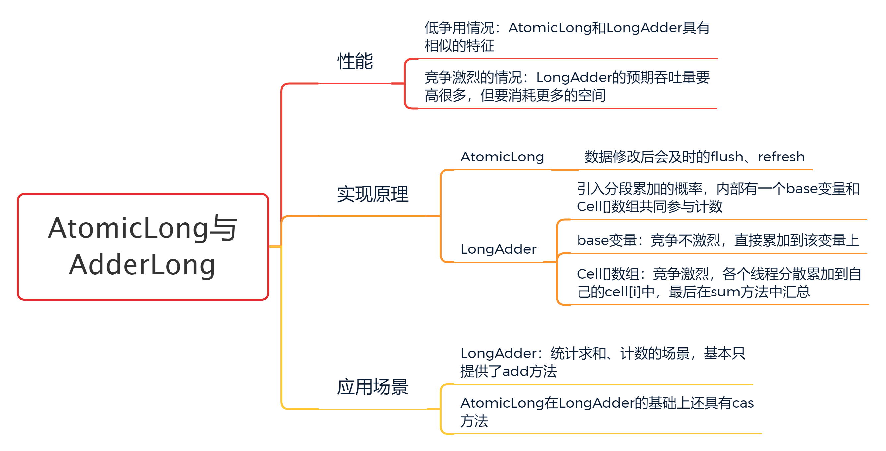
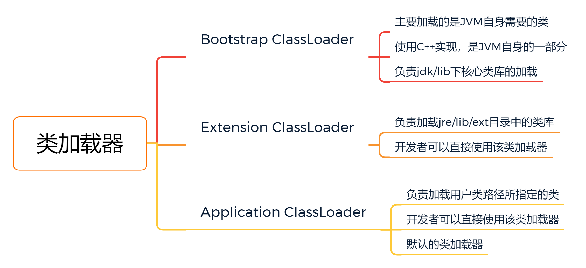
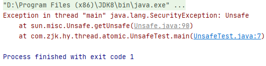

## Atomic简介

### 整体介绍：

`java.util.concurrent.atomic` Java JUC提供的一个小型工具包，支持单个变量上的**无锁线程安全**编程，包含以下工具类：


### AtomicLong与LongAdder对比



**LongAdder-sum方法源码：**

```java
public long sum() {
    Cell[] as = cells; Cell a;
    long sum = base;
    // 如果cell数组为null，则直接返回base的值，
    // 如果cell数组不为null，则循环cell求和
    if (as != null) {
        for (int i = 0; i < as.length; ++i) {
            if ((a = as[i]) != null)
                sum += a.value;
        }
    }
    return sum;
}
```

### 实现原理

基本都是通过Unsafe+CAS实现，Unsafe于JDK9移除

CAS相关原理见：[CAS深入理解](../../thread/CAS深入理解.md)

#### Unsafe简介

Unsafe类，来源于sun.misc包，该类封装了许多类似指针操作，可以直接进行内存管理、操作对象、阻塞/唤醒线程等操作，Unsafe使用不当会造成一些线程安全问题，**应尽量避免直接使用Unsafe来进行操作**。

##### 通过Unsafe提供的工厂方法getUnsafe创建对象

Unsafe是一个final类，不能被继承，也没有公共的构造方法，只能通过工厂方法getUnsafe获得Unsafe的单列，代码如下：

```java
public final class Unsafe {
     private Unsafe() {
    }

    @CallerSensitive
    public static Unsafe getUnsafe() {
        Class var0 = Reflection.getCallerClass();
        if (!VM.isSystemDomainLoader(var0.getClassLoader())) {
            throw new SecurityException("Unsafe");
        } else {
            return theUnsafe;
        }
    }
    
      static {
        Reflection.registerMethodsToFilter(Unsafe.class, new String[]{"getUnsafe"});
        theUnsafe = new Unsafe();
      }
    
}
```

在getUnsafe方法上有一个@CallerSensitive注解，该注解表示该方法的调用，需要调用者被该方法信任，也就是说**调用该方法的类的类加载器必须为Bootstrap ClassLoader** 。

**Java类加载器：**



所以在我们自己写的代码中调用getUnsafe方法，会抛出如下异常：



##### 通过反射获取Unsafe对象

```java
try {
    Field field = Unsafe.class.getDeclaredField("theUnsafe");
    field.setAccessible(true);
    Unsafe unsafe = (sun.misc.Unsafe) field.get(null);
    System.out.println(unsafe);
} catch (NoSuchFieldException | IllegalAccessException e) {
    e.printStackTrace();
}
```

