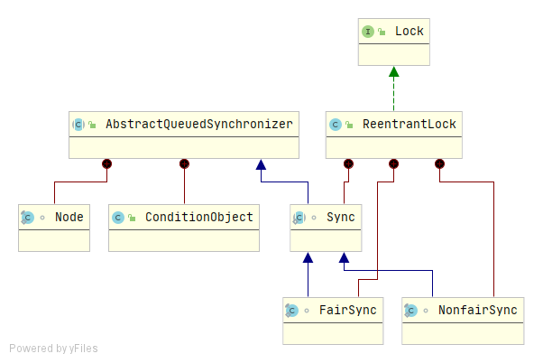

# Lock-Condition

基础需要：[ReentrantLock深入理解](./ReentrantLock深入理解.md)

## 简介

Condition是`java.util.concurrent.locks`包下的一个接口，我们在并发编程中使用Lock来实现加锁和解锁的功能，Condition的作用是我们在使用Lock时，能够实现线程间的通信，就如同使用Synchronized时，是通过Object的wait/notify/notifyAll进行线程间的通信。

一个Condition实例本质上是绑定到一个锁上的，通过具体锁（Lock的实现类）的`newCondition()`可以获得特定的Condition实例。

## Condition源码简介

```java
public interface Condition {
    // 导致当前线程等待，直到发出信号或者中断interrupted，
	void await() throws InterruptedException;
    // 导致当前线程等待直到发出信号或中断、或者指定的等待时间过去
    boolean await(long time, TimeUnit unit) throws InterruptedException;
    // 导致当前线程等待直到发出信号或中断、或者指定的等待时间过去
    // nanosTimeout单位为纳秒
    // awaitNanos(long)>0等同于await(long time, TimeUnit unit)
    long awaitNanos(long nanosTimeout) throws InterruptedException;
    // 使当前线程等待直到发出信号
    void awaitUninterruptibly();
    // 使当前线程等待直到发出信号或中断，或者指定的最后期限过去
    boolean awaitUntil(Date deadline) throws InterruptedException;
    // 唤醒一个等待线程
    void signal();
    // 唤醒所有等待线程
    void signalAll();
}
```

## Lock获取Condition实例

因为`newCondition()`是Lock接口的一个方法声明，具体实现在具体的Lock子类中，下面我们以ReentrantLock为列，在ReentrantLock实例化Condition的代码如下：

```java
public Condition newCondition() {
    return sync.newCondition();
}
```

这个方法中就一行代码`sync.newCondition()`，sync是Sync类的一个实例，Sync是ReentrantLock的内部类，`sync.newCondition();`具体代码如下：

```java
final ConditionObject newCondition() {
    return new ConditionObject();
}
```

创建了一个ConditionObject，到这里涉及的东西就比较多了，我们来看下ReentrantLock的类图，如下：



ReentrantLock的`newCondition`方法调用了其内部类Sync的`newCondition`方法创建了一个ConditionObject，ConditionObject是AQS的内部类，同时实现了Condition接口。

## ConditionObject

```java
public class ConditionObject implements Condition, java.io.Serializable {
    // Condition等待队列头结点
	private transient Node firstWaiter;
    // Condition等待队列尾结点
    private transient Node lastWaiter;
    // 构造方法
    public ConditionObject() { }
}
```

其中firstWaiter和lastWaiter是非常重要的两个属性，类型是AQS内部类Node，这两个属性类似于AQS的head和tail。

**重要方法如下：**


## Condition.await流程


