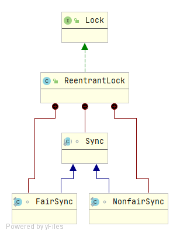
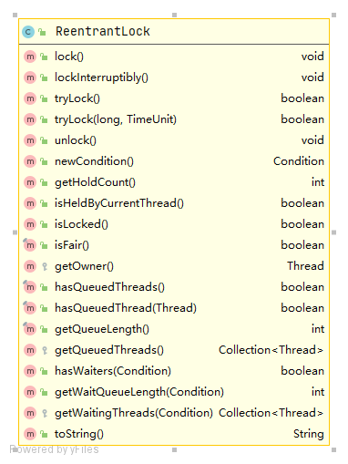
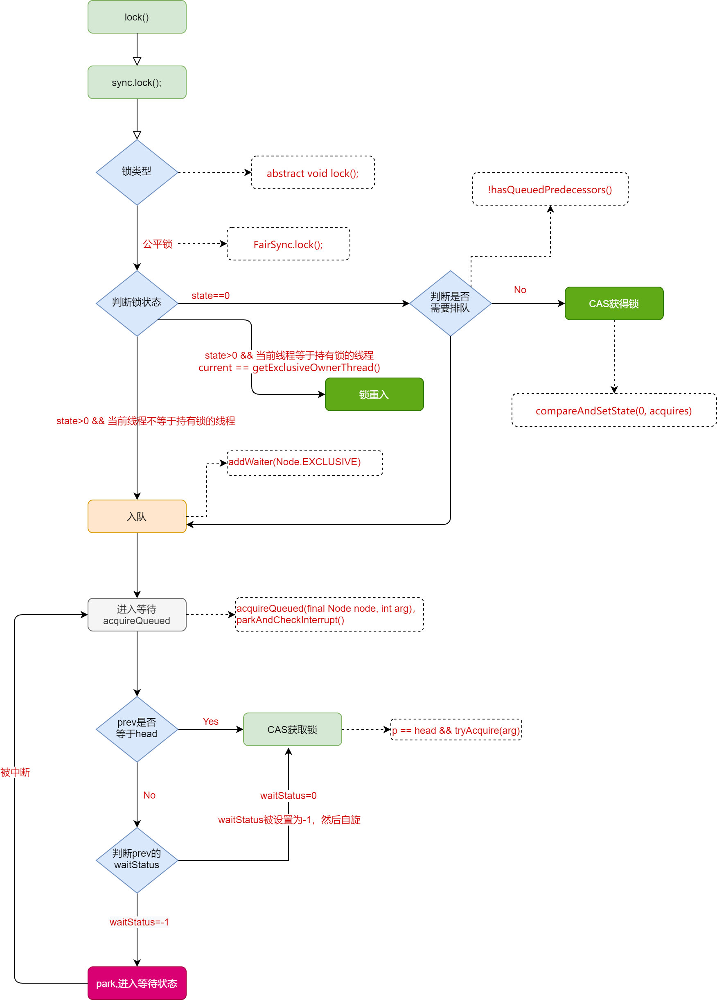
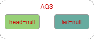
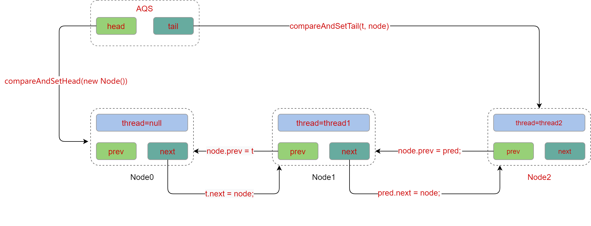

# ReentrantLock简介

​		一个可重入互斥Lock，具有与使用Synchronized隐式监视锁相同的基本行为和语义。同时ReentrantLock功能更加强大，使用更加灵活，具有公平锁、非公平锁、等待可中断、绑定多个条件等Synchronized不具备的功能。



​		ReentrantLock实现了Lock，同时通过内部类FairSync和NonFairSync实现了公平锁和非公平锁的扩展功能。FairSync和NonFairSync都继承自ReentrantLock的另一个内部类`Sync`，`Sync`继承自**`AbstractQueuedSynchronizer`**，这个类就是所谓的**`AQS`**，并发编程的核心，其使用了**自旋**、**CAS**、**park-unpark** 等技术。AQS通过内部类`Node`维护一个队列，当出现多个线程争抢锁时，无法获取锁的线程会被封装为一个Node结点放入队列中，同时通过LockSupport.park实现线程阻塞，**`如果是单个线程或者多个线程交替执行，其实和队列无关，在JDK级别解决问题`** 。

## 基础源码介绍



### ReentrantLock构造方法

```java
// 创建一个ReentrantLock的实例,默认创建的是非公平锁
ReentrantLock()
// 根据给定的公平策略创建一个ReentrantLock的实例
// fair=true表示采用公平锁
ReentrantLock(boolean fair) 
```

### ReentrantLock其他方法

其中`lock`、`lockInterruptibly`、`tryLock`、`unlock`、`newcondition`几个方法是ReentranLock实现的Lock接口中的方法，其他方法如下：

```java
// 获取当前线程对此锁持有的次数（重入的次数）
public int getHoldCount();
// 如果当前线程持有该锁返回true，否则返回false
public boolean isHeldByCurrentThread();
// 如果有线程持有该锁返回true，否则返回false
public boolean isLocked();
// 判断该锁是否为公平锁（true），非公平锁返回false
public final boolean isFair();
// 查询是否有线程在等待该锁，有返回true，否则返回false
public final boolean hasQueuedThreads();
// 查询给定的线程是否在等待该锁，
public final boolean hasQueuedThread(Thread thread);
// 获取正在等待该锁的线程数量——是个预估值
public final int getQueueLength();
// 查询任何线程是否等待与此锁相关联的给定条件
public boolean hasWaiters(Condition condition);
// 返回与此锁相关联的给定条件等待的线程数的估计
public int getWaitQueueLength(Condition condition);
```

### AQS核心参数

```java
public abstract class AbstractQueuedSynchronizer
    extends AbstractOwnableSynchronizer
    implements java.io.Serializable {
    //头节点，不保存真实信息，只表示位置，不代表实际的等待线程
    private transient volatile Node head;
    //尾节点
    private transient volatile Node tail;
    //状态
    private volatile int state;
}
```

### AQS-Node核心参数

```java
static final class Node {
	volatile int waitStatus;
    volatile Node prev;
    volatile Node next;
    volatile Thread thread;
}
```

## Lock流程



### 流程补充

#### 是否需要排队逻辑

```java
Node t = tail; 
Node h = head;
Node s;
return h != t && ((s = h.next) == null || s.thread != Thread.currentThread());
```

就这么点代码，不过真有点复杂，我并不是十分确定我理解的是否正确

+ 当队列未被初始化（head和tail都为null）或者队列中只有一个结点时（head和tail指向同一个结点）`h != t`都返回false，则不需要排队
+ 如果队列中存在多个Node，`h != t`为true，那么非并发正常情况下`(s = h.next) == null`一定为false，就需要执行`s.thread != Thread.currentThread()`逻辑判断
+ 如果是新线程争夺锁资源，那么`s.thread != Thread.currentThread()`为true，需要排队
+ 如果是前一个Node的线程释放锁，通过unpark唤醒线程，那么s.thread != Thread.currentThread()返回false，整个语句返回false，不需要排队
+ **特殊情况**：如果队列中存在多个Node，那么`h != t`为true，如果在并发情况下，有其他线程争夺锁入队，调用`addWaiter(Node mode)`方法，如果`(s = h.next) == null`发生在`compareAndSetTail(pred, node)`之后， `pred.next = node`之前，这个时候pred.next = null，那么`(s = h.next) == null`就为true，整个返回true，需要排队

#### acquireQueued方法

这个方法非常的有意思，通过**`for (;;)`** 实现死循环，如果当前Node的前一个结点是Head，那么就尝试的去获取锁，获取成功则返回true，如果当前结点的prev结点不是head，就去判断prev的waitStatus，**waitStatus初始值为0，这就实现了一次自旋获取锁**，为什么要自旋，因为自旋成功获取锁就**不用去park**，自旋一次还未获取到锁，就去park，有意思的是因为for死循环，park本身是不可中断的，这种情况下被中断了，那么会从park()中醒过来，发现拿不到资源，从而继续进入park()等待。

#### 为什么修改的是prev的waitStatus

+ park之前线程并没有暂停，park过后不能执行任何操作了，就像人睡觉，自己并不会知道自己睡着了，其他的人知道
+ 与解锁有关，这一块还未学习到，后面补上

### 入队流程如下

+ 初始状态下AQS中的head和tail都为null

  

+ 当发生资源争夺时，第一个线程入队

  

  这里有一个隐藏的操作，新建了一个thread=null的Node作为第一个节点，具体原因是队头的Node中的线程持有锁，而第一个线程获取锁是与队列没有关系的，没有入队的过程

  具体原因没怎么想明白，可能是为了兼容后面修改waitStatus等原因吧。

+ 当更多的节点入队时

  

  ## Lock流程源代码分析
  
  ```java
  // ReentrantLock.lock
  public void lock() {
  	// AQS lock
      // abstract void lock();
      sync.lock();
  }
  // FairSync.lock
  final void lock() {
      acquire(1);
  }
  public final void acquire(int arg) {
      // tryAcquire尝试获取锁，获取到锁返回true，获取失败返回false
      if (!tryAcquire(arg) &&
          // addWaiter线程入队
          // acquireQueued暂停线程
          acquireQueued(addWaiter(Node.EXCLUSIVE), arg))
          // 设置线程中断标识
          selfInterrupt();
  }
  // FairSync.tryAcquire
  // 尝试获取锁
  protected final boolean tryAcquire(int acquires) {
      // 拿到当前线程 
      final Thread current = Thread.currentThread();
      // 拿到当前锁的state状态
      int c = getState();
      if (c == 0) { // 锁未被持有
          // hasQueuedPredecessors,判断是否需要排队
          // compareAndSetState，通过CAS设置state，标识锁被持有
          if (!hasQueuedPredecessors() &&
              compareAndSetState(0, acquires)) {
              // 设置锁持有的线程为当前线程
              setExclusiveOwnerThread(current);
              // 锁获取成功
              return true;
          }
      }
      // 锁被当前线程持有,锁重入
      else if (current == getExclusiveOwnerThread()) {
          // 锁状态state值+acquires
          int nextc = c + acquires;
          if (nextc < 0)
              throw new Error("Maximum lock count exceeded");
         	// 设置锁的state，此处是线程安全的，因为当前线程已经持有了该锁
          setState(nextc);
          // 返回成功获取到锁
          return true;
      }
      // 获取锁失败
      return false;
  }
  // 判断当前线程是否需要排队
  public final boolean hasQueuedPredecessors() {
      Node t = tail; 
      Node h = head;
      Node s;
      // 具体的逻辑分析见上面的 >> 是否需要排队逻辑
      return h != t &&
          ((s = h.next) == null || s.thread != Thread.currentThread());
  }
  
  // 线程入队
  private Node addWaiter(Node mode) {
      // 创建一个node结点
      Node node = new Node(Thread.currentThread(), mode);
      // Try the fast path of enq; backup to full enq on failure
      // 尾结点
      Node pred = tail;
      if (pred != null) {
          node.prev = pred;
          // cas设置尾结点
          if (compareAndSetTail(pred, node)) {
              pred.next = node;
              return node;
          }
      }
      enq(node);
      return node;
  }
  
  private Node enq(final Node node) {
      for (;;) {
          Node t = tail;
          if (t == null) { // Must initialize
              // 队列初始化创建一个null的结点
              if (compareAndSetHead(new Node()))
                  tail = head;
          } else {
              node.prev = t;
              // cas指定尾结点
              if (compareAndSetTail(t, node)) {
                  t.next = node;
                  return t;
              }
          }
      }
  }
  // 中断线程
   final boolean acquireQueued(final Node node, int arg) {
       boolean failed = true;
       try {
           boolean interrupted = false;
           for (;;) {
               final Node p = node.predecessor();
               // 如果前一个结点是head，则尝试去获取锁，获取锁就能避免park操作
               if (p == head && tryAcquire(arg)) {
                   setHead(node);
                   p.next = null; // help GC
                   failed = false;
                   return interrupted;
               }
               // 中断前Node的waitStatus判断，waitStatus默认值为0，等于-1时返回true，实现一次自旋
               if (shouldParkAfterFailedAcquire(p, node) &&
                   parkAndCheckInterrupt())
                   interrupted = true;
           }
       } finally {
           // 等待过程中没有成功获取资源（如timeout，或者可中断的情况下被中断了）
           if (failed) 
               cancelAcquire(node);
       }
   }
  // 通过park中断线程
  private final boolean parkAndCheckInterrupt() {
      LockSupport.park(this);
      // 这句有点意思，因为在lockInterruptibly中使用了该方法，
      // 所以需要返回线程中断状态
      // 导致acquire方法中调用了selfInterrupt();作用是恢复用户线程状态
      return Thread.interrupted();
  }
  ```
  
  

