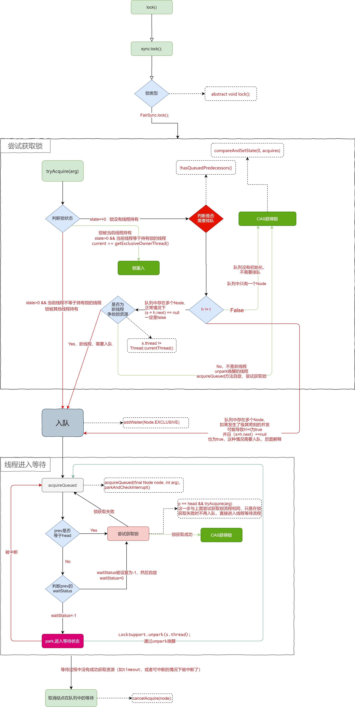
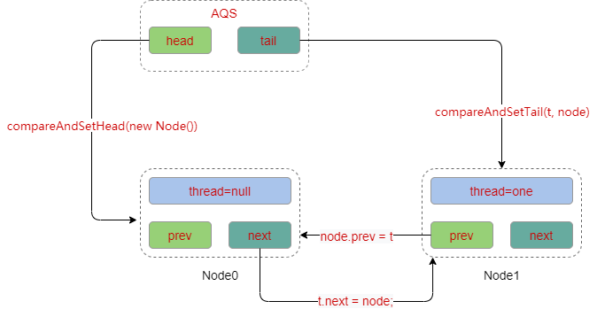

### ReentrantLock简介

####  简介		

​		一个可重入互斥Lock，具有与使用Synchronized隐式监视锁相同的基本行为和语义。同时ReentrantLock功能更加强大，使用更加灵活，具有公平锁、非公平锁、等待可中断、绑定多个条件等Synchronized不具备的功能。


​		ReentrantLock实现了Lock，同时通过内部类FairSync和NonFairSync实现了公平锁和非公平锁的扩展功能。FairSync和NonFairSync都继承自ReentrantLock的另一个内部类`Sync`，`Sync`继承自**`AbstractQueuedSynchronizer`**，这个类就是所谓的**`AQS`**，并发编程的核心，其使用了**自旋**、**CAS**、**park-unpark** 等技术。AQS通过内部类`Node`维护一个队列，当出现多个线程争抢锁时，无法获取锁的线程会被封装为一个Node结点放入队列中，同时通过LockSupport.park实现线程阻塞，**`如果是单个线程或者多个线程交替执行，其实和队列无关，在JDK级别解决问题`** 。

#### 基础源码介绍


##### ReentrantLock构造方法

```java
// 创建一个ReentrantLock的实例,默认创建的是非公平锁
ReentrantLock()
// 根据给定的公平策略创建一个ReentrantLock的实例
// fair=true表示采用公平锁
ReentrantLock(boolean fair) 
```

##### ReentrantLock其他方法

其中`lock`、`lockInterruptibly`、`tryLock`、`unlock`、`newcondition`几个方法是ReentranLock实现的Lock接口中的方法，其他方法如下：

```java
// 获取当前线程对此锁持有的次数（重入的次数）
public int getHoldCount();
// 如果当前线程持有该锁返回true，否则返回false
public boolean isHeldByCurrentThread();
// 如果有线程持有该锁返回true，否则返回false
public boolean isLocked();
// 判断该锁是否为公平锁（true），非公平锁返回false
public final boolean isFair();
// 查询是否有线程在等待该锁，有返回true，否则返回false
public final boolean hasQueuedThreads();
// 查询给定的线程是否在等待该锁，
public final boolean hasQueuedThread(Thread thread);
// 获取正在等待该锁的线程数量——是个预估值
public final int getQueueLength();
// 查询任何线程是否等待与此锁相关联的给定条件
public boolean hasWaiters(Condition condition);
// 返回与此锁相关联的给定条件等待的线程数的估计
public int getWaitQueueLength(Condition condition);
```

##### AQS核心参数

```java
public abstract class AbstractQueuedSynchronizer
    extends AbstractOwnableSynchronizer
    implements java.io.Serializable {
    //头节点，不保存真实信息，只表示位置，不代表实际的等待线程
    private transient volatile Node head;
    //尾节点
    private transient volatile Node tail;
    //状态
    private volatile int state;
}
```

##### AQS-Node核心参数

```java
static final class Node {
	volatile int waitStatus;
    volatile Node prev;
    volatile Node next;
    volatile Thread thread;
}
```

#### Lock流程



**流程补充：**

+ acquireQueued方法：

  这个方法非常的有意思，通过**`for (;;)`** 实现死循环，如果当前Node的前一个结点是Head，那么就尝试的去获取锁，获取成功则返回true，如果当前结点的prev结点不是head，就去判断prev的waitStatus，**waitStatus初始值为0，这就实现了一次自旋获取锁**，为什么要自旋，因为自旋成功获取锁就**不用去park**，自旋一次还未获取到锁，就去park，有意思的是因为for死循环，park本身是不可中断的，这种情况下被中断了，那么会从park()中醒过来，发现拿不到资源，从而继续进入park()等待。

+ 为什么修改的是prev的waitStatus：

  + park之前线程并没有暂停，park过后不能执行任何操作了，就像人睡觉，自己并不会知道自己睡着了，其他的人知道
  + 与解锁有关，这一块还未学习到，后面补上

**入队流程如下：**

+ 初始状态下AQS中的head和tail都为null

  

+ 当发生资源争夺时，第一个线程入队

  

  这里有一个隐藏的操作，新建了一个thread=null的Node作为第一个节点，具体原因没怎么想明白，可能是为了兼容后面修改waitStatus等原因吧。

+ 当更多的节点入队时

  

  

