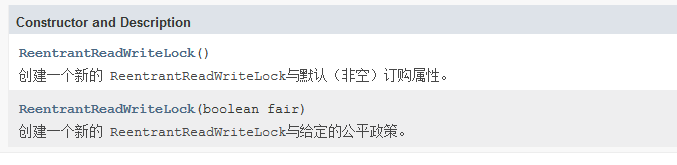
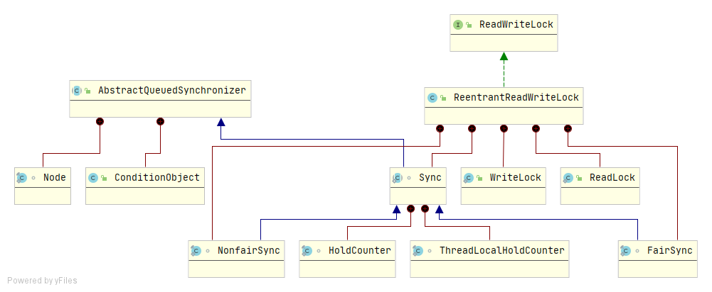
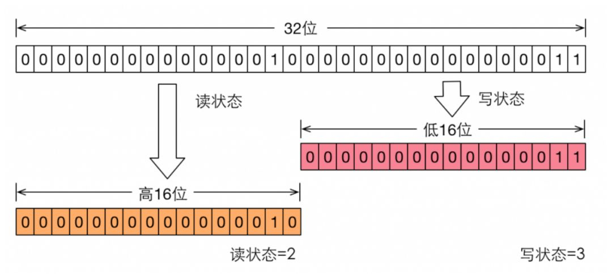
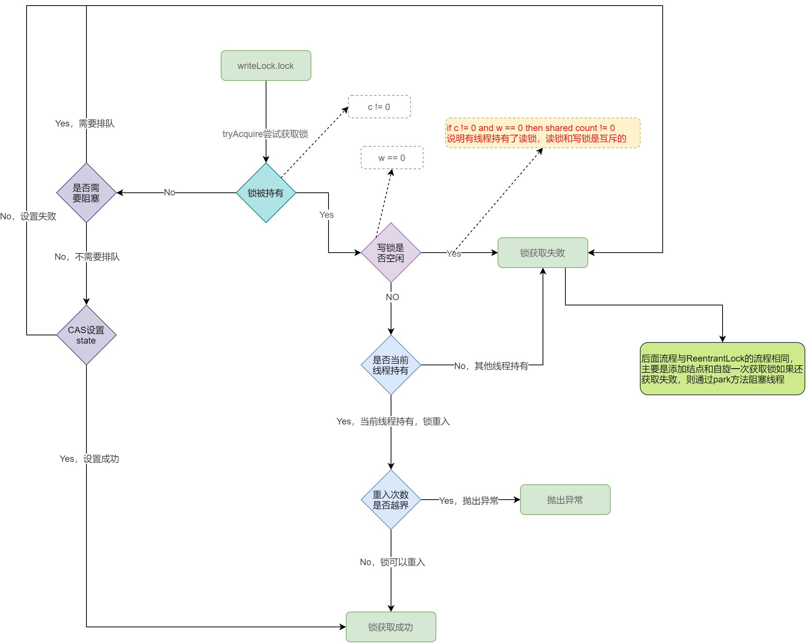

## ReentrantReadWriteLock简介

ReentrantReadWriteLock是一种读写锁，实现了ReadWriteLock接口，通过内部类Sync实现AQS框架的相关API来实现锁的功能。

对ReentrantReadWriteLock的理解需要Lock、AQS、ReentrantLock、Condition等相关的基础知识。

## 特点

+ 支持公平与非公平锁

  在创建ReentrantReadWriteLock时，支持传入参数指定创建公平锁还是非公平锁

+ 支持锁重入

  + 同一线程在获取了读锁过后还可以获取读锁

  + 同一线程在获取了写锁过后和还可以获取读锁和写锁

+ 支持锁降级

  写锁可以降级为读锁，读锁不能升级为写锁

## 整体结构




由上图可知，ReentrantReadWriteLock实现了ReadWriteLock接口，通过内部类`WriteLock`和`ReadLock`实现了读锁和写锁的相关功能，而具体的锁相关的功能，是内部类`Sync`继承自AbstractQueueSynchronizer，通过实现AQS框架的相关API来实现的，而公平锁和非公平锁是通过内部类`FairSync`和`NonfairSync`继承自`Sync`实现的。

## Sync如何同时表示读锁与写锁

```java
static final int SHARED_SHIFT   = 16;
static final int SHARED_UNIT    = (1 << SHARED_SHIFT);
static final int MAX_COUNT      = (1 << SHARED_SHIFT) - 1;
static final int EXCLUSIVE_MASK = (1 << SHARED_SHIFT) - 1;

/** Returns the number of shared holds represented in count  */
static int sharedCount(int c)    { return c >>> SHARED_SHIFT; }
/** Returns the number of exclusive holds represented in count  */
static int exclusiveCount(int c) { return c & EXCLUSIVE_MASK; }
```

从代码中获取读写状态可以看出其是把`state（int32位）`字段分成高16位与低16位，其中高16位表示读锁个数，低16位表示写锁个数，如下图所示（图来自Java并发编程艺术）



该图表示当前一个线程获取到了写锁，并且重入了两次，因此低16位是3，并且该线程又获取了读锁，并且重入了一次，所以高16位是2，当写锁被获取时如果读锁不为0那么读锁一定是获取写锁的这个线程。

## 方法声明

```java
// 返回当前持有写锁的线程，如果没有线程持有返回null
protected Thread getOwner();
// 获取读锁被持有的数量，只用于监控，不能用于同步控制
public int getReadLockCount();
// 查询写锁是否被线程持有，只用于监控，不能用于同步控制
public boolean isWriteLocked();
// 判断写锁是否被当前线程持有
public boolean isWriteLockedByCurrentThread();
// 获取当前线程对写锁的重入次数，当前线程没有持有该锁返回0 
public int getWriteHoldCount();
// 获取当前线程对读锁的重入次数
public int getReadHoldCount();
// 返回一个包含可能正在等待获取写锁的线程集合
protected Collection<Thread> getQueuedWriterThreads();
// 返回一个包含可能正在等待获取读锁的线程集合
protected Collection<Thread> getQueuedReaderThreads();
// 判断当前是否有线程在等待获取锁（写锁或读锁）
public final boolean hasQueuedThreads();
// 判断给定线程是否正在等待获取锁
public final boolean hasQueuedThread(Thread thread);
// 获取正在等待获取锁的线程数
public final int getQueueLength();
// 返回正在等待获取锁的线程
protected Collection<Thread> getQueuedThreads();
// 查询任何线程是否等待与写锁相关联的给定条件
public boolean hasWaiters(Condition condition);
// 返回与写入锁相关联的给定条件等待的线程数的估计
public int getWaitQueueLength(Condition condition);
// 返回包含可能在与写锁相关联的给定条件下等待的线程的集合
protected Collection<Thread> getWaitingThreads(Condition condition);
```

## 使用示例

```java
import java.util.concurrent.ExecutorService;
import java.util.concurrent.Executors;
import java.util.concurrent.TimeUnit;
import java.util.concurrent.locks.Lock;
import java.util.concurrent.locks.ReentrantReadWriteLock;

public class ReentrantReadWriteLockTest {
    private final static ReentrantReadWriteLock reentrantReadWriteLock = new ReentrantReadWriteLock(true);
    private final static Lock writeLock = reentrantReadWriteLock.writeLock();
    private final static Lock readLock = reentrantReadWriteLock.readLock();
    public static void main(String[] args) {
        ExecutorService executorService = Executors.newScheduledThreadPool(5);
        for (int i = 0; i < 5; i++) {
            executorService.submit(()->write());
        }
        for (int i = 0; i < 5; i++) {
            executorService.submit(()->read());
        }
        executorService.shutdown();
    }

    public static void write(){
       try {
           writeLock.lock();
           System.out.println(Thread.currentThread().getName()+":写入数据");
           try {
               TimeUnit.SECONDS.sleep(1);
           } catch (InterruptedException e) {
               e.printStackTrace();
           }
       }finally {
            writeLock.unlock();
       }
    }

    public static void read() {
        try {
            readLock.lock();
            System.out.println(Thread.currentThread().getName()+":读取数据");
            try {
                TimeUnit.SECONDS.sleep(1);
            } catch (InterruptedException e) {
                e.printStackTrace();
            }
        }finally {
            readLock.unlock();
        }
    }
}
```

由运行结果可以看出，**写与写是互斥的，写与读是互斥的，读与读可以同步**。

## 源码分析

### 构造方法

```java
public ReentrantReadWriteLock(boolean fair) {
    // 根据参数fair创建公平/非公平策略的sync
    sync = fair ? new FairSync() : new NonfairSync();
    // 创建读锁
    readerLock = new ReadLock(this);
    // 创建写锁
    writerLock = new WriteLock(this);
}
```

### 公平写锁-lock

```java
// WirteLock in ReentrantReadWriteLock
public void lock() {
    sync.acquire(1);
}
// AQS acquire
public final void acquire(int arg) {
    if (!tryAcquire(arg) &&
        // 添加结点和自旋一次获取锁如果还获取失败则通过park方法阻塞线程
        // 前面的文章介绍过，此处不再累赘
        acquireQueued(addWaiter(Node.EXCLUSIVE), arg))
        selfInterrupt();
}
// Sync in ReentrantReadWriteLock
// 尝试获取排它锁
protected final boolean tryAcquire(int acquires) {
    Thread current = Thread.currentThread();
    int c = getState();
    //计算写锁状态值，如果w=0表示锁空闲，w>0表示分配了锁，锁重入的次数
    int w = exclusiveCount(c);
    if (c != 0) { // 锁被持有
        // (Note: if c != 0 and w == 0 then shared count != 0)
        // w==0 写锁空闲--可以断言读锁被线程持有，读写锁互斥，直接获取锁失败，返回false
        // current != getExclusiveOwnerThread()判断是否当前线程持有锁
        if (w == 0 || current != getExclusiveOwnerThread())
            return false; 
        if (w + exclusiveCount(acquires) > MAX_COUNT) // 锁重入次数超过最大值
            throw new Error("Maximum lock count exceeded");
        // Reentrant acquire
        // 运行到这一步，说明：当前线程持有该写锁，并且可以重入
        // 这一步不用通过CAS设置state，因为该线程自己持有写锁
        setState(c + acquires);
        return true;
    }
    // 如果锁没有被持有
    if (writerShouldBlock() || // 判断是否需要排队
        !compareAndSetState(c, c + acquires)) // CAS设置state，获取锁
        return false;
    // 设置锁持有的线程为当前线程
    setExclusiveOwnerThread(current);
    return true;
}

static final class FairSync extends Sync {
    // 判断是否需要Block，其实就是判断是否需要排队
    final boolean writerShouldBlock() {
        return hasQueuedPredecessors();
    }
}
```

注意：`setState(c + acquires);`是线程安全的，因为当前线程自己持有写锁

**源码流程如下：**



### 非公平写锁-lock

非公平写锁整体逻辑只有在`writerShouldBlock()`方法处略有不同，非公平锁的`writerShouldBlock()`方法直接返回的false，即不需要排队，代码如下:

```java
static final class NonfairSync extends Sync {
    final boolean writerShouldBlock() {
        return false; // writers can always barge
    }
}
```

### 写锁-unlock

```java
// WirteLock in ReentrantReadWriteLock
public void unlock() {
    sync.release(1);
}
// AQS
public final boolean release(int arg) {
    if (tryRelease(arg)) { // 如果锁已经释放
        Node h = head;
        if (h != null && h.waitStatus != 0)
            // 唤醒下一个线程
            unparkSuccessor(h);
        return true;
    }
    return false;
}
// Sync in ReentrantReadWriteLock
// 尝试释放排它锁
protected final boolean tryRelease(int releases) {
    if (!isHeldExclusively()) // 判断当前线程是否是锁的持有者
        throw new IllegalMonitorStateException();
    int nextc = getState() - releases;
    // 计算写锁的持有状态
    boolean free = exclusiveCount(nextc) == 0;
    if (free) // 锁已经是否
        setExclusiveOwnerThread(null);
    setState(nextc);
    return free;
}
```

### 公平读锁-lock

```java
// ReadLock in ReentrantReadWriteLock
public void lock() {
    sync.acquireShared(1);
}
// AQS 
public final void acquireShared(int arg) {
    if (tryAcquireShared(arg) < 0)
        doAcquireShared(arg);
}
// Sync in ReentrantReadWriteLock
// 尝试获取共享锁
protected final int tryAcquireShared(int unused) {
    Thread current = Thread.currentThread();
    int c = getState();
    // 判断写锁是否被持有当前线程持有
    if (exclusiveCount(c) != 0 &&
        getExclusiveOwnerThread() != current)
      	// 其他线程持有写锁，获取读锁失败
        return -1;
    // 计算是否有线程持有读锁
    int r = sharedCount(c);
    // 判断读锁是否需要排队，如果队列中头结点
    if (!readerShouldBlock() && // 不需要排队
        r < MAX_COUNT && // 读锁能够继续获取
        // cas设置state
        compareAndSetState(c, c + SHARED_UNIT)) { // 锁获取成功
        if (r == 0) { // 没有人持有读锁
            firstReader = current; // 设置第一个持有读锁的线程
            firstReaderHoldCount = 1; // 第一个线程读锁持有数量
        } else if (firstReader == current) { // 第一个线程等于当前线程，锁重入
            firstReaderHoldCount++; // 持有量加1
        } else { // 其他线程获取读锁
            // readHolds类似于一个ThreadLocal，用于记录每个线程读锁的重入次数
            HoldCounter rh = cachedHoldCounter;
            if (rh == null || rh.tid != getThreadId(current))
                cachedHoldCounter = rh = readHolds.get();
            else if (rh.count == 0)
                readHolds.set(rh);
            rh.count++;
        }
        // 锁获取成功
        return 1;
    }
    // 获取锁失败，放到循环里重试
    return fullTryAcquireShared(current);
}
// 获取锁失败，放到循环里重试
final int fullTryAcquireShared(Thread current) {
    /*
    * This code is in part redundant with that in
    * tryAcquireShared but is simpler overall by not
    * complicating tryAcquireShared with interactions between
    * retries and lazily reading hold counts.
    */                                   
    HoldCounter rh = null;
    for (;;) {
        int c = getState();
        if (exclusiveCount(c) != 0) {
            if (getExclusiveOwnerThread() != current)
                return -1;
            // else we hold the exclusive lock; blocking here
            // would cause deadlock.
        } else if (readerShouldBlock()) {
            // Make sure we're not acquiring read lock reentrantly
            if (firstReader == current) {
                // assert firstReaderHoldCount > 0;
            } else {
                if (rh == null) {
                    rh = cachedHoldCounter;
                    if (rh == null || rh.tid != getThreadId(current)) {
                        rh = readHolds.get();
                        if (rh.count == 0)
                            readHolds.remove();
                    }
                }
                if (rh.count == 0)
                    return -1;
            }
        }
        if (sharedCount(c) == MAX_COUNT)
            throw new Error("Maximum lock count exceeded");
        if (compareAndSetState(c, c + SHARED_UNIT)) {
            if (sharedCount(c) == 0) {
                firstReader = current;
                firstReaderHoldCount = 1;
            } else if (firstReader == current) {
                firstReaderHoldCount++;
            } else {
                if (rh == null)
                    rh = cachedHoldCounter;
                if (rh == null || rh.tid != getThreadId(current))
                    rh = readHolds.get();
                else if (rh.count == 0)
                    readHolds.set(rh);
                rh.count++;
                cachedHoldCounter = rh; // cache for release
            }
            return 1;
        }
    }
}

// 锁获取失败后会执行该方法
private void doAcquireShared(int arg) {
    // 添加结点，通过指定nextWaiter为Node.SHARED，表示该结点为一个获取共享锁的结点，即读锁
    final Node node = addWaiter(Node.SHARED);
    boolean failed = true;
    try {
        boolean interrupted = false;
        for (;;) { // 自旋
            final Node p = node.predecessor();
            // 判断当前结点的前一个结点是否为头结点
            if (p == head) {
                // 再一次尝试获取锁
                int r = tryAcquireShared(arg);
                // 判断锁是否获取成功
                if (r >= 0) { // 锁获取成功
                    // 设置头结点，并判断下一个结点是否为共享的
                    setHeadAndPropagate(node, r);
                    p.next = null; // help GC
                    if (interrupted)
                        selfInterrupt();
                    failed = false;
                    return;
                }
            }
            // 判断ws，自旋一次，通过park阻塞线程，
            // 当线程被唤醒时会重新自旋一次获取锁
            if (shouldParkAfterFailedAcquire(p, node) &&
                parkAndCheckInterrupt())
                interrupted = true;
        }
    } finally {
        if (failed)
            cancelAcquire(node);
    }
}

private void setHeadAndPropagate(Node node, int propagate) {
    Node h = head; // Record old head for check below
    setHead(node);
    if (propagate > 0 || h == null || h.waitStatus < 0 ||
        (h = head) == null || h.waitStatus < 0) {
        Node s = node.next;
        if (s == null || s.isShared())
            // 会唤醒后面获取读锁的结点
            doReleaseShared();
    }
}
```

### 非公平读锁-lock

非公平读锁整体上与公平读锁逻辑相同，同样在判断是否需要等待的方法上有一点区别，NonfairSync的readerShouldBlock方法如下：

```java
final boolean readerShouldBlock() {
    return apparentlyFirstQueuedIsExclusive();
}
//整个判断的大体意思是在获取读锁的时候如果同步队列的头结点是正在等待获取写锁的结点时，需要阻塞，不能插队
final boolean apparentlyFirstQueuedIsExclusive() {
    Node h, s;
    return (h = head) != null &&
        (s = h.next)  != null &&
        !s.isShared()         &&
        s.thread != null;
}
```

### 读锁-unlock

```java
//ReadLock in ReentrantReadWriteLock
public void unlock() {
    sync.releaseShared(1);
}
// AQS
public final boolean releaseShared(int arg) {
    if (tryReleaseShared(arg)) { // 如果锁释放了，就执行后续线程
        doReleaseShared();
        return true;
    }
    // 锁重入 状态改变 但是锁没有释放
    return false;
}
// sync in ReentrantReadWriteLock
protected final boolean tryReleaseShared(int unused) {
    Thread current = Thread.currentThread();
    if (firstReader == current) {
        // assert firstReaderHoldCount > 0;
        if (firstReaderHoldCount == 1)
            firstReader = null;
        else
            firstReaderHoldCount--;
    } else {
        HoldCounter rh = cachedHoldCounter;
        if (rh == null || rh.tid != getThreadId(current))
            rh = readHolds.get();
        int count = rh.count;
        if (count <= 1) {
            readHolds.remove();
            if (count <= 0)
                throw unmatchedUnlockException();
        }
        --rh.count;
    }
    for (;;) {
        int c = getState();
        int nextc = c - SHARED_UNIT;
        if (compareAndSetState(c, nextc))
            // Releasing the read lock has no effect on readers,
            // but it may allow waiting writers to proceed if
            // both read and write locks are now free.
            return nextc == 0;
    }
}

private void doReleaseShared() {
    for (;;) {
        Node h = head;
        if (h != null && h != tail) {
            int ws = h.waitStatus;
            if (ws == Node.SIGNAL) {
                if (!compareAndSetWaitStatus(h, Node.SIGNAL, 0))
                    continue;            // loop to recheck cases
                unparkSuccessor(h);
            }
            else if (ws == 0 &&
                     !compareAndSetWaitStatus(h, 0, Node.PROPAGATE))
                continue;                // loop on failed CAS
        }
        if (h == head)                   // loop if head changed
            break;
    }
}
```