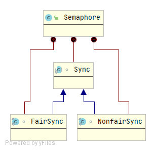

## Semaphore简介

Semaphore，又名信号量，维护着一定数量的“许可证”的许可集，当线程想要访问共享资源时，需要先获取到许可证，如果许可证不够，线程需要一直等待，直到有足够的许可证可用，当线程使用完共享资源后需要归还许可证，供其他线程使用。**Semaphore是共享数据访问权限的一种控制，并不能保证数据操作的原子性，如果将许可证数量设置为1，可以被当做锁来使用，许可证数量大于1，不能被当作锁。**

## 使用示例

```java
public class SemaphoreTest {

    public static void main(String[] args) {
        ExecutorService executorService = Executors.newScheduledThreadPool(5);
        Semaphore semaphore = new Semaphore(3);
        for (int i = 0; i < 10; i++) {
            executorService.submit(()->{
                try {
                    semaphore.acquire();
                    System.out.println(Thread.currentThread().getName()+"：正在执行。");
                    Thread.sleep(3000);
                } catch (InterruptedException e) {
                    e.printStackTrace();
                } finally {
                    System.out.println(Thread.currentThread().getName()+"：执行完成。");
                    System.out.println("=================================");
                    System.out.println("=================================");
                    semaphore.release();
                }

            });
        }
        executorService.shutdown();
    }
}
```

## 方法摘要

### 构造方法

```java
// 创建一个指定许可证数量的Semaphore，默认是非公平的
public Semaphore，默认是非公平的(int permits);
// 创建一个指定许可证数量的Semaphore，可通过fair参数指定是否为公平的
public Semaphore(int permits, boolean fair);
```

### 所有方法

```java
// 从该信号量获取许可证，如果没有许可证可用，则线程阻塞直到许可证可用或者线程被中断
public void acquire() throws InterruptedException;
// 从该信号量获取指定数量的许可证，如果没有足够的许可证可用，线程阻塞直到有足够的许可证可用或者线程被中断
public void acquire(int permits) throws InterruptedException;
// 从该信号量获取许可证，如果没有许可证可用，则线程阻塞直到许可证可用
public void acquireUninterruptibly();
// 从该信号量获取指定数量的许可证，如果没有足够的许可证可用，线程阻塞直到有足够的许可证可用
public void acquireUninterruptibly(int permits);
// 获取信号量中当前可用的许可证数量
public int availablePermits();
// 获取信号量当前许可证数量并清空所有许可证
public int availablePermits();
// 获取可能正在等待获取许可证的线程的集合
protected Collection<Thread> getQueuedThreads();
// 获取有可能正在等待获取许可证的线程的数量
public final int getQueueLength();
// 获取是否有线程正在等待获取许可证
public final boolean hasQueuedThreads();
// 判断是否为公平设置
public boolean isFair();
// 释放许可证
public void release();
// 释放指定数量的许可证
public void release(int permits);
// 尝试获取许可证
public boolean tryAcquire();
// 尝试获取指定数量的许可证
public boolean tryAcquire(int permits);
// 在指定时间内尝试获取指定数量的许可证
public boolean tryAcquire(int permits;long timeout,TimeUnit unit) throws InterruptedException;
// 在指定的时间内获取许可证
public boolean tryAcquire(long timeout, TimeUnit unit) throws InterruptedException;
// 缩小可用许可证数量
protected void reducePermits(int reduction);
```

## 源码分析

### 整体结构



Semaphore是通过内部类实现了AQS框架提供的接口，而且基本和ReentrantLock完全一样，通过内部类分别实现了公平与非公平策略。

### acquire方法

```java
public void acquire() throws InterruptedException {
    // AQS方法
    sync.acquireSharedInterruptibly(1);
}
public final void acquireSharedInterruptibly(int arg) throws InterruptedException {
    if (Thread.interrupted()) // 判断线程是否中断
        throw new InterruptedException();
    if (tryAcquireShared(arg) < 0) // 尝试获取锁
        // 阻塞线程，具体逻辑以前的文章中分析过了
        doAcquireSharedInterruptibly(arg);
}
// 公平策略下的tryAcquireShared
protected int tryAcquireShared(int acquires) {
    for (;;) { // 自旋
        if (hasQueuedPredecessors()) // 判断是否需要排队
            return -1;
        int available = getState();
        // 计算剩余可用的许可证
        int remaining = available - acquires;
        if (remaining < 0 ||
            compareAndSetState(available, remaining))
            return remaining;
    }
}
// 非公平策略下的tryAcquireShared
protected int tryAcquireShared(int acquires) {
    return nonfairTryAcquireShared(acquires);
}
// 与公平策略下的区别在于非公平策略下不需要判断排队
final int nonfairTryAcquireShared(int acquires) {
    for (;;) {
        int available = getState();
        int remaining = available - acquires;
        if (remaining < 0 ||
            compareAndSetState(available, remaining))
            return remaining;
    }
}
```

### release方法

```java
public void release() {
    sync.releaseShared(1);
}
public final boolean releaseShared(int arg) {
    if (tryReleaseShared(arg)) { //尝试归还许可证
        // AQS方法，正常情况下主要是唤醒线程
        doReleaseShared();
        return true;
    }
    return false;
}
protected final boolean tryReleaseShared(int releases) {
    for (;;) { //自旋
        int current = getState();
        // 可用许可证数 + releases
        int next = current + releases;
        if (next < current) // overflow
            throw new Error("Maximum permit count exceeded");
        if (compareAndSetState(current, next))
            return true;
    }
}
```


