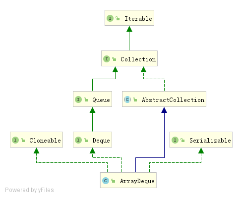
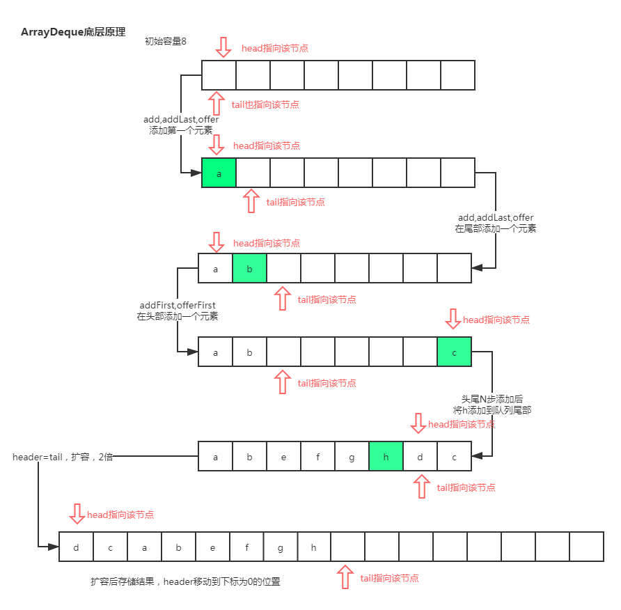

## 整体介绍

Deque 接口继承自 Queue接口，但 Deque 支持同时从两端添加或移除元素，因此又被成为双端队列。`ArrayDeque`是`Deque`的实现类 ，可以被当作 FIFO队列使用，效率高于`LinkedList` ；也可以当作LIFO队列（栈）来使用，效率高于`Stack` ，官方也是推荐使用 Deque 的实现来替代 Stack。ArrayDeque不支持值为 null 的元素。



由ArrayDeque的结构图可以知道，ArrayDeque继承自AbstractCollection，实现了Deque接口以及类名中的Array姓氏，基本可以判断ArrayDeque是一个基于数组实现的双向链表。 

```java
/**
 * Resizable-array implementation of the {@link Deque} interface.  Array
 * deques have no capacity restrictions; they grow as necessary to support
 * usage.  They are not thread-safe; in the absence of external
 * synchronization, they do not support concurrent access by multiple threads.
 * Null elements are prohibited.  This class is likely to be faster than
 * {@link Stack} when used as a stack, and faster than {@link LinkedList}
 * when used as a queue.
 */
```

以上注释是源代码中的第一段注释，我们可以从中获取到一下几点信息：

- ArrayDeque是支持动态扩容的

  通过对ArrayDeque扩容机制（后面讲解）的了解，知道ArrayDeque的容量一定是2^n（这里和HashMap类似） ，因此ArrayDeque的最大容量为2^30 。

- ArrayDeque不是线程安全的

- 不支持存储Null元素，应为null用于作为特殊返回值，用于判断队列是否为空

- ArrayDeque如果用作栈，比Stack的效率高，这是因为Stack是线程安全的，

- ArrayDeque如果用作队列比LinkedList效率高，这是因为其实现方式：数组作为基底，两个指分指头尾，插入删除操作时移动指针；如果头尾指针重合，则需要扩容

 ```java
  // 基于数组实现
  transient Object[] elements; 
  // 头指针
  transient int head;
  // 尾指针
  transient int tail;
 ```

元素添加流程，能整体上有个理解：




## 源码解析

默认对队列双向队列的数据结构有基本的认识，在使用和理解源码时，一定要有一个概念：**双向循环队列，元素存在head右边和tail的左边** 

### 核心参数

```java
// 存储具体数据的数组，不可序列化
transient Object[] elements; 
// 头部指针，不可被序列化
transient int head;
// 尾部指针、不可被序列化
transient int tail;
// 队列初始化的最小容量  必须是2的次方
private static final int MIN_INITIAL_CAPACITY = 8;
```

### 构造方法

```java
// 默认的构造方法，创建一个容量为16的空ArrayDeque
public ArrayDeque() {
    elements = new Object[16];
}
// 通过传入的numElements，计算出合适的容量值，并创建相应容量的空的ArrayDeque
public ArrayDeque(int numElements) {
    allocateElements(numElements);
}
// 通过传入集合的大小计算出合适的容量，并创建相应容量的空的ArrayDeque、
// 最后将传入集合C中的元素全部复制到新创建的ArrayDeque中
public ArrayDeque(Collection<? extends E> c) {
    allocateElements(c.size());
	// 将集合添加到队列中，该方法的源码后面分析
    addAll(c);
}
```

```java
// 根据给定的numElements计算合适的容量，并创建相应容量的空的ArrayDeque
private void allocateElements(int numElements) {
    int initialCapacity = MIN_INITIAL_CAPACITY;
    // 如果numElements大于最小初始容量，则通过位运算进行计算
    if (numElements >= initialCapacity) {
        initialCapacity = numElements;
        // 以下代码是位运算与或运算的组合运用，大家自行理解测试
        initialCapacity |= (initialCapacity >>>  1);
        initialCapacity |= (initialCapacity >>>  2);
        initialCapacity |= (initialCapacity >>>  4);
        initialCapacity |= (initialCapacity >>>  8);
        initialCapacity |= (initialCapacity >>> 16);
        
        // 经过上面的运算始终是个比2的n次方小1的单数，+1确保是2的n次方
        initialCapacity++;
		//initialCapacity超出int最大值时，左移一位（除以2），最大容量为2 ^ 30
        if (initialCapacity < 0)   // Too many elements, must back off
            initialCapacity >>>= 1;// Good luck allocating 2 ^ 30 elements
    }
   	// 创建数组
    elements = new Object[initialCapacity];
}
```

### 新增相关方法

```java
// 将元素e添加队列的尾部 
public boolean add(E e) {
    // 调用addLast方法
    addLast(e);
    // 添加成功返回true
    return true;
}
// 将元素e添加队列的尾部 没有返回值
public void addLast(E e) {
    if (e == null)  // 如果元素e为空，抛出null异常
        throw new NullPointerException();
    elements[tail] = e; 
    /**
    * 1、尾指针tail+1，即下个添加到尾部的元素的位置
    * 2、判断是否需要扩容，如果头尾指针相等就进行扩容
    * 3、此处为什么要使用&（与）运算？
    *    当队列存满了，如果head为0，那么tail一定是(elements.length - 1)(数组下标从0开始)
    *    那么tail+1其实等于elements.length，所以tail+1肯定不等于0
    *    而elements.length & (elements.length - 1)的结果就是0，所以这种情况下就需要扩容
    *    并且位运算是一种效率非常高的运算方式
    */
    if ( (tail = (tail + 1) & (elements.length - 1)) == head)
        // 扩容1倍
        doubleCapacity();
}

// 在头部添加元素 没有返回值
public void addFirst(E e) {
    if (e == null) // 如果元素e为空，抛出null异常
        throw new NullPointerException();
    /**
    *  1、计算头指针的值，
    *  2、将e设置到计算后的head位置
    *  3、此处为什么要使用&（与）运算？处理当head=0的情况，
    *     -1 & (elements.length - 1) = (elements.length - 1)，即数组的最后一个下标位置
    */
    elements[head = (head - 1) & (elements.length - 1)] = e;
    // 当头尾指针相等时，说明队列已满，
    if (head == tail)
        //扩容1倍
        doubleCapacity();
}
// 在队列的尾部添加元素
public boolean offer(E e) {
    return offerLast(e);
}
// 在队列的头部添加元素 添加成功返回true
public boolean offerFirst(E e) {
     addFirst(e);
     return true;
 }
 // 在队列的尾部添加元素 添加成功返回true
 public boolean offerLast(E e) {
     addLast(e);
     return true;
 }
```

### 扩容

```java
// 将底层数组elements，扩容1倍
private void doubleCapacity() {
    //断言head == tail
    assert head == tail;
    int p = head;
    int n = elements.length;
    // 计算有多少个元素是被添加到头部的
    int r = n - p; // number of elements to the right of p
    // 新容量设置为原容量的2倍
    int newCapacity = n << 1;
    // 如果扩容后超出int最大值则抛出异常
    if (newCapacity < 0)
        throw new IllegalStateException("Sorry, deque too big");
    // 定义新数组
    Object[] a = new Object[newCapacity];
    // 这两句arraycopy的作用是把head位置顺移到新数组下标为0的位置，
    // 理解为环形数组，所有的都跟着移动
    System.arraycopy(elements, p, a, 0, r);
    System.arraycopy(elements, 0, a, r, p);
    //将底层数组替换成扩容后的数组
    elements = a;
    // 因为顺移后，目前的head已经指向新数组下标0的位置
    head = 0;
    // 尾部最后一个元素的下标为原数组elements.length-1（数组下标从0开始），
    // 那么尾部下一个元素的下标就为(elements.length-1)+1即为n
    tail = n;
}
```

### 移除元素

```java
// 移除头部元素并返回
public E remove() {
    return removeFirst();
}
// 移除头部元素并返回，如果队列为空就抛出异常
public E removeFirst() {
    E x = pollFirst();
    if (x == null)
        throw new NoSuchElementException();
    return x;
}

// 移除尾部元素并返回，如果队列为空就抛出异常
public E removeLast() {
    E x = pollLast();
    if (x == null)
        throw new NoSuchElementException();
    return x;
}
// 将队列头部元素取出并移除
public E poll() {
    return pollFirst();
}
// 取出并移除头部元素，队列为空是返回null
public E pollFirst() {
    int h = head;
    // 取出元素
    @SuppressWarnings("unchecked")
    E result = (E) elements[h];
    // Element is null if deque empty
    if (result == null)
        return null;
    // 将头部指针对应的元素设置为null
    elements[h] = null;     // Must null out slot
    // 重新计算头部指针，指向后一个
    // 此处用&运算是处理h+1等于elements.length的情况，
    // 如果h+1等于elements.length，则head=0
    head = (h + 1) & (elements.length - 1);
    // 返回结果
    return result;
}

// 取出尾部元素并移除
public E pollLast() {
     //计算尾部元素的下标，tail存放的值是下一个尾部元素的下标
     int t = (tail - 1) & (elements.length - 1);
     @SuppressWarnings("unchecked")
     E result = (E) elements[t];
     if (result == null)
         return null;
     elements[t] = null;
     // 将下一个尾部元素的下标修改为刚清空的下标 
     tail = t;
     return result;
 }
//移除队列中从头部开始第一次出现的元素o，equals比较
public boolean remove(Object o) {
    return removeFirstOccurrence(o);
}
//移除队列中从头部开始第一次出现的元素o，equals比较
public boolean removeFirstOccurrence(Object o) {
    if (o == null)
        return false;
    int mask = elements.length - 1;
    int i = head;
    Object x;
    while ( (x = elements[i]) != null) {
        if (o.equals(x)) {
            delete(i);
            return true;
        }
        i = (i + 1) & mask;
    }
    return false;
}
// 移除队列中从尾部开始第一次出现的元素o，equals比较
public boolean removeLastOccurrence(Object o) {
    if (o == null)
        return false;
    int mask = elements.length - 1;
    int i = (tail - 1) & mask;
    Object x;
    while ( (x = elements[i]) != null) {
        if (o.equals(x)) {
            delete(i);
            return true;
        }
        i = (i - 1) & mask;
    }
    return false;
}

```

### 获取元素

```java
// 获取头部元素 不删除
public E element() {
    // 调用getFirst方法实现
    return getFirst();
}

//  获取头部元素，不删除、队列为空时抛出异常
public E getFirst() {
    @SuppressWarnings("unchecked")
    E result = (E) elements[head];
    if (result == null)
        throw new NoSuchElementException();
    return result;
}
// 获取尾部元素，不删除、队列为空时抛出异常
public E getLast() {
    @SuppressWarnings("unchecked")
    E result = (E) elements[(tail - 1) & (elements.length - 1)];
    if (result == null)
        throw new NoSuchElementException();
    return result;
}
// 获取头部元素，不删除、队列为空时返回null
public E peekFirst() {
    // elements[head] is null if deque empty
    return (E) elements[head];
}
// 获取尾部元素，不删除、队列为空时返回null
public E peekLast() {
    return (E) elements[(tail - 1) & (elements.length - 1)];
}
```

### 其他重要方法

```java
// 清空队列
public void clear() {
    int h = head;
    int t = tail;
    // 清空head到tail的数据
    if (h != t) { // clear all cells
        head = tail = 0;
        int i = h;
        int mask = elements.length - 1;
        do {
            elements[i] = null;
            // 相当于head一直++ ，当i>mask时（i+1）&mask = 0,
            // 然后i再继续++，知道清除到尾部元素时i=t
            i = (i + 1) & mask;
        } while (i != t);
    }
}
// 判断是否包含摸个元素
public boolean contains(Object o) {
    if (o == null)
        return false;
    int mask = elements.length - 1;
    int i = head;
    Object x;
    // 从头部到尾部逐个元素进行比较判断
    // 感觉这儿处理得很妙，从header到tail肯定都是有元素存在的，
    // 当(x = elements[i]) = null时，要么队列为空，要么已经从head到tail都验证完了
    // i = (i + 1) & mask; 因此这行代码只需从head到tail，下标不停的递推，不用考虑大于tail
    while ( (x = elements[i]) != null) {
        if (o.equals(x))
            return true;
        i = (i + 1) & mask;
    }
    return false;
}
// 内部拷贝元素
private <T> T[] copyElements(T[] a) {
    if (head < tail) { //head小于tail，直接拷贝head与tail之间的元素
        System.arraycopy(elements, head, a, 0, size());
    } else if (head > tail) { // 这种情况，可以理解为以下标0位分界点，左右两边都有元素
        // 分两步完成拷贝，bead到0，0到tail
        int headPortionLen = elements.length - head;
        System.arraycopy(elements, head, a, 0, headPortionLen);
        System.arraycopy(elements, 0, a, headPortionLen, tail);
    }
    return a;
}

```

```java
// 删除给定下标的元素
private boolean delete(int i) {
    // 检查队列中元素是否正确
    checkInvariants();
    // 将队列内容赋给一个新的数组
    final Object[] elements = this.elements;
    final int mask = elements.length - 1;
    final int h = head;
    final int t = tail;
    // 计算i前面有多少元素，即计算(i,head]的元素量
    final int front = (i - h) & mask;
    // 计算i后面有多少元素，即计算[i,tail-1]
    final int back  = (t - i) & mask;

    // Invariant: head <= i < tail mod circularity
    // 判断给定的下标i所对应的元素是否为null，如果为null就抛出异常
    if (front >= ((t - h) & mask))
        throw new ConcurrentModificationException();

    // Optimize for least element motion
    // 按照最小移动数的方向进行处理
    if (front < back) {
        if (h <= i) { 
            // 如果需要删除的元素位于head头指针前面（即在head与mask之间），
            // 则将head到i的元素[h,i)全部向右移动一位
            // 最后清除掉head位置的元素 elements[h] = null;
            System.arraycopy(elements, h, elements, h + 1, front);
        } else { // Wrap around
            // 需要删除的元素在0到tail之间
            // 首先将 [0,i)之间的元素全部向右移动一位，即i-1位置的元素会覆盖掉i位置的元素
            System.arraycopy(elements, 0, elements, 1, i);
            // 将elements[mask]最大位置的元素，移动到刚空出来的elements[0]的位置上
            elements[0] = elements[mask];
            // 然后将head到mask-1的元素全部向右移动一位，mask-1位置的元素会覆盖掉mask位置的元素
            // 这样head位置的元素就无用，应该被清除掉，即后面调用的elements[h] = null;
            System.arraycopy(elements, h, elements, h + 1, mask - h);
        }
        // 最后清除掉head位置的元素
        elements[h] = null;
        // head头指针+1，向右移动一位
        head = (h + 1) & mask;
        return false;
    } else {
        if (i < t) { // Copy the null tail as well
            // i在[0,t)之间，将[i+1,t-1)之间的元素全部向左移动一位
            System.arraycopy(elements, i + 1, elements, i, back);
            // 头指针同时左移一位，即-1
            tail = t - 1;
        } else { // Wrap around
            //如果i在[head,mask]之间，首先将[i+1,mask]中所有元素向左移动一位
            // i+1位置的元素会覆盖掉i位置的元素，而mask位置的元素会被腾空出来
            System.arraycopy(elements, i + 1, elements, i, mask - i);
            // 将0位置的元素elements[0]移动到mask位置
            elements[mask] = elements[0];
            // 将[1,t)中所有元素全部向左移动一位，
            System.arraycopy(elements, 1, elements, 0, t);
            // 同时tail头指针向左移动一位，即-1
            tail = (t - 1) & mask;
        }
        return true;
    }
}

/**
 * 其中涉及到两处Wrap around，我猜测的是i为负数或者i>elements.length的情况
 * 但是这个方法是个private的，说明外部不可能会调用的,这一点没弄明白
 * 另一个不明白的地方是 if (front < back)条件下为什么返回false
 */
```

```java
//判断队列是否是空队列，这儿需要说明的是，在有数据的情况下，出现head=tail的情况会进行扩容，最后head是不等于tail，所以如果head=tail，那么队列中肯定没有元素
public boolean isEmpty() {
    return head == tail;
}
```


