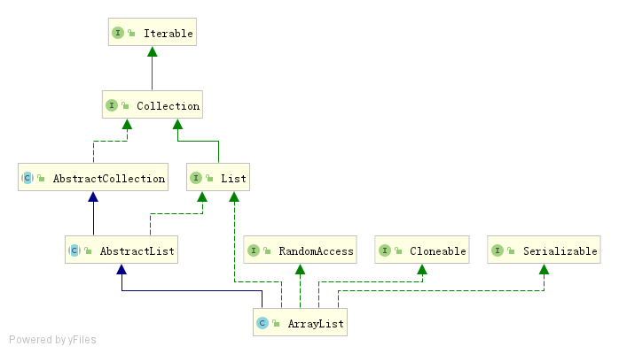

# ArrayList源码分析

## 简介



由上图可知，ArrayList继承了AbstractList，实现了List、RandomAccess、Cloneable、Serializable接口，其中RandomAccess接口是一个空的接口，

```java
public interface RandomAccess {
}
```

它用来标注某个类是否支持随机访问，ArrayList实现RandomAccess接口后，使得get(), set(), add()等方法的时间复杂度都是 O(1) 。

ArrayList是一个动态数组，底层的数据结构是数组，所谓的动态数组，指的是ArrayList实现了自动扩容，我们在使用ArrayList时，可以不考虑容量问题。不过扩容是ArrayList性能消耗较大的地方（需要将数据复制到新数组中），因此建议在能明确数据量的情况下，应该通过`public ArrayList(int initialCapacity) {}`构造方法 指定集合大小，减少扩容的次数。

## 构造方法

```java
// 默认初始化容量
private static final int DEFAULT_CAPACITY = 10;
// 空数组
private static final Object[] EMPTY_ELEMENTDATA = {};
// 默认空数组
private static final Object[] DEFAULTCAPACITY_EMPTY_ELEMENTDATA = {};
// 正在存放元素的数组申明，下面说明此处为什么使用transient
transient Object[] elementData;
// 当前元素数量
private int size;

// 用给定初始化容量构造List
public ArrayList(int initialCapacity) {
    if (initialCapacity > 0) {
        this.elementData = new Object[initialCapacity];
    } else if (initialCapacity == 0) {  //在initialCapacity为0的时候，使用EMPTY_ELEMENTDATA
        this.elementData = EMPTY_ELEMENTDATA;
    } else { // initialCapacity小于0，抛出异常
        throw new IllegalArgumentException("Illegal Capacity: "+ initialCapacity);
    }
}
// 默认构造函数
public ArrayList() {
    this.elementData = DEFAULTCAPACITY_EMPTY_ELEMENTDATA;
}

// 利用给定的集合c，构造List
public ArrayList(Collection<? extends E> c) {
    // 通过Collection.toArray()得到对象数组，并赋值给elementData
    elementData = c.toArray();
    if ((size = elementData.length) != 0) { // elementData不为null
        // c.toArray might (incorrectly) not return Object[] (see 6260652)
        // 可以理解为c.toArray()出错了,返回的不是Object[]
        if (elementData.getClass() != Object[].class) 
            // 利用Arrays.copyOf 来复制集合c中的元素到elementData数组中
            elementData = Arrays.copyOf(elementData, size, Object[].class);
    } else {
        // 如果传入的c是一个空的集合，则使用EMPTY_ELEMENTDATA替换
        this.elementData = EMPTY_ELEMENTDATA;
    }
}
```

ArrayList的构造过程中初始化了elementData和size。

阅读上面源代码遇到两个问题：

- elementData为什么加transient修饰符

  采用transient修饰的意思是在该对象进行序列化的时候，被修饰的属性不进行序列化。具体的原因是因为elementData里面不是所有的元素都有数据，因为容量的问题，elementData里面有一些元素是空的，这种是没必要序列化的。

  ArrayList的序列化和反序列化依赖于writeObject和readObject方法来实现。

- 如何导致elementData.getClass() != Object[].class

  通过(see 6260652)了解到，这是JDK的一个bug，在http://bugs.java.com/bugdatabase/view_bug.do?bug_id=6260652中有描述这个bug。它是这么描述的：Arrays.asList(x).toArray().getClass() should be Object[].class。原来，bug由来于Arrays这个工具类。 （后面用具体的篇幅来了解这个问题）

## trimToSize方法

```java
// 将elementData复制到一个大小刚好（size）的数组里
public void trimToSize() {
    //会修改modCount
    modCount++;
    if (size < elementData.length) {// elementData没有被装满
        // 如果是个空数组，则把EMPTY_ELEMENTDATA赋值给elementData
        // 如果不是空数组，通过Arrays.copyOf方法将elementData中的数据拷贝到新数组中
        elementData = (size == 0)
          ? EMPTY_ELEMENTDATA
          : Arrays.copyOf(elementData, size);
    }
}
```

## 新增相关方法

### add(E e)

将给定的元素e添加到集合的末尾

```java
public boolean add(E e) {
    // 保证容量确定是否需要扩容，同时modCount+1
    // size + 1 目前需要的最小容量
    ensureCapacityInternal(size + 1);  // Increments modCount!!
    // 赋值，同时size+1
    elementData[size++] = e;
    return true;
}
```

```java
private void ensureCapacityInternal(int minCapacity) {
    if (elementData == DEFAULTCAPACITY_EMPTY_ELEMENTDATA) {
        /**
        * 如果采用默认构造函数构造的list，
        * 则取DEFAULT_CAPACITY和minCapacity中最大的值作为目前需要的容量
        */
        minCapacity = Math.max(DEFAULT_CAPACITY, minCapacity);
    }
    // 确定容量的具体方法
    ensureExplicitCapacity(minCapacity);
}
```

```java
private void ensureExplicitCapacity(int minCapacity) {
    modCount++;
    // overflow-conscious code
    if (minCapacity - elementData.length > 0) 
        // 如果目前需要的最小容量大于elementData的容量，就进行扩容操作
        grow(minCapacity);
}
```

```java
// 数组所允许的最大容量
// -8的原因是因为会存一部分头信息在数组中，具体体现是数组的大小
private static final int MAX_ARRAY_SIZE = Integer.MAX_VALUE - 8;
// 扩容方法
private void grow(int minCapacity) {
    // overflow-conscious code
    int oldCapacity = elementData.length;
    // newCapacity为原容量的1.5倍
    int newCapacity = oldCapacity + (oldCapacity >> 1);
    if (newCapacity - minCapacity < 0)
        //如果扩容1.5倍后依然小于所需的最小容量，则用所需的最小容量最为新的容量
        newCapacity = minCapacity;
    if (newCapacity - MAX_ARRAY_SIZE > 0)
        // 如果扩容1.5倍后大于了MAX_ARRAY_SIZE允许的最大容量，就调用处理大容量的方法
        newCapacity = hugeCapacity(minCapacity);
    // minCapacity is usually close to size, so this is a win:
    //通过Arrays.copyOf将elementData拷贝到一个容量为newCapacity的新数组中
    elementData = Arrays.copyOf(elementData, newCapacity);
}
```

```java
private static int hugeCapacity(int minCapacity) {
    if (minCapacity < 0) // int是有最大值的超过了最大值，造成了溢出
        // 抛出OOM异常
        throw new OutOfMemoryError();
    // 最大也就分配Integer.MAX_VALUE
    return (minCapacity > MAX_ARRAY_SIZE) ?
        Integer.MAX_VALUE :
        MAX_ARRAY_SIZE;
}
```

### add(int index, E element)

在指定位置插入元素

```java
public void add(int index, E element) {
    // 检查下标是否越界
    rangeCheckForAdd(index);
    // 证容量确定是否需要扩容，同时modCount+1
    ensureCapacityInternal(size + 1);  // Increments modCount!!
    // 将从index开始的数据向后移一位
    System.arraycopy(elementData, index, elementData, index + 1,size - index);
    elementData[index] = element;
    size++;
}
```

```java
private void rangeCheckForAdd(int index) {
    // 如果给定的位置index大于了elementData中元素的数量size或者给定index小于0
    if (index > size || index < 0)
        throw new IndexOutOfBoundsException(outOfBoundsMsg(index));
}
```

### addAll(Collection<? extends E> c)

将给定的集合c添加到集合的末尾

```java
public boolean addAll(Collection<? extends E> c) {
    // 通过Collection.toArray()将c转化成Object数组
    Object[] a = c.toArray();
    // 获取需要添加的数组的长度
    int numNew = a.length;
    // (size + numNew)最小需要容量
    ensureCapacityInternal(size + numNew);  // Increments modCount
    // 赋值数组a，完成添加
    System.arraycopy(a, 0, elementData, size, numNew);
    // 最后elementData中的数量size为size+numNew
    size += numNew;
    return numNew != 0;
}
```

### addAll(int index, Collection<? extends E> c)

将给定的集合c添加到指定的位置index处

```java
public boolean addAll(int index, Collection<? extends E> c) {
    // 检查index是否下标越界
    rangeCheckForAdd(index);
	// 将c转化为数组
    Object[] a = c.toArray();
    int numNew = a.length;
    // 确保容量
    ensureCapacityInternal(size + numNew);  // Increments modCount
    //计算需要移动的数据量
    int numMoved = size - index;
    if (numMoved > 0)
        // 将从index开始的数据向后移动numNew位
        System.arraycopy(elementData, index, elementData, index + numNew,
                         numMoved);
	// 将a数组中的数据拷贝到elementData中，从index处开始
    System.arraycopy(a, 0, elementData, index, numNew);
    size += numNew;
    return numNew != 0;
}
```

## 删除相关方法

### remove(int index)

移除指定位置的元素

```java
public E remove(int index) {
    // 下标越界检查
    rangeCheck(index);
	// 修改modeCount 因为结构改变了
    modCount++;
    // 获取要删除的元素，如果index为负数 这儿会抛出java.lang.IndexOutOfBoundsException异常
    E oldValue = elementData(index);
    // 需要向前移动的元素数量
    int numMoved = size - index - 1;
    if (numMoved > 0)
        // 将index位置后的所有元素都向前移动一位
        System.arraycopy(elementData, index+1, elementData, index,
                         numMoved);
    // 将最后一个元素置空，GC时可以被回收
    elementData[--size] = null; // clear to let GC do its work

    return oldValue;
}
// 判断下标是否越界
private void rangeCheck(int index) {
    // 此处没有对小于0做判断，是因为在取值时elementData[index]，在底层中对index做了判断
    if (index >= size)
        throw new IndexOutOfBoundsException(outOfBoundsMsg(index));
}

E elementData(int index) {
	// 根据下标从数组中获取元素、并进行类型强转
    return (E) elementData[index];
}
```

### remove(Object o)

移除给定元素在集合中**第一次**出现的位置上的数据

```java
public boolean remove(Object o) {
    if (o == null) {
        for (int index = 0; index < size; index++)
            // 通过循环遍历取值与o进行对比，以此找到o对应的index
            if (elementData[index] == null) { 
                fastRemove(index); // 通过index下标删除数据
                return true;
            }
    } else {
        for (int index = 0; index < size; index++)
            if (o.equals(elementData[index])) {
                fastRemove(index);
                return true;
            }
    }
    return false;
}

// 根据下标快速删除
// 私有方法，调用者决定了不会出现下标越界，所以不用检查，
// 不会返回被删除的值
private void fastRemove(int index) {
    modCount++;
    int numMoved = size - index - 1;
    if (numMoved > 0)
        System.arraycopy(elementData, index+1, elementData, index,numMoved);
    elementData[--size] = null; // clear to let GC do its work
}

```

### removeAll(Collection<?> c)

移除给定集合中的元素，取集合，只移除集合和给定集合同时都存在的元素

```java
public boolean removeAll(Collection<?> c) {
    // 判断集合c是否为空
    Objects.requireNonNull(c);
    // 批量移除元素,第二个参数complement表示是否是补集
    return batchRemove(c, false);
}

private boolean batchRemove(Collection<?> c, boolean complement) {
        final Object[] elementData = this.elementData;
        int r = 0, w = 0;  // r最后会等于size，w表示最后剩余的元素数量
        // 是否修改成功
        boolean modified = false;
        try {
            // 高效的保存两个集合公有元素的算法
            for (; r < size; r++)
                // 如果complement=false，当c中不包含当前下标的元素时，该元素则保留下来，删除操作
                // 如果complement=true，当c中包含当前元素时，该元素则保留下来，同时存在才保留
                if (c.contains(elementData[r]) == complement)
                    elementData[w++] = elementData[r];
        } finally {
            // Preserve behavioral compatibility with AbstractCollection,
            // even if c.contains() throws.
            if (r != size) {// 出现异常了，则将出现异常处后面的数据全部复制覆盖到数组里
                System.arraycopy(elementData, r,
                                 elementData, w,
                                 size - r);
                w += size - r;
            }
            if (w != size) {// 最终的数量小于size，则将w后的数据全部置空
                // clear to let GC do its work
                for (int i = w; i < size; i++)
                    elementData[i] = null;
                modCount += size - w;// 修改修改记录次数
                size = w; // 更新数组中的实际数据量
                modified = true; // 设置修改结果
            }
        }
        return modified;
    }
```

### removeIf(Predicate<? super E> filter)

该方法是JDK8新增的方法，Predicate是一个函数式接口，因此该方法可以传入一个lambda表达式，该方法的作用是根据filter条件来移除元素。

```java
@Override
public boolean removeIf(Predicate<? super E> filter) {
    // 判断是否空
    Objects.requireNonNull(filter);
    // figure out which elements are to be removed
    // any exception thrown from the filter predicate at this stage
    // will leave the collection unmodified
    // 移除的数量
    int removeCount = 0;
    // BitSet按需增长的位向量，用来存放需要移除的元素的下标
    final BitSet removeSet = new BitSet(size);
    // 修改量，用来判断是否发生并发操作
    final int expectedModCount = modCount;
    final int size = this.size;
    // 循环遍历，必须在未发生并发操作的前提下
    for (int i=0; modCount == expectedModCount && i < size; i++) {
        @SuppressWarnings("unchecked")
        // 取出元素
        final E element = (E) elementData[i];
        // 根据filter条件进行判断
        if (filter.test(element)) { // 满足条件的将下标存放到removeSet中
            removeSet.set(i);
            // 记录移除数量
            removeCount++;
        }
    }
    if (modCount != expectedModCount) { // 如果发生了并发操作，则抛出异常
        throw new ConcurrentModificationException();
    }

    // shift surviving elements left over the spaces left by removed elements
    final boolean anyToRemove = removeCount > 0;
    if (anyToRemove) {  // 有元素需要删除
        // 计算剩余元素数量
        final int newSize = size - removeCount;
        for (int i=0, j=0; (i < size) && (j < newSize); i++, j++) {
            // 我并不是很理解nextClearBit，经过测试简单的理解为：
            // 传入的i与set中的值进行匹配，匹配不上则放回i，如果存在匹配的数据，则进行位移，匹配后面的数据，直到匹配不上再返回匹配不上的值
            // 后面有时间再研究BitSet的原理
            // 整个for循环的功能可以理解为循环遍历找出不在removeSet中的下标，并将下标对应的值重新添加到elementData中，即根据filter判断移除相应的元素
            i = removeSet.nextClearBit(i);
            elementData[j] = elementData[i];
        }
        // 将newSize以后的元素全部置空，这样elementData中的数据就是需要的结果数据
        for (int k=newSize; k < size; k++) {
            elementData[k] = null;  // Let gc do its work
        }
        //更新elementData的数据量
        this.size = newSize;
        if (modCount != expectedModCount) {
            throw new ConcurrentModificationException();
        }
        modCount++;
    }

    return anyToRemove;
}
```

### removeRange(int fromIndex, int toIndex)

移除list中 [fromIndex,toIndex) 的元素 

```java
protected void removeRange(int fromIndex, int toIndex) {
    modCount++;
    int numMoved = size - toIndex;
    //直接用toIndex后的元素，从fromIndex开始覆盖
    System.arraycopy(elementData, toIndex, elementData, fromIndex,numMoved);

    // clear to let GC do its work
    // 计算剩余元素
    int newSize = size - (toIndex-fromIndex);
    // 将其他元素置空
    for (int i = newSize; i < size; i++) {
        elementData[i] = null;
    }
    size = newSize;
}
```

### clear()

将所有元素置空

```java
public void clear() {
    modCount++；
    // clear to let GC do its work
    for (int i = 0; i < size; i++)
        elementData[i] = null;
    size = 0;
}
```

## 其他方法

### clone()

克隆一个ArrayList实例，深度复制方法

```java
public Object clone() {
    try {
        // Object 的克隆方法：会复制本对象及其内所有基本类型成员和 String 类型成员，但不会复制对象成员、引用对象
        ArrayList<?> v = (ArrayList<?>) super.clone();
        // 将elementData移入新的ArrayList数组中
        v.elementData = Arrays.copyOf(elementData, size);
        v.modCount = 0;
        return v;
    } catch (CloneNotSupportedException e) {
        // this shouldn't happen, since we are Cloneable
        throw new InternalError(e);
    }
}
```

### forEach(Consumer<? super E> action)

循环遍历执行传入的lambda表达式，JDK1.8提供的方法

```java
@Override
public void forEach(Consumer<? super E> action) {
    Objects.requireNonNull(action);
    final int expectedModCount = modCount;
    @SuppressWarnings("unchecked")
    final E[] elementData = (E[]) this.elementData;
    final int size = this.size;
    for (int i=0; modCount == expectedModCount && i < size; i++) {
        action.accept(elementData[i]);
    }
    if (modCount != expectedModCount) {
        throw new ConcurrentModificationException();
    }
}
```

### replaceAll(UnaryOperator<E> operator) 

对数组中的每一个元素进行一系列的操作，返回同样的元素 

```java
public void replaceAll(UnaryOperator<E> operator) {
    Objects.requireNonNull(operator);
    final int expectedModCount = modCount;
    final int size = this.size;
    for (int i=0; modCount == expectedModCount && i < size; i++) {
        // 取出每一个元素给operator的apply方法
        elementData[i] = operator.apply((E) elementData[i]);
    }
    if (modCount != expectedModCount) {
        throw new ConcurrentModificationException();
    }
    modCount++;
}
```

### retainAll(Collection<?> c) 

取两个集合的交集

```java
public boolean retainAll(Collection<?> c) {
    Objects.requireNonNull(c);
    //batchRemove方法，前面介绍过
    return batchRemove(c, true);
}
```

ArrayList整体上就介绍到这儿，有部分方法没有介绍，都是比较基础或者比较容易理解的方法，至于里面的内部类，后面用另外的篇幅进行分析吧。