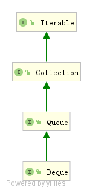

# Deque源码分析



Deque接口继承自Queue接口，是一个双向队列，支持从两端进行添加和移除。因此Deque的实现可以被当作 FIFO队列使用，也可以当作LIFO的栈来使用。官方也是推荐使用 Deque 的实现来替代 Stack。

Deque有两个实现ArrayDeque和LinkedList， ArrayDeque底层基于数组实现，LinkedList底层基于链表实现。

```java
public interface Deque<E> extends Queue<E> {
    // 向队列头插入元素 元素不能为null
    void addFirst(E e);
    // 向队列尾部插入元素 元素不能为null
    void addLast(E e);
	// 向队列头插入元素 插入返回true，失败返回false
    boolean offerFirst(E e);
	// 向队列尾插入元素 插入返回true，失败返回false
    boolean offerLast(E e);
    
    // 返回并移除队列头部的元素，如果队列为空抛出异常
    E removeFirst();
	// 返回并移除队列位部的元素，如果队列为空抛出异常
    E removeLast();
    // 返回并移除队列头部的元素，如果队列为空则返回null
    E pollFirst();
    // 返回并移除队列尾部的元素，如果队列为空则返回null
    E pollLast();
    
    // 获取头部的元素，并不移除，如果队列为空，抛出异常
    E getFirst();
	// 获取尾部的元素，并不移除，如果队列为空，抛出异常
    E getLast();
	// 获取头部的元素，并不移除，如果队列为空，返回null
    E peekFirst();
	// 获取尾部的元素，并不移除，如果队列为空，返回null
    E peekLast();
    // 移除对象o，在队列中首次出现位置对应的元素
    // 或者移除队列中首次出现的o
    boolean removeFirstOccurrence(Object o);
	// 移除队列中最后一次出现的o
    boolean removeLastOccurrence(Object o);

    // *** Queue 接口中的方法 ***
    boolean add(E e);
    boolean offer(E e)
    E remove();
    E poll();
    E element();
    E peek();


    // *** 栈对应的方法 ***
    // 压栈
    void push(E e);
    // 出栈
    E pop();
    
    boolean remove(Object o); 
    public int size();
    Iterator<E> iterator();
    Iterator<E> descendingIterator();

}
```