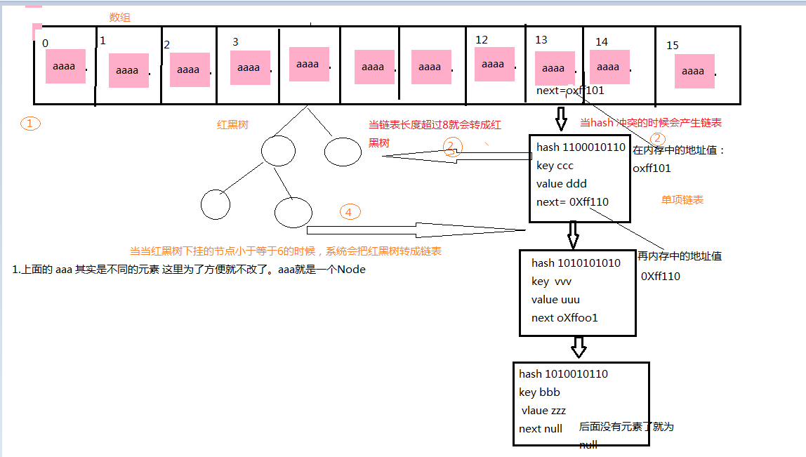
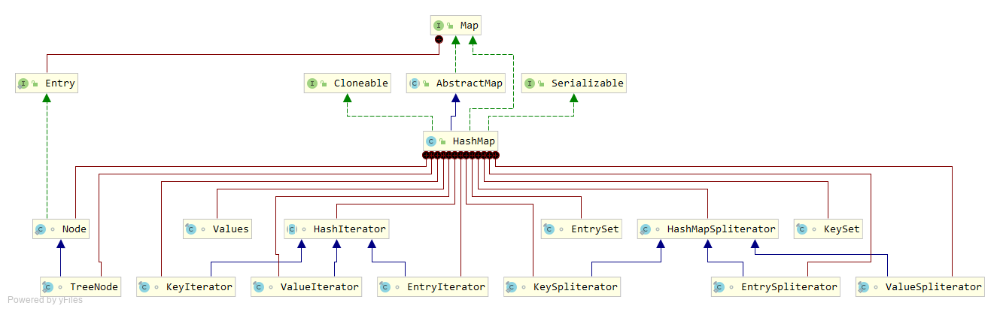

#### 实现原理

+ JDK1.7中采用的是**数组+链表实现，即使用链表处理冲突**，同一hash值的元素都存储在一个链表里 ，hash值相等的元素较多时，通过key值依次查找的效率较低 。
+ JDK1.8中，HashMap采用**数组+链表+红黑树实现，当链表长度超过阈值（8）时，将链表转换为红黑树,当红黑树节点小于等于6时，红黑树会转成链表**，这样大大减少了查找时间。 

HashMap结构图（来源于网络）：

#### HashMap扩容

当前存储容量达到总容量的0.75时，按原有容量的2倍进行扩容，把原数组中的数据搬移到新的数组中 

eg:16*0.75=12时，扩容16*2=32 

#### 解决Hash冲突

所谓的hash冲突就是不同的元素的key通过hash方法算出来的值是一样的，出现在了相同的位置。

Hash冲突解决方案：

+ JDK1.7  使用链表，通过node的next节点，将冲突的元素挂在了当前位置的下面 
+ JDK1.8 引用了红黑树，这个链表只让挂7个元素，超过七个就会转成一个红黑树进行处理（最多是64，超多64 就会重新拆分），当红黑树下挂的节点小于等于6的时候，系统会把红黑树转成链表。

Node 在jdk1.8之前是插入链表头部的，在jdk1.8中是插入链表的尾部的。 

抛开HashMap，Hash冲突有哪些解决办法：**开放定址法、链地址法、再哈希法**
首先HashMap是线程不安全的，其主要体现：
#1.在jdk1.7中，在多线程环境下，扩容时会造成环形链或数据丢失。
#2.在jdk1.8中，在多线程环境下，会发生数据覆盖的情况。

#### 基础源码分析

##### 整体结构

```java
public class HashMap<K,V> extends AbstractMap<K,V> implements Map<K,V>, Cloneable, Serializable 
```



从类上可知HashMap继承自AbstractMap，实现了Map接口，从整体的结构图上看整个hashmap内容还是很多，包含了许多的内部类，其中Node是其核心。

##### 类属性

```java
public class HashMap<K,V> extends AbstractMap<K,V> implements Map<K,V>, Cloneable,Serializable {
    private static final long serialVersionUID = 362498820763181265L;
    // 默认初始容量 16
    static final int DEFAULT_INITIAL_CAPACITY = 1 << 4; // aka 16
    // 最大容量
    static final int MAXIMUM_CAPACITY = 1 << 30;
    // 默认填充因子 - 当存储容量达到当前容量的0.75时，进行扩容
    static final float DEFAULT_LOAD_FACTOR = 0.75f;
    // 当链表（桶位）上的节点大于这个值时，链表会被转化成红黑树
    static final int TREEIFY_THRESHOLD = 8;
    // 当红黑树节点小于等于6时，红黑树会被转换成链表
    static final int UNTREEIFY_THRESHOLD = 6;
    // 红黑树的大小
    static final int MIN_TREEIFY_CAPACITY = 64;
    // 存储元素的数组，总是2的幂次倍
    transient Node<K,V>[] table;
    // 存放具体元素的集
    transient Set<Map.Entry<K,V>> entrySet;
    // 存放元素的个数，注意这个不等于数组的长度。
    transient int size;
     // 每次扩容和更改map结构的计数器
    transient int modCount;   
    // 临界值 当前 HashMap 所能容纳键值对数量的最大值，超过这个值，则需扩容
    int threshold;
    // 填充因子 实时计算：size/capacity
    final float loadFactor;
}
```

##### 重要内部类

Node：

```java
// Node是单向链表，它实现了Map.Entry接口
static class Node<K,V> implements Map.Entry<K,V> {
    final int hash;
    final K key;
    V value;
    // 下一个节点 通过该属性实现节点间的关联
    Node<K,V> next;

    Node(int hash, K key, V value, Node<K,V> next) {
        this.hash = hash;
        this.key = key;
        this.value = value;
        this.next = next;
    }

    public final K getKey()        { return key; }
    public final V getValue()      { return value; }
    public final String toString() { return key + "=" + value; }

    public final int hashCode() {
        return Objects.hashCode(key) ^ Objects.hashCode(value);
    }

    public final V setValue(V newValue) {
        V oldValue = value;
        value = newValue;
        return oldValue;
    }

    // 判断两个node是否相等,若key和value都相等，返回true
    public final boolean equals(Object o) {
        if (o == this)
            return true;
        if (o instanceof Map.Entry) {
            Map.Entry<?,?> e = (Map.Entry<?,?>)o;
            if (Objects.equals(key, e.getKey()) &&
                Objects.equals(value, e.getValue()))
                return true;
        }
        return false;
    }
}
```

TreeNode：

内容较多，只展示简单结构

```java
// 红黑树
static final class TreeNode<K,V> extends LinkedHashMap.Entry<K,V> {
    TreeNode<K,V> parent;  // 父节点
    TreeNode<K,V> left;  // 左节点
    TreeNode<K,V> right; // 右节点
   	// 前一个节点 删除后需要取消链接
    TreeNode<K,V> prev;    // needed to unlink next upon deletion
    
    // 颜色
    boolean red;
    TreeNode(int hash, K key, V val, Node<K,V> next) {
        super(hash, key, val, next);
    }

    //返回当前节点的根节点  
    final TreeNode<K,V> root() {
        for (TreeNode<K,V> r = this, p;;) {
            if ((p = r.parent) == null)
                return r;
            r = p;
        }
    }
}
```

##### 构造函数

```java
//使用给定的容量大小和填充因子，创建一个空的HashMap
public HashMap(int initialCapacity, float loadFactor) {
    // 初始化容量不能小于0
    if (initialCapacity < 0)
        throw new IllegalArgumentException("Illegal initial capacity: " + initialCapacity);
    // 设置的初始化容量大于默认最大容量，则以默认的最大容量为容器容量
    if (initialCapacity > MAXIMUM_CAPACITY)
        initialCapacity = MAXIMUM_CAPACITY;
    // 填充因子小于0或者不是有效浮点数，抛出异常
    if (loadFactor <= 0 || Float.isNaN(loadFactor))
        throw new IllegalArgumentException("Illegal load factor: " + loadFactor);
    // 初始化填充因子
    this.loadFactor = loadFactor;
    // 初始化threshold大小
    this.threshold = tableSizeFor(initialCapacity);
}

// 返回大于initialCapacity的最小的二次幂数值
static final int tableSizeFor(int cap) {
    int n = cap - 1;
    n |= n >>> 1;
    n |= n >>> 2;
    n |= n >>> 4;
    n |= n >>> 8;
    n |= n >>> 16;
    return (n < 0) ? 1 : (n >= MAXIMUM_CAPACITY) ? MAXIMUM_CAPACITY : n + 1;
}

 public HashMap(int initialCapacity) {
     this(initialCapacity, DEFAULT_LOAD_FACTOR);
 }

public HashMap() {
	// 初始化填充因子
    this.loadFactor = DEFAULT_LOAD_FACTOR; // all other fields defaulted
}

public HashMap(Map<? extends K, ? extends V> m) {
    // 初始化填充因子
    this.loadFactor = DEFAULT_LOAD_FACTOR;
    // 将m中的所有元素添加至HashMap中
    putMapEntries(m, false);
}

// 将m中的所有元素添加至HashMap中
final void putMapEntries(Map<? extends K, ? extends V> m, boolean evict) {
    int s = m.size();
    if (s > 0) {
        // 判断table是否已经初始化
        if (table == null) { // pre-size
            // 未初始化，s为m的实际元素个数
            float ft = ((float)s / loadFactor) + 1.0F;
            int t = ((ft < (float)MAXIMUM_CAPACITY) ?
                    (int)ft : MAXIMUM_CAPACITY);
            // 计算得到的t大于阈值，则重新计算阈值
            if (t > threshold)
                threshold = tableSizeFor(t);
        }
        // 已初始化，并且m元素个数大于阈值，进行扩容处理
        else if (s > threshold)
            // 初始化table或对table进行扩容-----后面详细介绍
            resize();
        // 将m中的所有元素添加至HashMap中
        for (Map.Entry<? extends K, ? extends V> e : m.entrySet()) {
            K key = e.getKey();
            V value = e.getValue();
            putVal(hash(key), key, value, false, evict);
        }
    }
}
```

##### hash算法

```java
// JDK 1.8 HashMap中的hash方法
static final int hash(Object key) {
    int h;
    return (key == null) ? 0 : (h = key.hashCode()) ^ (h >>> 16);
}
```

+ 首先获取对象的hashCode()值，然后将hashCode值右移16位，然后将右移后的值与原来的hashCode做**异或**运算。（将key的hashCode右移16位在与自身异或，使得高位也可以参与hash，更大程度上减少了碰撞率 ,在JDK1.8中，优化了高位运算的算法，使用了零扩展，无论正数还是负数，都在高位插入0）。
+ 在putVal源码中，我们通过**(n-1)&hash**获取该对象的键在hashmap中的位置，其中n表示的是hash桶数组的长度，并且该长度为2的n次方，这样(n-1)&hash就等价于hash%n（&运算的效率高于%运算）。

位置计算，eg：


#### 重要方法分析

**put方法：**

```java
// 添加元素，实际是通过putVal方法实现的
public V put(K key, V value) {
    return putVal(hash(key), key, value, false, true);
}
```

putVal方法执行过程 ：


1. 如果table为空(null)或length=0，则通过resize()方法创建或者扩容。
2. 通过key计算hash值，进一步计算出添加到数组的索引i，如果table[i]=null,直接新建节点添加，然后执行第6步，如果table[i] != null,则执行第3步。
3. 判断table[i]的首个元素是否和key相同（hashCode以及equals相同），如果相同直接覆盖Value值，然后执行第6步，否则执行第4步。
4. 判断table[i]是否为treeNode，如果table是红黑树，则直接在树中插入键值对, 否则执行第5步。
5. 遍历table[i]，判断链表长度是否大于8，大于8的话把链表转换为红黑树，在红黑树中执行插入操作，否则进行链表的插入操作；遍历过程中若发现key已经存在直接覆盖value即可； 
6. 插入成功后，判断实际存在的键值对数量size是否超多了最大容量threshold，如果超过，进行扩容。 

```java
final V putVal(int hash, K key, V value, boolean onlyIfAbsent, boolean evict) {
    Node<K,V>[] tab; Node<K,V> p; int n, i;
    // table未初始化或长度为0，通过resize方法扩容（或创建）
    if ((tab = table) == null || (n = tab.length) == 0)
        n = (tab = resize()).length;
    // (n - 1) & hash 计算下标，
    if ((p = tab[i = (n - 1) & hash]) == null)
         // 如果i位置没有元素,新建节点直接插入
        tab[i] = newNode(hash, key, value, null);
    else {  // table(桶)中已经存在元素
        Node<K,V> e; K k;
        // 通过hash和equals判断key是否相同，
        if (p.hash == hash &&
            ((k = p.key) == key || (key != null && key.equals(k))))
            // 将第一个元素赋值给e，用e来记录
            e = p;
        // key不相等；判断是否为红黑树结点
        else if (p instanceof TreeNode)
            // 放入树中
            e = ((TreeNode<K,V>)p).putTreeVal(this, tab, hash, key, value);
        else { // 为链表结点
            // 在链表最末插入结点
            for (int binCount = 0; ; ++binCount) {
                if ((e = p.next) == null) { // 到达链表的尾部
                    // 在尾部插入新结点
                    p.next = newNode(hash, key, value, null);
                    if (binCount >= TREEIFY_THRESHOLD - 1) // -1 for 1st
                         // 结点数量达到阈值，转化为红黑树
                        treeifyBin(tab, hash);
                    // 跳出循环
                    break;
                }
                // 判断链表中结点的key值与插入的元素的key值是否相等
                if (e.hash == hash &&
                    ((k = e.key) == key || (key != null && key.equals(k))))
                    break;
                // 用于遍历桶中的链表，与前面的e = p.next组合，可以遍历链表
                p = e;
            }
        }
        // 表示在桶中找到key值、hash值与插入元素相等的结点
        if (e != null) { // existing mapping for key
            V oldValue = e.value;
            // onlyIfAbsent为false或者旧值为null
            if (!onlyIfAbsent || oldValue == null)
                 //用新值替换旧值
                e.value = value;
            // 访问后回调
            afterNodeAccess(e);
             // 返回旧值
            return oldValue;
        }
    }
    // 结构性修改
    ++modCount;
    // 实际大小大于阈值则扩容
    if (++size > threshold)
        resize();
    // 插入后回调
    afterNodeInsertion(evict);
    return null;
}
```

数据存储实现原理：

1. 根据key计算得到key.hash = (h = k.hashCode()) ^ (h >>> 16)；

2. 根据key.hash计算得到桶数组的索引index = key.hash & (table.length - 1)，这样就找到该key的存放位置了：

   ① 如果该位置没有数据，用该数据新生成一个节点保存新数据，返回null；

   ② 如果该位置有数据是一个红黑树，那么执行相应的插入 / 更新操作；

   ③ 如果该位置有数据是一个链表，分两种情况一是该链表没有这个节点，另一个是该链表上有这个节点，注意这里判断的依据是key.hash是否一样：

   如果该链表没有这个节点，那么采用尾插法新增节点保存新数据，返回null；如果该链表已经有这个节点了，那么找到该节点并更新新数据，返回老数据。

**get方法：**

```java
public V get(Object key) {
    Node<k,v> e;
    return (e = getNode(hash(key), key)) == null ? null : e.value;
}

final Node<K,V> getNode(int hash, Object key) {
    Node<K,V>[] tab; Node<K,V> first, e; int n; K k;
    // table已经初始化，长度大于0，根据hash寻找table中的项也不为空
    if ((tab = table) != null && (n = tab.length) > 0 &&
        (first = tab[(n - 1) & hash]) != null) {
        // 桶中第一项(数组元素)相等
        if (first.hash == hash && // always check first node
            ((k = first.key) == key || (key != null && key.equals(k))))
            return first;
        // 桶中不止一个结点
        if ((e = first.next) != null) {
            // 为红黑树结点
            if (first instanceof TreeNode)
                // 在红黑树中查找
                return ((TreeNode<K,V>)first).getTreeNode(hash, key);
            // 否则，在链表中查找
            do {
                if (e.hash == hash &&
                    ((k = e.key) == key || (key != null && key.equals(k))))
                    return e;
            } while ((e = e.next) != null);
        }
    }
    return null;
}
```

**resize方法:**

+ 在jdk1.8中，resize方法是在hashmap中的键值对大于阀值时或者初始化时，就调用resize方法进行扩容； 
+ 每次扩展的时候，都是扩展2倍； 
+ 扩展后Node对象的位置要么在原位置，要么移动到原偏移量两倍的位置 

```java
final Node<K,V>[] resize() {
    Node<K,V>[] oldTab = table;//oldTab指向hash桶数组
    int oldCap = (oldTab == null) ? 0 : oldTab.length;
    int oldThr = threshold;
    int newCap, newThr = 0;
    if (oldCap > 0) {//如果oldCap不为空的话，就是hash桶数组不为空
        if (oldCap >= MAXIMUM_CAPACITY) {//如果大于最大容量了，就赋值为整数最大的阀值
            threshold = Integer.MAX_VALUE;
            return oldTab;//返回
        }//如果当前hash桶数组的长度在扩容后仍然小于最大容量 并且oldCap大于默认值16
        else if ((newCap = oldCap << 1) < MAXIMUM_CAPACITY &&
                 oldCap >= DEFAULT_INITIAL_CAPACITY)
            newThr = oldThr << 1; // double threshold 双倍扩容阀值threshold
    }
    else if (oldThr > 0) // table为空或length为0，将原threshold设置为新容量
        newCap = oldThr;
    else {               // table没有初始化，使用默认的参数这容量值和阀值
        newCap = DEFAULT_INITIAL_CAPACITY;
        newThr = (int)(DEFAULT_LOAD_FACTOR * DEFAULT_INITIAL_CAPACITY);
    }
    if (newThr == 0) { // 如果新阀值为0，通过新的容量newCap计算新阀值
        float ft = (float)newCap * loadFactor;
        newThr = (newCap < MAXIMUM_CAPACITY && ft < (float)MAXIMUM_CAPACITY ?
                  (int)ft : Integer.MAX_VALUE);
    }
    // 设置阀值
    threshold = newThr;
    @SuppressWarnings({"rawtypes","unchecked"})
        Node<K,V>[] newTab = (Node<K,V>[])new Node[newCap];//新建hash桶数组
    table = newTab;//将新数组的值复制给旧的hash桶数组
    if (oldTab != null) {//进行扩容操作，复制Node对象值到新的hash桶数组
        for (int j = 0; j < oldCap; ++j) {
            Node<K,V> e;
            if ((e = oldTab[j]) != null) {//如果旧的hash桶数组在j结点处不为空，复制给e
                oldTab[j] = null;//将旧的hash桶数组在j结点处设置为空，方便gc
                if (e.next == null)//如果e后面没有Node结点
                    newTab[e.hash & (newCap - 1)] = e;//直接对e的hash值对新的数组长度求模获得存储位置
                else if (e instanceof TreeNode)//如果e是红黑树的类型，那么添加到红黑树中
                    ((TreeNode<K,V>)e).split(this, newTab, j, oldCap);
                else { // preserve order
                    Node<K,V> loHead = null, loTail = null;
                    Node<K,V> hiHead = null, hiTail = null;
                    Node<K,V> next;
                    do {
                        next = e.next;//将Node结点的next赋值给next
                        if ((e.hash & oldCap) == 0) {//如果结点e的hash值与原hash桶数组的长度作与运算为0
                            if (loTail == null)//如果loTail为null
                                loHead = e;//将e结点赋值给loHead
                            else
                                loTail.next = e;//否则将e赋值给loTail.next
                            loTail = e;//然后将e复制给loTail
                        }
                        else {//如果结点e的hash值与原hash桶数组的长度作与运算不为0
                            if (hiTail == null)//如果hiTail为null
                                hiHead = e;//将e赋值给hiHead
                            else
                                hiTail.next = e;//如果hiTail不为空，将e复制给hiTail.next
                            hiTail = e;//将e复制个hiTail
                        }
                    } while ((e = next) != null);//直到e为空
                    if (loTail != null) {//如果loTail不为空
                        loTail.next = null;//将loTail.next设置为空
                        newTab[j] = loHead;//将loHead赋值给新的hash桶数组[j]处
                    }
                    if (hiTail != null) {//如果hiTail不为空
                        hiTail.next = null;//将hiTail.next赋值为空
                        newTab[j + oldCap] = hiHead;//将hiHead赋值给新的hash桶数组[j+旧hash桶数组长度]
                    }
                }
            }
        }
    }
    return newTab;
}
```

