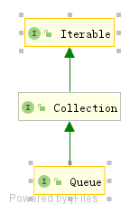

# Queue、AbstractQueue源码分析

## Queue



Queue-队列，是一种先进先出的数据结构，在Queue的实现中，主要通过链表或者数组来实现。

源代码如下：

```java
public interface Queue<E> extends Collection<E> {  
    boolean add(E e); // 添加元素到队列中，相当于进入队尾排队。  
    boolean offer(E e);  //添加元素到队列中，相当于进入队尾排队.  
  
    E remove(); //移除队头元素  
    E poll();  //移除队头元素  
  
    E element(); //获取但不移除队列头的元素  
    E peek();  //获取但不移除队列头的元素  
}
```

对于数据的存取，提供了两种方式，一种失败会抛出异常，另一种则返回null或者false。抛出异常的接口：add，remove，element，分别对应：offer，poll，peek。

## AbstractQueue

AbstractQueue继承自AbstractCollection，同时实现了Queue接口，在这个抽象类中对Queue中的add、remove、element方法进行简单的实现，同时实现了clear和addAll。


源码如下：

```java
public abstract class AbstractQueue<E> extends AbstractCollection<E> implements Queue<E> {

    protected AbstractQueue() {
    }
    // 添加元素 
    public boolean add(E e) {
        // 调用子类实现的offer方法添加
        if (offer(e))
            return true;
        else  // 添加队列已满、失败抛出异常
            throw new IllegalStateException("Queue full");
    }

    // 移除头部元素
    public E remove() {
        // 调用子类实现的poll方法移除
        E x = poll();
        if (x != null)
            return x;
        else // 如果队列为空、移除失败抛出异常
            throw new NoSuchElementException();
    }
    
    // 获取头部元素
    public E element() {
        // 调用子类实现的peek方法
        E x = peek();
        if (x != null)
            return x;
        else // 获取元素失败，抛出异常
            throw new NoSuchElementException();
    }

    // 清除队列中所有元素
    public void clear() {
        // 通过while循环直到情况所有元素
        // poll为子类实现的方法
        while (poll() != null)
            ;
    }

    // 将给定的集合C依次添加到队列中
    public boolean addAll(Collection<? extends E> c) {
        if (c == null)
            throw new NullPointerException();
        if (c == this)
            throw new IllegalArgumentException();
        boolean modified = false;
        for (E e : c)
            if (add(e))
                modified = true;
        return modified;
    }
}
```

