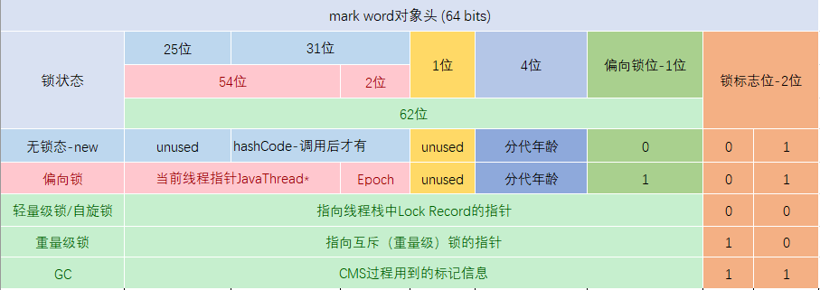

## java对象在内存中的存储布局

### 存储布局


以上为JVM中普通对象和数组在内存中的存储布局，为什么会是这样的一个结构，因为这是JVM规范中定义的。

### Hotspot对应源码

HotSpot采用instanceOopDesc和arrayOopDesc来描述对象头，arrayOopDesc对象用来描述数组类
型。instanceOopDesc的定义的在Hotspot源码的 instanceOop.hpp 文件中，另外，arrayOopDesc
的定义对应 arrayOop.hpp 。

**instanceOop.hpp源码：**

```c++
class instanceOopDesc : public oopDesc {
 public:
  // aligned header size.
  static int header_size() { return sizeof(instanceOopDesc)/HeapWordSize; }

  // If compressed, the offset of the fields of the instance may not be aligned.
  static int base_offset_in_bytes() {
    // offset computation code breaks if UseCompressedClassPointers
    // only is true
    return (UseCompressedOops && UseCompressedClassPointers) ?
             klass_gap_offset_in_bytes() :
             sizeof(instanceOopDesc);
  }

  static bool contains_field_offset(int offset, int nonstatic_field_size) {
    int base_in_bytes = base_offset_in_bytes();
    return (offset >= base_in_bytes &&
            (offset-base_in_bytes) < nonstatic_field_size * heapOopSize);
  }
};
```

从上面源码可以看到，instanceOopDesc继承自oopDesc，，oopDesc的定义在Hotspot
源码中的 oop.hpp 文件中，代码如下：

```c++
class oopDesc {
    friend class VMStructs;
    private:
    volatile markOop _mark;
    union _metadata {
    Klass* _klass;
    narrowKlass _compressed_klass;
    } _metadata;
    // Fast access to barrier set. Must be initialized.
    static BarrierSet* _bs;
    // 省略其他代码
};
```

其中` markOop _mark`对应Mark Word，`Klass* _klass`对应Klass Pointer，如果开启了指针压缩，则对应`narrowKlass _compressed_klass`。

_mark源码位于 markOop.hpp 中 ，代码中说明如下：


以64位为列，翻译过来如下图所示：



Mark Word总共8个字节64位，与之对应的二进制码如下图：


对于markword中64位如何变化的，此处我们不做关注，在Synchronized优化锁升级的过程中再做详细的分析

### JVM相关参数查看

在了解一个java对象在内存中如何存储，占用了多少内存，还需要了解一些JVM基本的参数。在命令行中输入以下命令`java -XX:+PrintCommandLineFlags -version`,得到如下结果：

```java
-XX:InitialHeapSize=197070592 -XX:MaxHeapSize=3153129472 -XX:+PrintCommandLineFlags -XX:+UseCompressedClassPointers -XX:+UseCompressedOops -XX:-UseLargePagesIndividualAllocation -XX:+UseParallelGC
java version "1.8.0_241"
Java(TM) SE Runtime Environment (build 1.8.0_241-b07)
Java HotSpot(TM) 64-Bit Server VM (build 25.241-b07, mixed mode)
```

参数说明：

+ **InitialHeapSize：** 初始化堆大小
+ **MaxHeapSize：** 最大堆大小
+ **UseCompressedClassPointers：** 压缩指针，在一个64位的JVM中，一个指针应该是64位（8字节），开启了指针压缩过后，指针的大小会被压缩为4个字节
+ **UseCompressedOops：** ordinary Object Pointer 普通对象指针（对象内的一个属性指向了另一个对象），同样也是被压缩的，占4个字节

### 存储布局数据

以`Object obj = new Object();`为列，查看对象obj在内存中的存储情况，

**maven中引入jol-core：**

```java
<dependency>
    <groupId>org.openjdk.jol</groupId>
    <artifactId>jol-core</artifactId>
    <version>0.13</version>
</dependency>
```

**示例代码如下：**

```java
import org.openjdk.jol.info.ClassLayout;
public class ObjMemoryDemo {
    public static void main(String[] args) {
        Object obj = new Object();
        System.out.println(ClassLayout.parseInstance(obj).toPrintable());
    }
}
```

**输出结果如下：**

java.lang.Object object internals:
 OFFSET  SIZE   TYPE DESCRIPTION                               VALUE
      0     	4        (object header)                           01 00 00 00 (00000001 00000000 00000000 00000000) (1)
      4     	4        (object header)                           00 00 00 00 (00000000 00000000 00000000 00000000) (0)
      8     	4        (object header)                           e5 01 00 f8 (11100101 00000001 00000000 11111000) 
     12        4        (loss due to the next object alignment)
Instance size: 16 bytes
Space losses: 0 bytes internal + 4 bytes external = 4 bytes total

以上结果映射到存储布局图上的结果如下:


Object header包含两部分：对象头和类型指针，对象头(markword，后面专门介绍)在64位系统中也是64位的，也就是占8个字节，类型指针经过前面的分析我们知道占4个字节，obj对象没有实例属性所以实例数据没有占用内存，所以整个Object header占用了12个字节，不能被8整除，最后补齐4字节，整个占用了16字节。

**对象有变量的情况：**

```java
public class User {
    private String name;

    public String getName() {
        return name;
    }

    public void setName(String name) {
        this.name = name;
    }
}
```

按同样的方式输出结果如下：

com.zjk.hy.se.User object internals:
 OFFSET  SIZE               TYPE DESCRIPTION                               VALUE
      0     4                    (object header)                           01 00 00 00 (00000001 00000000 00000000 00000000) (1)
      4     4                    (object header)                           00 00 00 00 (00000000 00000000 00000000 00000000) (0)
      8     4                    (object header)                           43 c1 00 f8 (01000011 11000001 00000000 11111000) 
     12    4   				java.lang.String User.name                                 null
Instance size: 16 bytes
Space losses: 0 bytes internal + 0 bytes external = 0 bytes total

对应在内存的存储布局如下图：


与obj对象不同的是user对象中存在一个变量`name`，` 12 4 java.lang.String User.name`此处占用了4个字节，8+4+4=16，能够被8整除不需要补齐，所以user对象也是占用了16个字节。

