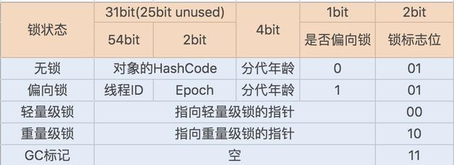

### JDK对synchronized的优化

​	JDK1.6借助新增的Java对象头，对synchronized同步锁做了充分的优化，实现了锁升级功能(无锁->偏向锁->轻量级锁->重量级锁)，在某些场景下，它的性能甚至超越了Lock同步锁 。

偏向锁主要用来优化同一个线程多次申请同一个线程的竞争（无需再进入Monitor去竞争对象，避免用户态和内核态的切换）。

偏向锁的获取：

当对象呗当做同步锁，并且有一个线程已经抢到该锁，那么锁标志位还是01，是否为偏向锁设置为1，并且记录抢到锁的线程ID。

#### 偏向锁：

+ 偏向锁不会主动释放
+ 当线程再次获取锁时，会判断当前线程ID是否与对象头中记录的线程ID相同，如果相同则无需通过CAS来抢占锁
+ 如果不一致，则需要判断对象头中记录的线程是否存活，
+ 如果不存活，那么锁对象被重置为无锁状态，然后重新由新的线程获得（偏向新的线程）
+ 如果存活，则查找线程1的栈帧信息，如果线程还要继续持有该锁对象，那么暂停线程1（stw：Stop-The-World），撤销偏向锁（可能需要等待全局安全点）升级为轻量级锁
+ 如果线程1不再使用该锁对象，那么将该锁对象设为无锁状态（也是一种撤销），然后重新偏向线程2

#### 轻量级锁

​	**适用场景：线程交替执行同步块，绝大部分的锁在整个同步周期内都不存在长时间的竞争**