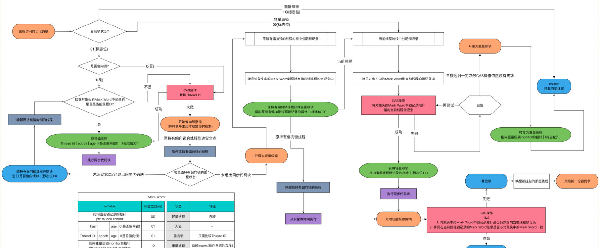

### JDK对synchronized的优化

​	JDK1.6借助新增的Java对象头，对synchronized同步锁做了充分的优化，实现了锁升级功能(无锁->偏向锁->轻量级锁->重量级锁)，在某些场景下，它的性能甚至超越了Lock同步锁 。

**对象头Mark Word：**

**锁升级过程：**

#### 偏向锁

偏向锁是为了在无线程竞争的情况下避免在锁获取过程中执行不必要的CAS原子指令，**因为CAS底层是利用LOCK指令+cmpxchg汇编指令来保证原子性的，Lock指令会锁总线，其他CPU的内存操作将会被阻塞**。

当对象被当做同步锁，并且有一个线程已经抢到该锁，那么锁标志位还是01，是否为偏向锁设置为1，并且记录抢到锁的线程ID。

+ 偏向锁不会主动释放
+ 当线程再次获取锁时，会判断当前线程ID是否与对象头中记录的线程ID相同，如果相同则无需通过CAS来抢占锁
+ 如果不一致，则需要判断对象头中记录的线程是否存活，
+ 如果不存活，那么锁对象被重置为无锁状态，然后重新由新的线程获得（偏向新的线程）
+ 如果存活，则查找线程1的栈帧信息，如果线程还要继续持有该锁对象，那么暂停线程1（stw：Stop-The-World），撤销偏向锁（可能需要等待全局安全点）升级为轻量级锁
+ 如果线程1不再使用该锁对象，那么将该锁对象设为无锁状态（也是一种撤销），然后重新偏向线程2

#### 轻量级锁

​	**适用场景：线程交替执行同步块，绝大部分的锁在整个同步周期内都不存在长时间的竞争**

#### 与Lock的区别

+ synchronized是关键字，JVM底层通过C++实现，而Lock是一个接口，JDK层面通过Java实现
+ synchronized会自动释放锁，而Lock必须手动释放锁
+ synchronized是不可中断的，Lock是可以中断的
+ Lock可以知线程有没有拿到锁，而synchronized无法知道
+ synchronized能锁住方法和代码块，而Lock只能锁住代码块
+ Lock可以通过读锁提供多线程读的效率
+ synchronized是非公平锁，Lock的实现ReentrantLock提供了公平锁和非公平锁
+ synchronized—锁升级是不可逆的