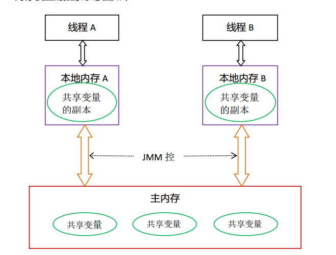
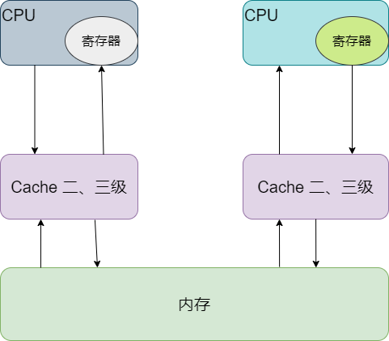
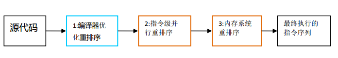

#### 线程间通信机制

**内存共享：** 线程之间通过读-写内存中的公共状态来隐式进行通信

**消息传递：** 线程之间没有公共状态，必须通过明确的发送消息来显示的进行通信

Java的并发采用的是内存共享模型，

#### JMM

Java内存模型的作用：规范内存数据和工作空间数据的交互。

线程之间的共享变量存储在主内存（main memory）中，每个线程都有一个私有的本地内存（local memory）（抽象概念），本地内存中存储了该线程以读-写共享变量的副本。

**说明：**

+ 主内存：共享的信息
+ 本地内存：又叫工作内存，私有信息、基本数据类型、引用对象的引用地址都在工作内存中分配空间存储，引用对象存放在堆中
+ 工作方式：
  + 线程修改私有数据，直接在本地内存（工作内存）中修改
  + 线程修改共享数据，把数据复制到工作内存中，在工作内存中修改，修改完成后刷新到主内存中

#### 硬件内存架构

结构如下：

CPU缓存一致性问题：体现在并发处理的不同步

解决方案：

+ 总线加锁，降低CPU的吞吐量
+ 缓存一致性协议（MESI）：当CPU在Cache中操作数据时，如果该数据是共享变量，数据在CACHE读到寄存器中，进行新修改，并更新内存数据，Cache LINE置无效，其他的CPU就从内存中读数据

#### 重排序

* 编译器优化的重排序

* 指令级并行的重排序   现代处理器使用了指令级并行技术来将多条指令重叠执行。如果不存在数据依赖性，处理器可以改变语句对应机器指令的执行顺序

* 内存系统的重排序  由于处理器使用缓存和读-写缓冲区，这使得加载和存储操作看上去可能是乱序执行的

  

  重排序可能会导致多线程程序出现内存可见性问题，JMM会通过内存屏障指令来禁止特定类型的处理器重排序，为程序员提供一致的内存可见性保证

#### happens-before

​	JDK5使用JSR-133内存模型，JSR-133使用happens-before来阐述操作间的内存可见性。

在JMM中，如果一个操作执行的结果需要对另一个操作可见，那么这两个操作之间必须存在happens-before关系。

**happens-before规则**

* 程序顺序规则：一个线程中的每个操作，happens-before与该线程中的任意后续操作
* 监视器锁规则：对一个监视器的解锁，happens-before于随后对这个监视器的枷锁
* volatile变量规则：对一个volatile域的写，happens-before域任意后续对这个volatile域的读
* 传递性：如果A happens-before B ,B happens-before C，那么A happens-before C

#### as-if-serial语义

不管怎么重排序，(单线程)程序的执行结果不能被改变

#### 数据竞争

在一个线程中写一个变量，在另一个线程中读同一个变量，而且读和写没有通过同步来排序，就会发生数据竞争

#### 一个64位long/double型变量的写操作

对于32位操作系统来说，单次操作能处理的最大长度为32bit，对于64bit的long/double的操作都是分两次完成的，不是一个原子操作，可通过volatile关键字修饰，保证其原子性。

对于64位操作系统，单次能操作64bit，所以对于long和double的操作都是原子操作。

#### Volatile特性

可见性，对一个volatile变量的读，总是能看到（任意线程）对这个volatile变量最后的写入

原子性，对单个volatile变量的读写具有原子性，但类似volatile++这种复合操作不具备原子性

#### Volatile内存语义

volatile变量在写的时候会把本地内存中的值写入到主内存中（锁释放的内存语义与此相同）

volatile变量在读的时候会把本地内存中的值作废，直接从主内存中读取 （锁获取的内存语义与此相同）

