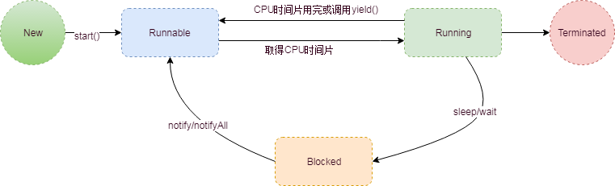
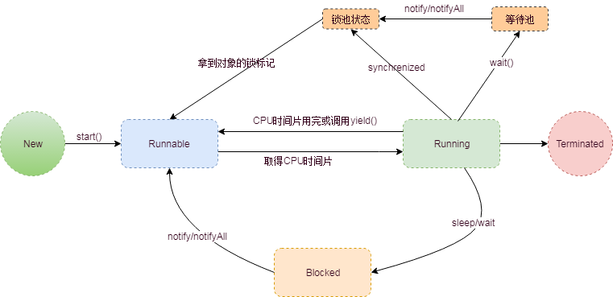
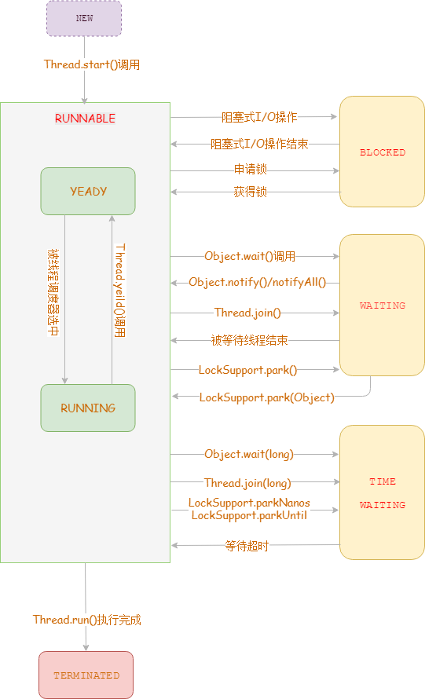
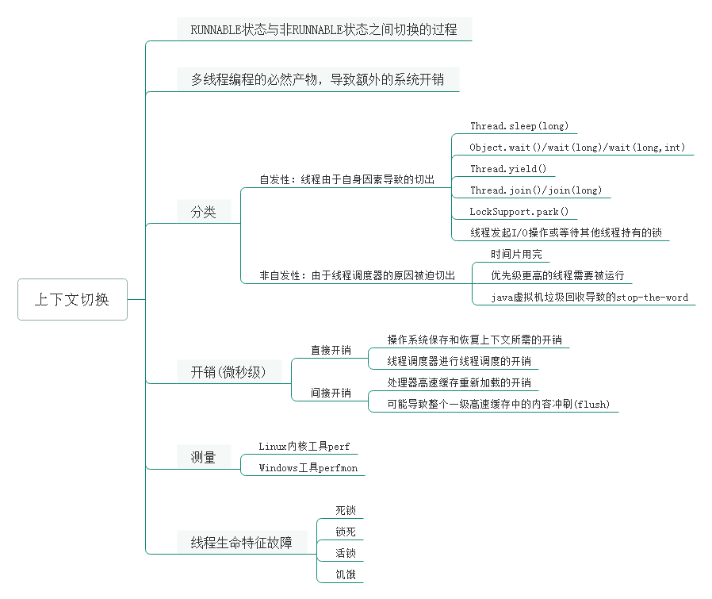
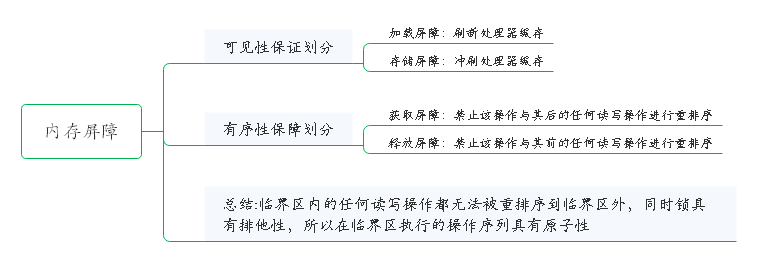
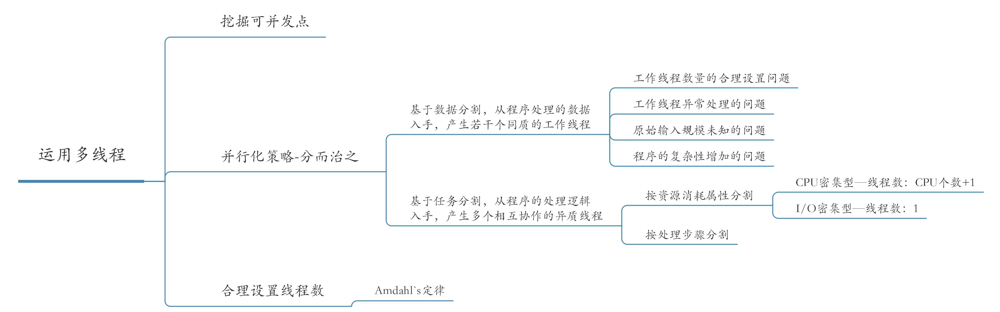
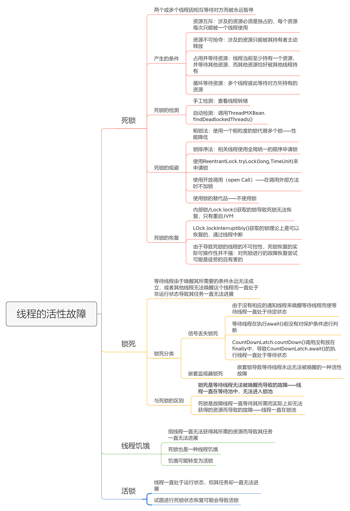
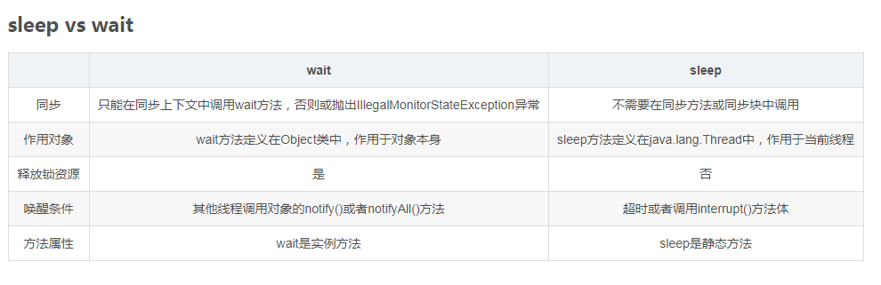

### 多线程技术
#### 线程模型

+ ULT：用户级线程

  用户程序实现，不依赖操作系统核心，不需要用户态/内核态切换，速度开

+ KLT：内核级线程

  系统内核管理的线程

**市面上大部分JVM虚拟机使用的都是KLT线程模型**

#### 同步与异步

同步与异步通常用来形容一次方法调用，
 **同步**调用一旦开始，必须等到执行完成，才能继续后面的行为。
 **异步**调用一旦开始，方法会立即返回，异步执行的方法通常会在另外的线程中执行。

#### 原子性

访问（读、写）某个共享变量的操作从其执行线程以外的任何线程来看，该操作要么已经执行结束要么尚未发生，其执行过程是不可分割的。java有两种方式来实现原子性：使用锁（Lock）、利用处理器提供的专门的CAS指令。

#### 可见性

+ 可见性问题是多线程衍生出来的问题，与运行环境是单处理器还是多处理器无关
+ 保证可见性并不能保证原子性
+ 线程启动或停止都能保证可见性：父线程在启动子线程之前对共享变量的更新对于子线程来说是可见的，线程A更新共享变量后结束，其他线程对更改结果可见

#### 有序性

-------------------------

#### 线程的生命周期

线程的生命周期包含五个阶段，新建、就绪、运行、阻塞、销毁

+ 新建：刚使用new方法，new出来的线程
+ 就绪：新建的线程调用start()方法后，这时候线程处于等待CPU分配资源阶段
+ 运行：处于就绪状态的线程被调度并获取到CPU资源，便进入运行状态，执行run方法中的操作
+ 阻塞：在运行状态时，可能因为某些原因导致运行状态变为阻塞状态，比如：sleep()、wait()之后线程就处于阻塞状态，需要通过notify()/notifyAll()唤醒线程，被唤醒的线程处理就绪状态，需要等待CPU重新分配资源

**完成生命周期如下：**



**操作系统层次的状态转换图：**



锁池：存放需要重新获取锁的线程

等待池：线程调用await后进入等待池

**说明：** 以上状态为普遍认为的生命周期，根据源码了解到更为详情的线程生命周期，如下：

```java 
// Thread.State源码
public enum State {
    NEW,
    RUNNABLE,
    BLOCKED,
    WAITING,
    TIMED_WAITING,
    TERMINATED;
}
```

生命周期具体流程：



#### 线程上下文切换

**上下文切换：**

一个线程的生命周期状态在RUNNABLE状态与非RUNNABLE状态（BLOCKED/WAITING/TIMED_WAITING）之间切换的过程

- 自发性上下文切换

  线程由于自身因素导致的切出，从Java角度来看，下列方法都会引起自发性上下文切换

  - Thread.sleep(long)
  - Object.wait()/wait(long)/wait(long,int)
  - Thread.yield()
  - Thread.join()/join(long)
  - LockSupport.park()
  - 线程发起I/O操作或等待其他线程持有的锁

- 非自发性上下文切换

  由于线程调度器的原因被迫切出，导致非自发性上下文切换的常见因素如下：

  - 时间片用完
  - 优先级更高的线程需要被运行
  - java虚拟机垃圾回收导致的stop-the-word

**整理：** 



#### wait/notify 开销与问题

+ 过早唤醒问题

+ Object.wait(long)无法区分其返回是否是等待超时还是notify唤醒

  以上两点可通过Condition接口解决

+ 信号丢失问题

+ 欺骗性唤醒问题

+ 较多的上下文切换——确保正确的前提下用notify代替notifyAll，另外通知线程尽快释放锁

notify代替notifyAll的前提：一次通知至多唤醒一个线程，等待池中仅包含同质等待线程

#### 线程同步机制

一套用于协调线程间的数据访问以及活动的机制，该机制用于保障线程安全以及实现这些线程的共同目标。

**内存屏障：** 

内存屏障是对一类仅针对内存读、写操作指令的跨处理器架构的底层抽象（或称呼）；因为内屏障的存在临界区内的任何读写操作都无法被重排序到临界区外，同时锁具有排他性，所以在临界区执行的操作序列具有原子性



**锁与重排序：**

+ 临界区内的操作不允许被重排序到临界区之外
+ 临界区内的操作之间允许被重排序
+ 临界区外的操作之间可以被重排序
+ 临界区外的操作可以被重排序到临界区之内
+ 申请锁与释放锁操作不能被重排序
+ 两个锁申请操作不能被重排序
+ 两个锁释放操作不能被重排序

**多线程应用：**




#### 线程安全设计

+ 无状态对象
+ 不可变对象
+ 线程持有对象
+ 使用装饰者模式
+ 使用并发集合

#### 线程的活性故障

由于资源稀缺或程序自身的问题和缺陷导致线程一直处于非RUNNABLE状态，或者线程虽然处于RUNNABLE状态但是其要执行的任务却一直无法进展的故障现象。



#### synchronized与Lock的区别

- synchronized是关键字，JVM底层通过C++实现，而Lock是一个接口，JDK层面通过Java实现
- synchronized会自动释放锁，而Lock必须手动释放锁
- synchronized是不可中断的，Lock是可以中断的
- Lock可以知线程有没有拿到锁，而synchronized无法知道
- synchronized能锁住方法和代码块，而Lock只能锁住代码块
- Lock可以通过读锁提供多线程读的效率
- synchronized是非公平锁，Lock的实现ReentrantLock提供了公平锁和非公平锁
- synchronized—锁升级是不可逆的

#### 多线程的实现方式

- 继承Thread类，重写run方法
- 实现Runnable接口，实现run方法
  这两种方式实现的多线程都是没有返回值的，针对Java的单一继承推荐使用实现Runnable的方式
- 实现Callable接口，有返回值

#### 停止线程

+ 使用退出标记，使线程正常退出，也就是当run()方法完成后线程终止
+ 使用stop()方法强行终止，不推荐，该方法已被废弃
+ 使用interrupt方法中断线程

**推荐使用interrupt+异常法**，详情见**JavaBase-com.zjk.hy.thread.ThreadTest04**

- thread.interrupt()用于停止线程，该方法仅仅是在当前线程中打一个停止的标记，并不是真正的停止线程
- this.interrupted()测试当前线程是否已经中断，执行后具有将状态标志清除为false的功能
- this.isInterupted()测试线程是否已经中断，不清除状态标志
#### 守护线程
在Java线程中有两种线程，一是用户线程，另外一种是守护线程。守护线程是当进程中不存在非守护线程时，守护线程会自动注销掉，是一种在后台提供通用服务的线程，如：**垃圾回收线程**。
示例见**JavaBase-com.zjk.hy.thread.DaemonTest** ,程序运行结果是main线程结束后DaemonThread线程也结束了，如果注释掉设置守护线程的代码：

```java
daemonThread.setDaemon(true);
```

主线程结束后，DaemonThread线程会继续一直执行。

#### join方法

thread.join()方法阻塞调用此方法的线程，直到线程thread执行完成，此线程在继续。

A线程中执行b.jion(),A线程将暂停等待b线程执行完成

示例见：**JavaBase-com.zjk.hy.thread.JoinTest**



