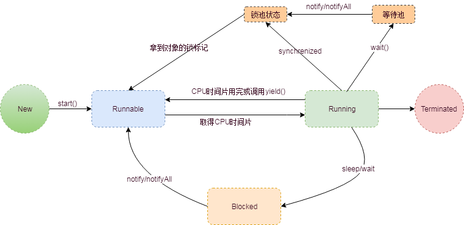

### 多线程技术
#### 同步与异步
同步与异步通常用来形容一次方法调用，
 **同步**调用一旦开始，必须等到执行完成，才能继续后面的行为。
 **异步**调用一旦开始，方法会立即返回，异步执行的方法通常会在另外的线程中执行。
#### 多线程的实现方式
- 继承Thread类，重写run方法
- 实现Runnable接口，实现run方法
  这两种方式实现的多线程都是没有返回值的，针对Java的单一继承推荐使用实现Runnable的方式
- **其他方式后面补上**
#### 线程的生命周期

线程的生命周期包含五个阶段，新建、就绪、运行、阻塞、销毁

+ 新建：刚使用new方法，new出来的线程
+ 就绪：新建的线程调用start()方法后，这时候线程处于等待CPU分配资源阶段
+ 运行：处于就绪状态的线程被调度并获取到CPU资源，便进入运行状态，执行run方法中的操作
+ 阻塞：在运行状态时，可能因为某些原因导致运行状态变为阻塞状态，比如：sleep()、wait()之后线程就处于阻塞状态，需要通过notify()/notifyAll()唤醒线程，被唤醒的线程处理就绪状态，需要等待CPU重新分配资源

**完成生命周期如下：**


**操作系统层次的状态转换图：**



锁池：存放需要重新获取锁的线程

等待池：线程调用await后进入等待池

#### 停止线程

能正确停止线程，并且推荐使用的方法-异常法，
详情见**JavaBase-com.zjk.hy.thread.ThreadTest04**

- thread.interrupt()用于停止线程，该方法仅仅是在当前线程中打一个停止的标记，并不是真正的停止线程
- this.interrupted()测试当前线程是否已经中断，执行后具有将状态标志清除为false的功能
- this.isInterupted()测试线程是否已经中断，不清除状态标志
#### 守护线程
在Java线程中有两种线程，一是用户线程，另外一种是守护线程。守护线程是当进程中不存在非守护线程时，守护线程会自动注销掉，是一种在后台提供通用服务的线程，如：**垃圾回收线程**。
示例见**JavaBase-com.zjk.hy.thread.DaemonTest** ,程序运行结果是main线程结束后DaemonThread线程也结束了，如果注释掉设置守护线程的代码：

```java
daemonThread.setDaemon(true);
```

主线程结束后，DaemonThread线程会继续一直执行。

#### join方法

thread.join()方法阻塞调用此方法的线程，直到线程thread执行完成，此线程在继续。

A线程中执行b.jion(),A线程将暂停等待b线程执行完成

示例见：**JavaBase-com.zjk.hy.thread.JoinTest**