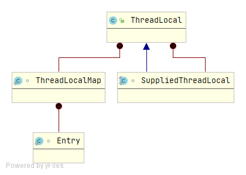
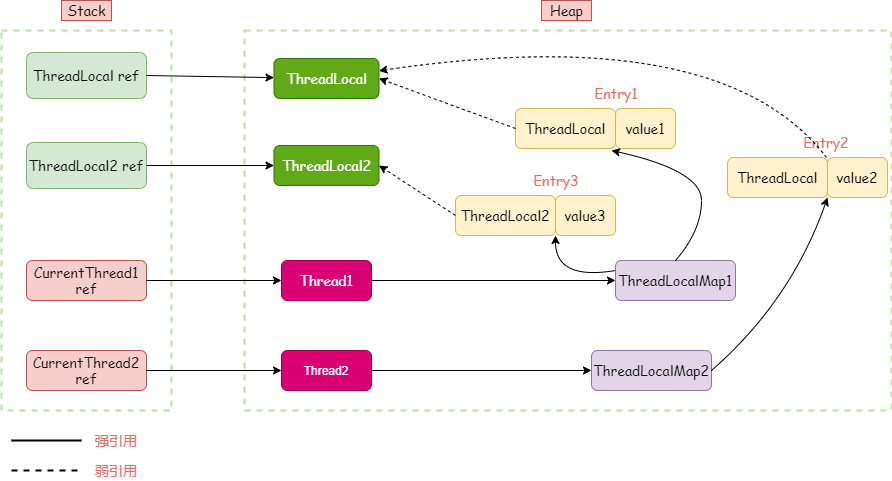

### ThreadLocal

#### 什么是ThreadLocal变量

ThreadLoal 变量，线程局部变量，同一个 ThreadLocal 所包含的对象，在不同的 Thread 中有不同的副本，并且不同的Thread无法相互访问。

ThreadLocal 适用于每个线程需要自己独立的实例且该实例需要在多个方法中被使用，也即变量在线程间隔离而在方法或类间共享的场景。

**应用场景：**

+ 每个线程需要一个独享的对象
+ 每个线程内需要保存类似于全局变量的信息

#### 整体认识

**UML类图：**



ThreadLocal内嵌了ThreadLocalMap和SuppliedThreadLocal两个内部类，

+ ThreadLocalMap是ThreadLocal存储数据的数据结构，该类本质上就是个map，实现类似于HashMap，依然采用的是key-value形式，key是ThreadLocal，value为具体的值
+ SuppliedThreadLocal提供了初始化值的支持

**存储结构与引用关系：**



ThreadLocal的存储结构和引用关系如上图所示：

+ 当一个线程通过ThreadLocal保持数据时，当前线程会持有一个ThreadLocalMap，

+ ThreadLocalMap类似于HashMap底层采用数组存储一个Entry对象实例，Entry为Key-value结构，key为ThreadLocal，value为具体的值，

+ 当一个线程（Thread）使用多个ThreadLocal来存储多个值得时候，是通过Thread中的ThreadLocalMap来存储多个Entry，如图中的ThreadLocalMap1的Entry1和Entry3，
+ Entry与ThreadLocal为软引用关系，当线程执行完毕，Thread和ThreadLocalMap被销毁，Entry则不再被强引用，当发生GC时，Entry将被回收

**软引用补充：**

Java中弱引用通过WeakReference实现，WeakReference继承Reference，其中只有两个构造函数：

```java
public class WeakReference<T> extends Reference<T> {
    public WeakReference(T referent) {
        super(referent);
    }

    public WeakReference(T referent, ReferenceQueue<? super T> q) {
        super(referent, q);
    }
}
```

+ WeakReference(T referent)：referent就是被弱引用的对象，eg：在ThreadLocal中ThreadLocal就是被弱引用的对象
+ WeakReference(T referent, ReferenceQueue<? super T> q)：与上面的构造方法比较，多了个ReferenceQueue，在对象被回收后，会把弱引用对象，也就是WeakReference对象或者其子类的对象，放入队列ReferenceQueue中，eg：Entry就是被放入ReferenceQueue的对象


#### ThreadLocal内存泄漏

**内存泄漏memory leak** ：是指程序在申请内存后，无法释放已申请的内存空间，一次内存泄漏似乎不会有大的影响，但内存泄漏堆积后的后果就是内存溢出。 
**内存溢出 out of memory** ：没内存可以分配给新的对象了

**ThreadLocal内存泄漏的原因：**

ThreadLocalMap使用ThreadLocal的弱引用作为key，如果一个ThreadLocal没有外部强引用来引用它，那么系统 GC 的时候，这个ThreadLocal势必会被回收，这样一来，ThreadLocalMap中就会出现key为null的Entry，就没有办法访问这些key为null的Entry的value，如果当前线程再迟迟不结束的话，这些key为null的Entry的value就会一直存在一条强引用链：Thread Ref -> Thread -> ThreaLocalMap -> Entry -> value永远无法回收，造成内存泄漏。ThreadLocal内存泄漏的根源是：**由于ThreadLocalMap的生命周期跟Thread一样长**，如果没有手动删除对应key就会导致内存泄漏，而不是因为弱引用。

**容易造成内存泄漏的使用方式：**

+ 使用static的ThreadLocal
+ 线程池中使用ThreadLocal

**ThreadLocalMap提供的防护措施：**

在ThreadLocal的get(),set(),remove()的时候都会清除线程ThreadLocalMap里所有key为null的value

**解决办法：每次使用完ThreadLocal，都调用它的remove()方法，清除数据**


#### 源码分析

##### ThreadLocalMap源码分析

**成员变量**

```java
// 初始化容量
private static final int INITIAL_CAPACITY = 16;
// 存放数据的数组，数组长度必须是2的N次方
private Entry[] table;
// table中的Entry数量
private int size = 0;
// 扩容阈值
private int threshold;
```

**存储结构-Entry**

```java
/**
 * Entry继承WeakReference，为弱引用对象，被引用对象为ThreadLocal
 * 用ThreadLocal作为key
 * 当该对象不再被其他对象强引用，GC时JVM会回收该对象
 */
static class Entry extends WeakReference<ThreadLocal<?>> {
    /** The value associated with this ThreadLocal. */
    Object value;

    Entry(ThreadLocal<?> k, Object v) {
        super(k);
        value = v;
    }
}

```

##### ThreadLocal源码分析

**构造方法**

```java
// 构造方法
public ThreadLocal() {
}
```

**指定初始化值**

```java
// 初始化一个有初始值的ThreadLocal，
// SuppliedThreadLocal为ThreadLocal的子类，重写了initialValue方法
public static <S> ThreadLocal<S> withInitial(Supplier<? extends S> supplier) {
    return new SuppliedThreadLocal<>(supplier);
}
@Override
protected T initialValue() {
    return supplier.get();
}
```

**set方法**

```java
public void set(T value) {
    // 获取当前线程
    Thread t = Thread.currentThread();
    // 从当前线程中获取ThreadLocalMap
    ThreadLocalMap map = getMap(t);
    if (map != null) // ThreadLocalMap不为空，则用当前ThreadLocal作为key，将value值设置到map中
        map.set(this, value);
    else // ThreadLocalMap为空,则创建一个ThreadLocalMap
        createMap(t, value);
}
// 获取线程中的ThreadLocalMap
ThreadLocalMap getMap(Thread t) {
    return t.threadLocals;
}

// 创建ThreadLocalMap
void createMap(Thread t, T firstValue) {
    t.threadLocals = new ThreadLocalMap(this, firstValue);
}
// ThreadLocalMap构造方法
ThreadLocalMap(ThreadLocal<?> firstKey, Object firstValue) {
    //初始化table
    table = new ThreadLocal.ThreadLocalMap.Entry[INITIAL_CAPACITY];
    //计算索引
    int i = firstKey.threadLocalHashCode & (INITIAL_CAPACITY - 1);
    //设置值
    table[i] = new ThreadLocal.ThreadLocalMap.Entry(firstKey, firstValue);
    size = 1;
    //设置阈值
    setThreshold(INITIAL_CAPACITY);
}
```

**ThreadLocalMap中的set()**

ThreadLocalMap使用`线性探测法`来解决哈希冲突，可以将table看作一个环形数组，线性探测获取table索引代码如下：

```java
// 获取环形数组的下一个索引
private static int nextIndex(int i, int len) {
    return ((i + 1 < len) ? i + 1 : 0);
}
// 获取环形数组的上一个索引
private static int prevIndex(int i, int len) {
    return ((i - 1 >= 0) ? i - 1 : len - 1);
}
```

set()与set相关的方法:

```java
private void set(ThreadLocal<?> key, Object value) {
    ThreadLocal.ThreadLocalMap.Entry[] tab = table;
    int len = tab.length;
    //计算索引
    int i = key.threadLocalHashCode & (len-1);
	// 根据获取到的索引进行循环，如果当前索引上的table[i]不为空，在没有return的情况下，
    // 就使用nextIndex()获取下一个（上面提到到线性探测法）。
    for (ThreadLocal.ThreadLocalMap.Entry e = tab[i];
         e != null;
         e = tab[i = nextIndex(i, len)]) {
        ThreadLocal<?> k = e.get();
        //table[i]上key不为空，并且和当前key相同，更新value
        if (k == key) {
            e.value = value;
            return;
        }
        // table[i]上的key为空，说明被回收了（上面的弱引用中提到过）。
        // 这个时候说明改table[i]可以重新使用，用新的key-value将其替换,并删除其他无效的entry
        if (k == null) {
            replaceStaleEntry(key, value, i);
            return;
        }
    }

    //找到为空的插入位置，插入值，在为空的位置插入需要对size进行加1操作
    tab[i] = new ThreadLocal.ThreadLocalMap.Entry(key, value);
    int sz = ++size;

    /**
      * cleanSomeSlots用于清除那些e.get()==null
      * 也就是table[index]!=null&&table[index].get()==null
      * 之前提到过，这种数据key关联的对象已经被回收，所以这个Entry(table[index])可以被置null。
      * 如果没有清除任何entry,并且当前使用量达到了负载因子所定义(长度的2/3)，那么进行rehash()
      */
    if (!cleanSomeSlots(i, sz) && sz >= threshold)
        rehash();
}

// 替换无效entry
private void replaceStaleEntry(ThreadLocal<?> key, Object value,
                               int staleSlot) {
    ThreadLocal.ThreadLocalMap.Entry[] tab = table;
    int len = tab.length;
    ThreadLocal.ThreadLocalMap.Entry e;

    /**
      * 根据传入的无效entry的位置（staleSlot）,向前扫描
      * 一段连续的entry(这里的连续是指一段相邻的entry并且table[i] != null),
      * 直到找到一个无效entry，或者扫描完也没找到
      */
    int slotToExpunge = staleSlot;//之后用于清理的起点
    for (int i = prevIndex(staleSlot, len);
         (e = tab[i]) != null;
         i = prevIndex(i, len))
        if (e.get() == null)
            slotToExpunge = i;

    // 向后扫描一段连续的entry
    for (int i = nextIndex(staleSlot, len);
         (e = tab[i]) != null;
         i = nextIndex(i, len)) {
        ThreadLocal<?> k = e.get();

        // 如果找到了key，将其与传入的无效entry替换，也就是与table[staleSlot]进行替换
        if (k == key) {
            e.value = value;
            tab[i] = tab[staleSlot];
            tab[staleSlot] = e;
            //如果向前查找没有找到无效entry，则更新slotToExpunge为当前值i
            if (slotToExpunge == staleSlot)
                slotToExpunge = i;
            cleanSomeSlots(expungeStaleEntry(slotToExpunge), len);
            return;
        }

        // 如果向前查找没有找到无效entry，并且当前向后扫描的entry无效，则更新slotToExpunge为当前值i
        if (k == null && slotToExpunge == staleSlot)
            slotToExpunge = i;
    }

    /**
      * 如果没有找到key,也就是说key之前不存在table中
      * 就直接最开始的无效entry——tab[staleSlot]上直接新增即可
      */
    tab[staleSlot].value = null;
    tab[staleSlot] = new ThreadLocal.ThreadLocalMap.Entry(key, value);

    // slotToExpunge != staleSlot,说明存在其他的无效entry需要进行清理
    if (slotToExpunge != staleSlot)
        cleanSomeSlots(expungeStaleEntry(slotToExpunge), len);
}

/**
     * 连续段清除
     * 根据传入的staleSlot,清理对应的无效entry——table[staleSlot],
     * 并且根据当前传入的staleSlot,向后扫描一段连续的entry(这里的连续是指一段相邻的entry并且table[i] != null),
     * 对可能存在hash冲突的entry进行rehash，并且清理遇到的无效entry.
     *
     * @param staleSlot key为null,需要无效entry所在的table中的索引
     * @return 返回下一个为空的solt的索引。
     */
private int expungeStaleEntry(int staleSlot) {
    ThreadLocal.ThreadLocalMap.Entry[] tab = table;
    int len = tab.length;

    // 清理无效entry，置空
    tab[staleSlot].value = null;
    tab[staleSlot] = null;
    //size减1，置空后table的被使用量减1
    size--;

    ThreadLocal.ThreadLocalMap.Entry e;
    int i;
    // 从staleSlot开始向后扫描一段连续的entry
    for (i = nextIndex(staleSlot, len);
         (e = tab[i]) != null;
         i = nextIndex(i, len)) {
        ThreadLocal<?> k = e.get();
        //如果遇到key为null,表示无效entry，进行清理.
        if (k == null) {
            e.value = null;
            tab[i] = null;
            size--;
        } else {
            //如果key不为null,计算索引
            int h = k.threadLocalHashCode & (len - 1);
            /**
              * 计算出来的索引——h，与其现在所在位置的索引——i不一致，置空当前的table[i]
              * 从h开始向后线性探测到第一个空的slot，把当前的entry挪过去。
              */
            if (h != i) {
                tab[i] = null;
                while (tab[h] != null)
                    h = nextIndex(h, len);
                tab[h] = e;
            }
        }
    }
    //下一个为空的solt的索引。
    return i;
}

/**
  * 启发式的扫描清除，扫描次数由传入的参数n决定
  * @param i 从i向后开始扫描（不包括i，因为索引为i的Slot肯定为null）
  * @param n 控制扫描次数，正常情况下为 log2(n) ，
  * 如果找到了无效entry，会将n重置为table的长度len,进行段清除。
  * map.set()点用的时候传入的是元素个数，replaceStaleEntry()调用的时候传入的是table的长度len
  * @return true if any stale entries have been removed.
  */
private boolean cleanSomeSlots(int i, int n) {
    boolean removed = false;
    ThreadLocal.ThreadLocalMap.Entry[] tab = table;
    int len = tab.length;
    do {
        i = nextIndex(i, len);
        ThreadLocal.ThreadLocalMap.Entry e = tab[i];
        if (e != null && e.get() == null) {
            //重置n为len
            n = len;
            removed = true;
            //依然调用expungeStaleEntry来进行无效entry的清除
            i = expungeStaleEntry(i);
        }
    } while ( (n >>>= 1) != 0);//无符号的右移动，可以用于控制扫描次数在log2(n)
    return removed;
}


private void rehash() {
    //全清理
    expungeStaleEntries();

    /**
      * threshold = 2/3 * len
      * 所以threshold - threshold / 4 = 1en/2
      * 这里主要是因为上面做了一次全清理所以size减小，需要进行判断。
      * 判断的时候把阈值调低了。
      */
    if (size >= threshold - threshold / 4)
        resize();
}

// 扩容，扩大为原来的2倍（这样保证了长度为2的冥）
private void resize() {
    ThreadLocal.ThreadLocalMap.Entry[] oldTab = table;
    int oldLen = oldTab.length;
    int newLen = oldLen * 2;
    ThreadLocal.ThreadLocalMap.Entry[] newTab = new ThreadLocal.ThreadLocalMap.Entry[newLen];
    int count = 0;

    for (int j = 0; j < oldLen; ++j) {
        ThreadLocal.ThreadLocalMap.Entry e = oldTab[j];
        if (e != null) {
            ThreadLocal<?> k = e.get();
            //虽然做过一次清理，但在扩容的时候可能会又存在key==null的情况。
            if (k == null) {
                //这里试试将e.value设置为null
                e.value = null; // Help the GC
            } else {
                //同样适用线性探测来设置值。
                int h = k.threadLocalHashCode & (newLen - 1);
                while (newTab[h] != null)
                    h = nextIndex(h, newLen);
                newTab[h] = e;
                count++;
            }
        }
    }

    //设置新的阈值
    setThreshold(newLen);
    size = count;
    table = newTab;
}

// 全清理，清理所有无效entry
private void expungeStaleEntries() {
    ThreadLocal.ThreadLocalMap.Entry[] tab = table;
    int len = tab.length;
    for (int j = 0; j < len; j++) {
        ThreadLocal.ThreadLocalMap.Entry e = tab[j];
        if (e != null && e.get() == null)
            //使用连续段清理
            expungeStaleEntry(j);
    }
}
```

**ThreadLocal中的get()**

```java
public T get() {
    //同set方法类似获取对应线程中的ThreadLocalMap实例
    Thread t = Thread.currentThread();
    ThreadLocalMap map = getMap(t);
    if (map != null) {
        ThreadLocalMap.Entry e = map.getEntry(this);
        if (e != null) {
            @SuppressWarnings("unchecked")
            T result = (T)e.value;
            return result;
        }
    }
    //为空返回初始化值
    return setInitialValue();
}
/**
 * 初始化设值的方法，可以被子类覆盖。
 */
protected T initialValue() {
   return null;
}

private T setInitialValue() {
    //获取初始化值，默认为null(如果没有子类进行覆盖)
    T value = initialValue();
    Thread t = Thread.currentThread();
    ThreadLocalMap map = getMap(t);
    //不为空不用再初始化，直接调用set操作设值
    if (map != null)
        map.set(this, value);
    else
        //第一次初始化，createMap在上面介绍set()的时候有介绍过。
        createMap(t, value);
    return value;
}
```

**ThreadLocalMap中的getEntry()**

```java
private ThreadLocal.ThreadLocalMap.Entry getEntry(ThreadLocal<?> key) {
    //根据key计算索引，获取entry
    int i = key.threadLocalHashCode & (table.length - 1);
    ThreadLocal.ThreadLocalMap.Entry e = table[i];
    if (e != null && e.get() == key)
        return e;
    else
        return getEntryAfterMiss(key, i, e);
}

// 通过直接计算出来的key找不到对于的value的时候适用这个方法
private ThreadLocal.ThreadLocalMap.Entry getEntryAfterMiss(ThreadLocal<?> key, int i, ThreadLocal.ThreadLocalMap.Entry e) {
    ThreadLocal.ThreadLocalMap.Entry[] tab = table;
    int len = tab.length;

    while (e != null) {
        ThreadLocal<?> k = e.get();
        if (k == key)
            return e;
        if (k == null)
            //清除无效的entry
            expungeStaleEntry(i);
        else
            //基于线性探测法向后扫描
            i = nextIndex(i, len);
        e = tab[i];
    }
    return null;
}
```

**ThreadLocalMap中的remove()**

```java
private void remove(ThreadLocal<?> key) {
    ThreadLocal.ThreadLocalMap.Entry[] tab = table;
    int len = tab.length;
    //计算索引
    int i = key.threadLocalHashCode & (len-1);
    //进行线性探测，查找正确的key
    for (ThreadLocal.ThreadLocalMap.Entry e = tab[i];
         e != null;
         e = tab[i = nextIndex(i, len)]) {
        if (e.get() == key) {
            //调用weakrefrence的clear()清除引用
            e.clear();
            //连续段清除
            expungeStaleEntry(i);
            return;
        }
    }
}
```

