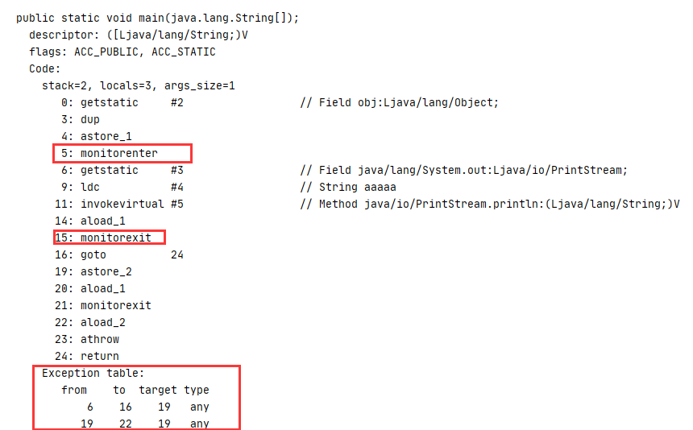
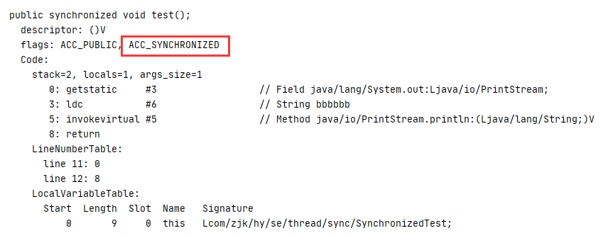
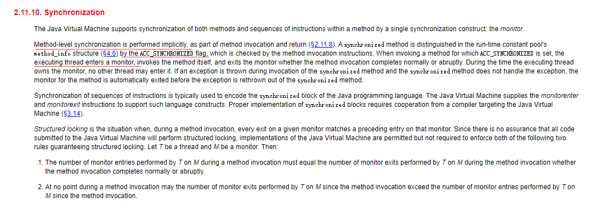
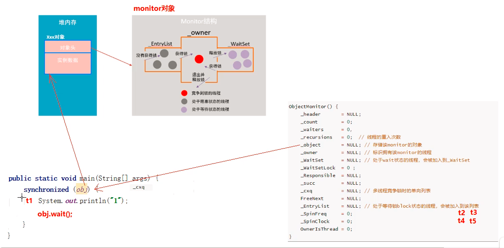
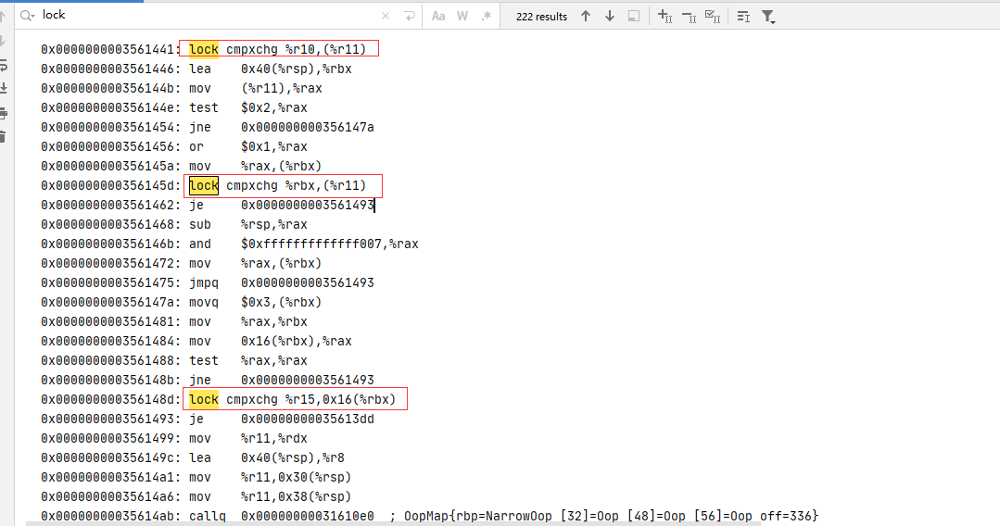
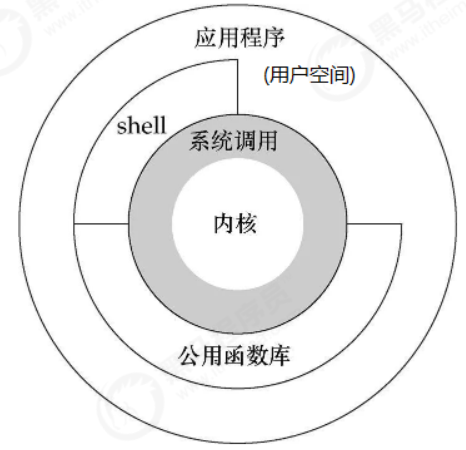

## Synchronized实现原理

### 简介

synchronized是java提供的一个关键字，是由JVM实现的，用于在多线程环境下保证线程间的同步，是一个非公平锁。

Synchronized具有如下特点：

+ 

### 使用方式

- 用于普通方法，锁是当前对象
- 用于静态方法，锁是当前类的class实例，是一个全局锁
- 用于代码块，锁是synchronized(obj)括号的中obj对象

使用示例如下：

```java
public class SynchronizedTest {
    private static Object obj = new Object();
    public static void main(String[] args) {
        synchronized (obj) {
            System.out.println("aaaaa");
        }
    }
    public synchronized void test(){
        System.out.println("bbbbbb");
    }
}
```

### 实现原理

#### 字节码层面 

由于Synchronized并非JDK实现的，而是由jvm实现的，所以我们只能通过一些其他的方式去查看其字节码、汇编指令等，来了解Synchronized底层原理。

**通过javap查看SynchronizedTest的字节码：**

首先将SynchronizedTest.java编译成SynchronizedTest.class文件，然后在class文件所在的目录执行`javap -v SynchronizedTest.class `,查看其字节码。

main方法：



test方法：



从两个方法的字节码中可以看出，Synchronized对于用于代码块和用于方法上在字节码层面是不相同的，前者是通过使用MonitorEnter和MoniterExit指令实现的，后者是通过flags标志上添加了ACC_SYNCHRONIZED来实现的。

另外有一个`Exception table`，这是一个异常表，意思是从from行开始到to行，如果这之间发生了异常就从第targer行开始执行，其作用是：**保证了在Synchronized中的代码发生异常时也能释放掉锁** 。 

#### monitorenter分析 

首先去oracle官网找到JVM规范中对Monitor的相关描述，如下：

https://docs.oracle.com/javase/specs/jvms/se8/html/jvms-6.html#jvms-6.5.monitorenter

> The *objectref* must be of type `reference`.
>
> Each object is associated with a monitor. A monitor is locked if and only if it has an owner. The thread that executes *monitorenter* attempts to gain ownership of the monitor associated with *objectref*, as follows:
>
> + If the entry count of the monitor associated with *objectref* is zero, the thread enters the monitor and sets its entry count to one. The thread is then the owner of the monitor.
> + If the thread already owns the monitor associated with *objectref*, it reenters the monitor, incrementing its entry count.
> + If another thread already owns the monitor associated with *objectref*, the thread blocks until the monitor's entry count is zero, then tries again to gain ownership.

**翻译过来：** 

与Monitor关联的对象必须是一个应用类型。

每一个对象都会一个监视器monitor关联，监视器被占用时会被锁住，其他线程无法获取该monitor。当JVM执行到*monitorenter* 时，会尝试获取该monitor的所有权，其过程如下：

+ 若monitor的进入数0，线程可以进入monitor，并把进入数设置为1，monitor的所有者（owner）设置为当前线程
+ 如果线程已经拥有了该monitor所有权，同一个线程允许重入该monitor，并把进入数+1
+ 如果其他线程已经占用了该monitor的所有权，那么当前获取monitor所有权的线程会被阻塞，直到该monitor的进入数变为0，并重新获取该monitor的所有权

#### monitorexit分析

> The thread that executes *monitorexit* must be the owner of the monitor associated with the instance referenced by *objectref*.
>
> The thread decrements the entry count of the monitor associated with *objectref*. If as a result the value of the entry count is zero, the thread exits the monitor and is no longer its owner. Other threads that are blocking to enter the monitor are allowed to attempt to do so.

**翻译过来：**

+ 能够执行 *monitorexit* 的线程一定是获取到了monitor所有权的线程。

+ 执行*monitorexit* 时会将monitor的进入数减一，当monitor的进入数为0时，当前线程退出monitor，不再拥有该monitor的所有权，此时其他被该monitor阻塞的线程会尝试获取该monitor的所有权。

#### 同步方法

通过上面的字节码可以看出，同步方法是通过flags标志上添加了ACC_SYNCHRONIZED来实现的，对于这一点，JVM规范在Synchronization的介绍中有说明，



大体的意思是，会隐式的调用monitorenter和monitorexit，在执行同步方法前会调用monitorenter，同步方法执行完成会调用monitorexit。

### Monitor源码分析

经过上面的分析，我们知道，Synchronized内部其实是通过Monitor来实现的，要分析其内部实现我们需要准备一份hotspot的源代码，JVM是一种规范，而hotspot是其众多实现中用得较多的一种。

在hotspot中与monitor对应的对象是ObjectMonitor，位于`\hotspot\src\share\vm\runtime\ObjectMonitor.hpp`，ObjectMonitor的主要结构如下：

```c++
ObjectMonitor() {
    _header       = NULL;
    _count        = 0;
    _waiters      = 0,
    _recursions   = 0; // 线程重入的次数
    _object       = NULL; // 关联该monitor的对象
    _owner        = NULL; // 持有该monitor的线程
    _WaitSet      = NULL; // 处于wait状态的线程
    _WaitSetLock  = 0 ;
    _Responsible  = NULL ;
    _succ         = NULL ;
    _cxq          = NULL ; // 多线程竞争时的单向链表
    FreeNext      = NULL ;
    _EntryList    = NULL ; // 等待获取锁而被阻塞的线程集合
    _SpinFreq     = 0 ;
    _SpinClock    = 0 ;
    OwnerIsThread = 0 ;
    _previous_owner_tid = 0;
  }
```

其中有两个属性：`_recursions`和`_owner` 就是分析monitorenter时提到的重入次数和持有该monitor的线程。

整个Synchronized过程如下：



#### monitor竞争

在字节码层面，Synchronized的实现是monitorenter和monitorexit，当执行到monitorenter的时候会执行`InterpreterRuntime::monitorenter`方法，位于.\hotspot\src\share\vm\interpreter\interpreterRuntime.cpp中，具体的Hotspot源码如下：

```c++
IRT_ENTRY_NO_ASYNC(void, InterpreterRuntime::monitorenter(JavaThread* thread, BasicObjectLock* elem))
#ifdef ASSERT
  thread->last_frame().interpreter_frame_verify_monitor(elem);
#endif
  if (PrintBiasedLockingStatistics) {
    Atomic::inc(BiasedLocking::slow_path_entry_count_addr());
  }
  Handle h_obj(thread, elem->obj());
  assert(Universe::heap()->is_in_reserved_or_null(h_obj()),
         "must be NULL or an object");
  if (UseBiasedLocking) { // 是否使用偏向锁，JVM默认开启，可以通过参数关闭
    // Retry fast entry if bias is revoked to avoid unnecessary inflation
    ObjectSynchronizer::fast_enter(h_obj, elem->lock(), true, CHECK);
  } else { // 使用重量级锁
    ObjectSynchronizer::slow_enter(h_obj, elem->lock(), CHECK);
  }
  assert(Universe::heap()->is_in_reserved_or_null(elem->obj()),
         "must be NULL or an object");
#ifdef ASSERT
  thread->last_frame().interpreter_frame_verify_monitor(elem);
#endif
IRT_END
```

对于重量级锁，monitorenter函数中会调用`ObjectSynchronizer::slow_enter`方法，该方法位于.\hotspot\src\share\vm\runtime\synchronizer.cpp中，在slow_enter方法中，调用了`ObjectSynchronizer::inflate(THREAD, obj())`方法，该方法返回一个ObjectMonitor，最后调用了`ObjectMonitor::enter`。

```c++
ObjectSynchronizer::inflate(THREAD, obj())->enter(THREAD);
```

`ObjectMonitor::enter`位于.\hotspot\src\share\vm\runtime\objectMonitor.cpp文件中，部分源码如下：

```c++
void ATTR ObjectMonitor::enter(TRAPS) {
  Thread * const Self = THREAD ;
  void * cur ;
  // 通过CAS操作将moniter的_owner设置为当前线程
  cur = Atomic::cmpxchg_ptr (Self, &_owner, NULL) ;
  if (cur == NULL) {
     // Either ASSERT _recursions == 0 or explicitly set _recursions = 0.
     assert (_recursions == 0   , "invariant") ;
     assert (_owner      == Self, "invariant") ;
     // CONSIDER: set or assert OwnerIsThread == 1
     return ;
  }

  if (cur == Self) { // 线程重入， _recursions ++
     _recursions ++ ;
     return ;
  }

  // 如果是第一次进入，则将_recursions设置为1
  if (Self->is_lock_owned ((address)cur)) {
    assert (_recursions == 0, "internal state error");
    _recursions = 1 ;
    _owner = Self ;
    OwnerIsThread = 1 ;
    return ;
  }
    // 省略部分代码
    for (;;) {
      jt->set_suspend_equivalent();
	  // 如果锁获取失败，则等待锁的释放
      EnterI (THREAD) ;
      if (!ExitSuspendEquivalent(jt)) break ;
          _recursions = 0 ;
      _succ = NULL ;
      exit (false, Self) ;
      jt->java_suspend_self();
    }
    Self->set_current_pending_monitor(NULL);
  }
}
```

以上代码的具体流程概况如下：

+ 通过CAS尝试把monitor的owner设置为当前线程.
+ 如果monitor的owner在设置前就指向当前线程，即锁重复，执行recursions++，记录重入次数.
+ 如果当前线程是第一次进入该monitor,设置recursions=1,owner设置为当前线程,该线程成功获取到锁并返回.
+ 如果获取锁失败,则等待锁释放.

以上流程省略了自旋优化等操作,后面Synchronized优化,锁升级再说.

####  monitor等待

竞争失败进入等待调用的是ObjectMonitor对象的EnterI方法（位于：./hotspot/src/share/vm/runtime/objectMonitor.cpp），源码如下所示：  

```c++
void ATTR ObjectMonitor::EnterI (TRAPS) {
    Thread * Self = THREAD ;
	// 尝试获取锁
    if (TryLock (Self) > 0) {
        return ;
    }
    // 自旋获取锁
    if (TrySpin (Self) > 0) {
        assert (_owner == Self        , "invariant") ;
        assert (_succ != Self         , "invariant") ;
        assert (_Responsible != Self  , "invariant") ;
        return ;
    }
	// 封装成一个ObjectWaiter，node，状态设置为TS_CXQ
    ObjectWaiter node(Self) ;
    Self->_ParkEvent->reset() ;
    node._prev   = (ObjectWaiter *) 0xBAD ;
    node.TState  = ObjectWaiter::TS_CXQ ;

    ObjectWaiter * nxt ;
    for (;;) { // 自旋，并发情况下通过cas将node结点push到_cxq上
        node._next = nxt = _cxq ;
        if (Atomic::cmpxchg_ptr (&node, &_cxq, nxt) == nxt) break ;
		// 再次尝试获取锁
        if (TryLock (Self) > 0) {
            return ;
        }
    }

   // 省略部分代码

    for (;;) {
		// 再次尝试获取锁
        if (TryLock (Self) > 0) break ;
		
        if ((SyncFlags & 2) && _Responsible == NULL) {
           Atomic::cmpxchg_ptr (Self, &_Responsible, NULL) ;
        }

        // 以下代码会导致当前线程park，线程被阻塞，等待被其他线程唤醒
        if (_Responsible == Self || (SyncFlags & 1)) {
            TEVENT (Inflated enter - park TIMED) ;
            Self->_ParkEvent->park ((jlong) RecheckInterval) ;
            // Increase the RecheckInterval, but clamp the value.
            RecheckInterval *= 8 ;
            if (RecheckInterval > 1000) RecheckInterval = 1000 ;
        } else {
            TEVENT (Inflated enter - park UNTIMED) ;
            Self->_ParkEvent->park() ;
        }
		// 尝试获取锁
        if (TryLock(Self) > 0) break ;
		// 省略部分代码
    }

  	// 省略部分代码
}
```

当该线程被唤醒时，会从挂起的点继续执行，通过`ObjectMonitor::TryLock`尝试获取锁，TryLock方
法实现如下：  

```c++
// 尝试获取锁，获取到锁返回1，没有获取到返回-1
int ObjectMonitor::TryLock (Thread * Self) {
   for (;;) {
      void * own = _owner ;
      if (own != NULL) return 0 ;
      if (Atomic::cmpxchg_ptr (Self, &_owner, NULL) == NULL) {
         return 1 ;
      }
      if (true) return -1 ;
   }
}
```

monitor等待整体流程如下：

1. 将当前线程封装成ObjectWaiter对象node，状态设置为ObjectWaiter::TS_CXQ。
2. 在for循环中，通过CAS把node结点push到_cxq列表中，并发情况下，同一时刻可能会有多个node结点同时push到cxq列表中。
3. push到_cxq列表之后，通过自旋尝试获取锁，如果还是没有获取到锁，则通过park将当前线程挂起，等待被唤醒。
4. 当线程被唤醒以后，会从挂起的点继续执行，通过`ObjectMonitor::tryLock`尝试获取锁。

#### monitor释放

当某个持有锁的线程执行完同步代码块时，会进行锁的释放，对应的指令是monitorexit，对应底层的方法是`ObjectMonitor::exit`,（位于：./hotspot/src/share/vm/runtime/objectMonitor.cpp）,具体代码如下：

```c++
void ATTR ObjectMonitor::exit(bool not_suspended, TRAPS) {
   Thread * Self = THREAD ;
   // 省略部分代码
   if (_recursions != 0) {
     _recursions--;   // 重入次数减一
     TEVENT (Inflated exit - recursive) ;
     return ;
   }
   if ((SyncFlags & 4) == 0) {
      _Responsible = NULL ;
   }

#if INCLUDE_TRACE
   if (not_suspended && Tracing::is_event_enabled(TraceJavaMonitorEnterEvent)) {
     _previous_owner_tid = SharedRuntime::get_java_tid(Self);
   }
#endif

   for (;;) {
	  // 省略部分代码
      ObjectWaiter * w = NULL ;
      int QMode = Knob_QMode ;
	  // qmode=2,直接绕过EntryList队列，从cxq队列中获取线程用于竞争锁
      if (QMode == 2 && _cxq != NULL) {
          w = _cxq ;
          assert (w != NULL, "invariant") ;
          assert (w->TState == ObjectWaiter::TS_CXQ, "Invariant") ;
          ExitEpilog (Self, w) ;
          return ;
      }
	  // qmode=3,从cxq队列获取线程用于竞争，并将cxq添加到EntryList尾部
      if (QMode == 3 && _cxq != NULL) {
          w = _cxq ;
          for (;;) {
             assert (w != NULL, "Invariant") ;
             ObjectWaiter * u = (ObjectWaiter *) Atomic::cmpxchg_ptr (NULL, &_cxq, w) ;
             if (u == w) break ;
             w = u ;
          }
          assert (w != NULL              , "invariant") ;

          ObjectWaiter * q = NULL ;
          ObjectWaiter * p ;
          for (p = w ; p != NULL ; p = p->_next) {
              guarantee (p->TState == ObjectWaiter::TS_CXQ, "Invariant") ;
              p->TState = ObjectWaiter::TS_ENTER ;
              p->_prev = q ;
              q = p ;
          }

          ObjectWaiter * Tail ;
          for (Tail = _EntryList ; Tail != NULL && Tail->_next != NULL ; Tail = Tail->_next) ;
          if (Tail == NULL) {
              _EntryList = w ;
          } else {
              Tail->_next = w ;
              w->_prev = Tail ;
          }
      }
	  // qmode=4,cxq队列插入到EntryList头部
      if (QMode == 4 && _cxq != NULL) {
          w = _cxq ;
          for (;;) {
             assert (w != NULL, "Invariant") ;
             ObjectWaiter * u = (ObjectWaiter *) Atomic::cmpxchg_ptr (NULL, &_cxq, w) ;
             if (u == w) break ;
             w = u ;
          }
          assert (w != NULL              , "invariant") ;

          ObjectWaiter * q = NULL ;
          ObjectWaiter * p ;
          for (p = w ; p != NULL ; p = p->_next) {
              guarantee (p->TState == ObjectWaiter::TS_CXQ, "Invariant") ;
              p->TState = ObjectWaiter::TS_ENTER ;
              p->_prev = q ;
              q = p ;
          }

          // Prepend the RATs to the EntryList
          if (_EntryList != NULL) {
              q->_next = _EntryList ;
              _EntryList->_prev = q ;
          }
          _EntryList = w ;

      }

      w = _EntryList  ;
      if (w != NULL) {
          
          assert (w->TState == ObjectWaiter::TS_ENTER, "invariant") ;
          ExitEpilog (Self, w) ;
          return ;
      }

      // If we find that both _cxq and EntryList are null then just
      // re-run the exit protocol from the top.
      w = _cxq ;
      if (w == NULL) continue ;

      // Drain _cxq into EntryList - bulk transfer.
      // First, detach _cxq.
      // The following loop is tantamount to: w = swap (&cxq, NULL)
      for (;;) {
          assert (w != NULL, "Invariant") ;
          ObjectWaiter * u = (ObjectWaiter *) Atomic::cmpxchg_ptr (NULL, &_cxq, w) ;
          if (u == w) break ;
          w = u ;
      }
      TEVENT (Inflated exit - drain cxq into EntryList) ;

      assert (w != NULL              , "invariant") ;
      assert (_EntryList  == NULL    , "invariant") ;
      if (QMode == 1) {
         ObjectWaiter * s = NULL ;
         ObjectWaiter * t = w ;
         ObjectWaiter * u = NULL ;
         while (t != NULL) {
             guarantee (t->TState == ObjectWaiter::TS_CXQ, "invariant") ;
             t->TState = ObjectWaiter::TS_ENTER ;
             u = t->_next ;
             t->_prev = u ;
             t->_next = s ;
             s = t;
             t = u ;
         }
         _EntryList  = s ;
         assert (s != NULL, "invariant") ;
      } else {
         // QMode == 0 or QMode == 2
         _EntryList = w ;
         ObjectWaiter * q = NULL ;
         ObjectWaiter * p ;
         for (p = w ; p != NULL ; p = p->_next) {
             guarantee (p->TState == ObjectWaiter::TS_CXQ, "Invariant") ;
             p->TState = ObjectWaiter::TS_ENTER ;
             p->_prev = q ;
             q = p ;
         }
      }
      if (_succ != NULL) continue;

      w = _EntryList  ;
      if (w != NULL) {
          guarantee (w->TState == ObjectWaiter::TS_ENTER, "invariant") ;
          ExitEpilog (Self, w) ;
          return ;
      }
   }
}
```

以上代码流程如下：

1. 退出同步代码块时会然_recursions减1，当其值减为0时，说明线程释放了锁

2. 根据不同的策略（由QMode指定），从cxq或者EntryList中获取头结点，通过`ObjectMonitor::ExitEpilog`方法唤醒该结点封装的线程，唤醒操作最终由unpark完成，源码如下：

   ```c++
   void ObjectMonitor::ExitEpilog (Thread * Self, ObjectWaiter * Wakee) {
      assert (_owner == Self, "invariant") ;
      _succ = Knob_SuccEnabled ? Wakee->_thread : NULL ;
      ParkEvent * Trigger = Wakee->_event ;
      Wakee  = NULL ;
   
      // Drop the lock
      OrderAccess::release_store_ptr (&_owner, NULL) ;
      OrderAccess::fence() ;                        
      if (SafepointSynchronize::do_call_back()) {
         TEVENT (unpark before SAFEPOINT) ;
      }
   
      DTRACE_MONITOR_PROBE(contended__exit, this, object(), Self);
      Trigger->unpark() ;// 唤醒被park()挂起的线程
   
      if (ObjectMonitor::_sync_Parks != NULL) {
         ObjectMonitor::_sync_Parks->inc() ;
      }
   }
   ```

   被唤醒的线程会回到`ObjectMonitor::EnterI`方法中继续执行，去竞争monitor锁。

#### Monitor总结

在以上的源码分析中，许多地方都使用到了CAS，通过工具打印出相应的汇编指令，截取其中一部分，如下：



如此我们可以明白，Synchronized的实现原理，**通过monitorenter和monitorexit来完成加锁和释放锁，monitor内部则是通过recurisions来记录线程的重入次数，owner来记录持有该monitor的线程，cxq和EntryList作为存储阻塞的线程，再通过自旋、相应的CAS操作，就实现了整个的加锁和释放锁** 。

如何查看java类对应的汇编指令：[Idea使用javap和hsdis](../../other/Idea使用javap和hsdis.md)

CAS原理：[CAS深入理解](./CAS深入理解.md)

### Monitor是重量级锁

ObjectMonitor源码中多处使用了Atomic::cmpxchg_相关的方法，该类方法是操作系统的内核函数，在锁竞争的过程中如果锁竞争失败，会调用park()方法，获取到锁后又会调用unpark()方法唤醒其他的线程，都会导致用户态和内核态的切换，这种切换会消耗操作系统大量的资源，所以锁Monitor是一个重量级锁。

Linux系统体系结构：



所有进程初始都运行于用户空间，此时即为用户运行状态（简称：用户态）；但是当它调用系统调用执
行某些操作时，例如 I/O调用，此时需要陷入内核中运行，我们就称进程处于内核运行态（或简称为内
核态）。 系统调用的过程可以简单理解为：

1. 用户态程序将一些数据值放在寄存器中， 或者使用参数创建一个堆栈， 以此表明需要操作系统提
   供的服务。
2. 用户态程序执行系统调用。
3.  CPU切换到内核态，并跳到位于内存指定位置的指令。
4.  系统调用处理器(system call handler)会读取程序放入内存的数据参数，并执行程序请求的服务。
5.  系统调用完成后，操作系统会重置CPU为用户态并返回系统调用的结果。

由此可见用户态切换至内核态需要传递许多变量，同时内核还需要保护好用户态在切换时的一些寄存器
值、变量等，以备内核态切换回用户态。这种切换就带来了大量的系统资源消耗，这就是在
synchronized未优化之前，效率低的原因。  